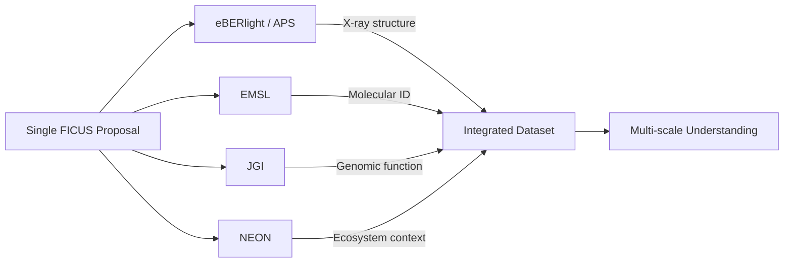

# Partner Facilities

eBERlight's scientific impact is amplified through partnerships with complementary
DOE user facilities and national research infrastructure. These partnerships enable
multimodal characterization — studying the same systems across multiple length scales
and analytical techniques.

## Partner Facility Overview

```
┌─────────────────────────────────────────────────────────────────┐
│                        eBERlight (APS)                          │
│              X-ray: structure, composition, dynamics             │
└──────────┬──────────┬──────────┬──────────┬──────────┬──────────┘
           │          │          │          │          │
     ┌─────▼──┐  ┌───▼───┐  ┌──▼──┐  ┌───▼───┐  ┌───▼───┐
     │  EMSL  │  │  JGI  │  │NEON │  │ HFIR  │  │ ALCF  │
     │Molecular│  │Genomic│  │Eco- │  │Neutron│  │Compute│
     │Analysis │  │  Data │  │Data │  │Scatt. │  │  HPC  │
     └────────┘  └───────┘  └─────┘  └───────┘  └───────┘
```

---

## EMSL — Environmental Molecular Sciences Laboratory

| | |
|---|---|
| **Location** | Pacific Northwest National Laboratory (PNNL), Richland, WA |
| **Operator** | DOE Office of Biological and Environmental Research (BER) |
| **Website** | [https://www.emsl.pnnl.gov](https://www.emsl.pnnl.gov) |

### Capabilities
- **Mass Spectrometry**: High-resolution MS (Orbitrap, FT-ICR) for molecular characterization
- **NMR Spectroscopy**: Solid-state and solution NMR for molecular structure
- **Electron Microscopy**: Cryo-EM, environmental TEM
- **Computational**: Molecular dynamics, quantum chemistry

### Synergy with eBERlight
- APS provides elemental distribution (XRF) → EMSL provides molecular identification (MS)
- Complementary length scales: APS (nm–µm structure) + EMSL (molecular-level)
- Joint proposals through FICUS enable combined experiments on same samples
- **Use case**: Soil organic matter — APS maps element distribution while EMSL identifies organic species

---

## JGI — Joint Genome Institute

| | |
|---|---|
| **Location** | Lawrence Berkeley National Laboratory (LBNL), Berkeley, CA |
| **Operator** | DOE Office of Science |
| **Website** | [https://jgi.doe.gov](https://jgi.doe.gov) |

### Capabilities
- **DNA/RNA Sequencing**: High-throughput whole-genome, metagenome, metatranscriptome sequencing
- **Genome Assembly & Annotation**: Computational genomics pipelines
- **Functional Genomics**: Gene expression analysis, pathway reconstruction
- **Synthetic Biology**: DNA synthesis and engineering

### Synergy with eBERlight
- APS provides structural/elemental data → JGI provides genomic/functional data
- **Use case**: Rhizosphere microbiome — APS maps nutrient element distribution near roots while
  JGI sequences the microbial community to identify functional roles
- FICUS proposals enable "genotype to phenotype" studies connecting molecular structure to gene function

---

## NEON — National Ecological Observatory Network

| | |
|---|---|
| **Location** | Distributed across 81 field sites, 47 US states |
| **Operator** | NSF (managed by Battelle) |
| **Website** | [https://www.neonscience.org](https://www.neonscience.org) |

### Capabilities
- **Field Observations**: Standardized ecological measurements across US ecosystems
- **Remote Sensing**: Airborne LIDAR, hyperspectral imaging, aerial photography
- **Biogeochemistry**: Soil, water, atmospheric chemistry monitoring
- **Biodiversity**: Organism sampling, environmental DNA

### Synergy with eBERlight
- NEON provides ecosystem-scale context → APS provides microscale characterization
- **Use case**: Carbon cycling — NEON measures ecosystem CO₂ flux while APS characterizes
  the nanoscale structure of soil organic matter controlling decomposition
- Enables linking field-scale observations to laboratory-scale mechanisms

---

## HFIR / CSMB — High Flux Isotope Reactor / Center for Structural Molecular Biology

| | |
|---|---|
| **Location** | Oak Ridge National Laboratory (ORNL), Oak Ridge, TN |
| **Operator** | DOE Office of Science |
| **Website** | [https://neutrons.ornl.gov/hfir](https://neutrons.ornl.gov/hfir) |

### Capabilities
- **Neutron Scattering**: SANS, neutron diffraction, neutron reflectometry
- **Neutron Imaging**: Neutron tomography, radiography
- **Bio-SANS**: Small-angle neutron scattering for biological macromolecules
- **Deuterium Labeling**: Contrast matching for multi-component systems

### Synergy with eBERlight
- X-rays (APS) are sensitive to electron density → Neutrons (HFIR) are sensitive to light elements (H, D)
- **Use case**: Protein-membrane interactions — APS crystallography for protein structure +
  HFIR neutron scattering for lipid bilayer organization
- Complementary contrast mechanisms enable full structural characterization

---

## ALCF — Argonne Leadership Computing Facility

| | |
|---|---|
| **Location** | Argonne National Laboratory, Lemont, IL |
| **Operator** | DOE Office of Science |
| **Website** | [https://www.alcf.anl.gov](https://www.alcf.anl.gov) |

### Capabilities
- **Aurora**: Exascale supercomputer (2+ ExaFLOPS)
- **Polaris**: 44-petaflop GPU-accelerated system
- **AI/ML Training**: Large-scale deep learning model training
- **Data Analysis**: Massive parallel data processing

### Synergy with eBERlight
- **Critical infrastructure**: Located on same ANL campus as APS
- Low-latency, high-bandwidth connection enables real-time analysis during experiments
- **Use case**: Real-time tomographic reconstruction — data streams from APS to ALCF for
  GPU-accelerated reconstruction and AI-based segmentation during beam time
- AI model training on large synchrotron datasets
- Enables computational analyses too large for beamline-local computing

---

## CNM — Center for Nanoscale Materials

| | |
|---|---|
| **Location** | Argonne National Laboratory, Lemont, IL |
| **Operator** | DOE Office of Science |
| **Website** | [https://www.anl.gov/cnm](https://www.anl.gov/cnm) |

### Capabilities
- **Nanofabrication**: Electron-beam lithography, thin-film deposition
- **Scanning Probe Microscopy**: STM, AFM at cryogenic temperatures
- **Electron Microscopy**: Aberration-corrected TEM/STEM
- **Theory & Modeling**: Nanoscale simulations

### Synergy with eBERlight
- CNM fabricates specialized sample environments and X-ray optics for APS
- **Use case**: Custom microfluidic devices for in-situ XRF measurements of live cells
- Complementary nanoscale imaging (electron microscopy) to validate APS measurements

---

## APCF — Argonne Protein Crystallization Facility

| | |
|---|---|
| **Location** | Argonne National Laboratory, Lemont, IL |
| **Operator** | ANL Biosciences Division |

### Capabilities
- **Crystallization Screening**: Automated high-throughput protein crystallization
- **Crystal Imaging**: UV microscopy, automated crystal detection
- **Sample Preparation**: Crystal harvesting, cryo-cooling
- **Mail-in Service**: Remote crystal screening and optimization

### Synergy with eBERlight
- Provides crystal samples directly to eBERlight crystallography beamlines (21-ID)
- Streamlines structural biology pipeline from protein to structure
- Reduces beam time waste by pre-screening crystal quality

---

## FICUS Integration Map



Researchers submit a single proposal to access multiple facilities, enabling truly
integrated multi-scale science that would be impossible at any single facility alone.
