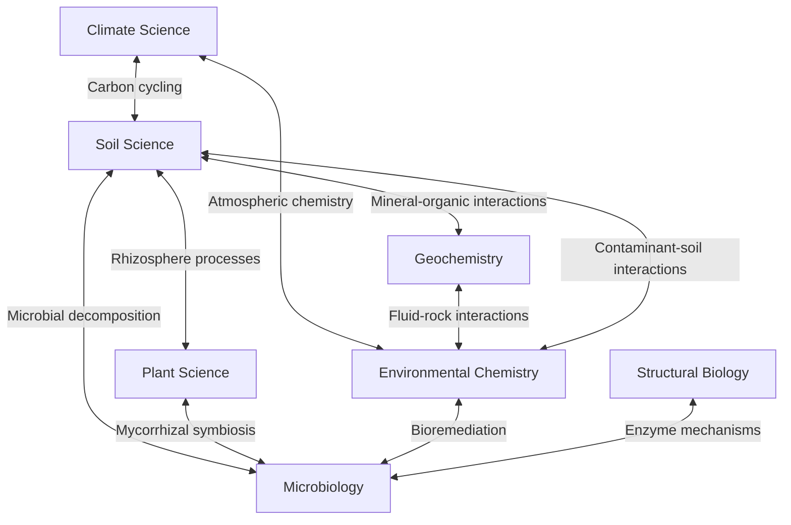

# Research Domains

The BER program supports seven interconnected research domains in biological and environmental
science. Each domain leverages specific X-ray techniques and benefits from the APS-U
upgrade's enhanced capabilities.

---

## 1. Soil Science

### Definition
Study of soil as a complex, heterogeneous system — understanding how soil organic matter
(SOM) is formed, stabilized, and decomposed at the microscale.

### Key Scientific Questions
- How do mineral-organic associations control carbon storage in soils?
- What is the spatial distribution of organic matter within soil aggregates?
- How do redox fluctuations affect nutrient cycling at the pore scale?
- What controls the persistence of soil organic matter over decades to millennia?

### X-ray Techniques Used
| Technique | Application | Beamlines |
|-----------|-------------|-----------|
| µCT / nano-CT | 3D pore structure, aggregate architecture | 2-BM-A, 32-ID-B/C |
| XRF Microscopy | Elemental mapping (Fe, Mn, C associations) | 2-ID-D, 2-ID-E, 8-BM-B |
| XANES/EXAFS | Fe/Mn redox speciation, S/P bonding | 9-BM, 20-BM |
| SAXS | SOM nanostructure, clay mineral organization | 12-ID-B |

### Representative Studies
- Mineral-organic matter co-localization in soil aggregates using correlated µCT + XRF
- Redox-driven Fe speciation changes in wetland soils via µ-XANES
- Pore-scale transport modeling validated by in-situ tomography

---

## 2. Plant Science

### Definition
Investigation of plant structure and function from the cellular to organ level, with
emphasis on root systems, nutrient uptake mechanisms, and plant-microbe interactions.

### Key Scientific Questions
- How do root architectures adapt to nutrient-poor environments?
- What are the mechanisms of heavy metal tolerance and hyperaccumulation?
- How do mycorrhizal fungi facilitate nutrient transfer to plant roots?
- What structural features control water transport in plant vasculature?

### X-ray Techniques Used
| Technique | Application | Beamlines |
|-----------|-------------|-----------|
| µCT | Root architecture in soil, vasculature 3D imaging | 2-BM-A, 7-BM-B |
| XRF Nanoprobe | Nutrient distribution in root cross-sections | 2-ID-D |
| XANES | Metal speciation in plant tissues | 9-BM, 20-BM |
| Ptychography | Cell wall nanostructure | 33-ID-C |

### Representative Studies
- 4D in-situ tomography of root growth in soil columns
- XRF mapping of Zn hyperaccumulation mechanisms in Noccaea caerulescens
- Combined ptychography + XRF for subcellular nutrient mapping

---

## 3. Environmental Chemistry

### Definition
Study of chemical speciation, transformation, and transport of contaminants and
nutrients in environmental systems including water, sediments, and waste materials.

### Key Scientific Questions
- What controls the bioavailability and toxicity of heavy metals in contaminated sites?
- How do engineered nanomaterials transform in environmental media?
- What are the speciation and mobility of radionuclides in nuclear waste forms?
- How does natural organic matter interact with mineral surfaces and contaminants?

### X-ray Techniques Used
| Technique | Application | Beamlines |
|-----------|-------------|-----------|
| XANES/EXAFS | Metal/metalloid speciation (As, Cr, U, Pb) | 20-BM, 9-BM |
| XRF Microscopy | Contaminant spatial distribution | 2-ID-D, 8-BM-B |
| µCT | Porous media structure, flow path visualization | 2-BM-A |
| SAXS/WAXS | Nanoparticle size/structure in suspension | 12-ID-B |

### Representative Studies
- As(III)/As(V) speciation in contaminated groundwater sediments via µ-XANES
- Nanoparticle fate in wastewater treatment tracked by SAXS
- U speciation in cement waste forms using spatially-resolved EXAFS

---

## 4. Microbiology

### Definition
Characterization of microbial cells, communities, and their interactions with
environments at the single-cell and community scale using X-ray methods.

### Key Scientific Questions
- How do bacteria sequester and utilize trace metals?
- What is the elemental composition of individual microbial cells?
- How do biofilms organize spatially and chemically?
- Can X-ray methods enable rapid microbial phenotyping without labeling?

### X-ray Techniques Used
| Technique | Application | Beamlines |
|-----------|-------------|-----------|
| XRF Nanoprobe | Single-cell elemental analysis | 2-ID-D, 2-ID-E |
| Ptychography | Cell ultrastructure without staining | 33-ID-C, 2-ID-E |
| MX/SSX | Microbial enzyme structures | 21-ID-D, 21-ID-G |
| XANES | Metal speciation in biofilms | 9-BM |

### Representative Studies
- ROI-Finder applied to XRF elemental mapping of bacterial cell populations
- Ptychographic imaging of unstained cyanobacteria at nanometer resolution
- Crystal structures of soil-relevant microbial enzymes (nitrogenases, laccases)

---

## 5. Structural Biology

### Definition
Determination of 3D structures of biological macromolecules (proteins, nucleic acids,
macromolecular complexes) at atomic or near-atomic resolution.

### Key Scientific Questions
- What are the structures of environmentally-relevant enzymes (lignin degradation, N fixation)?
- How do protein conformational changes relate to catalytic function?
- Can serial crystallography capture enzyme intermediates under near-physiological conditions?
- What are the structures of membrane proteins involved in nutrient transport?

### X-ray Techniques Used
| Technique | Application | Beamlines |
|-----------|-------------|-----------|
| MX | High-resolution protein crystallography | 21-ID-D, 21-ID-F |
| SSX | Time-resolved serial crystallography | 21-ID-G |
| SAXS | Solution-state macromolecular shape | 12-ID-B |

### Representative Studies
- Structure of cellulose-degrading enzyme complexes from soil microbes
- Time-resolved SSX of photosynthetic reaction centers
- SAXS characterization of intrinsically disordered proteins in solution

---

## 6. Climate Science

### Definition
Characterization of atmospheric particles, ice core records, and materials relevant
to climate change understanding and mitigation.

### Key Scientific Questions
- What is the chemical composition and mixing state of atmospheric aerosols?
- How do ice core microparticles record past climate conditions?
- What are the structural properties of materials for carbon capture and storage?
- How do cloud condensation nuclei form and evolve?

### X-ray Techniques Used
| Technique | Application | Beamlines |
|-----------|-------------|-----------|
| XRF/XANES | Aerosol composition and speciation | 2-ID-E, 8-BM-B |
| µCT | Ice core microstructure, porous capture materials | 2-BM-A |
| SAXS/WAXS | Aerosol nanostructure, ice crystallography | 12-ID-B |
| Ptychography | Individual aerosol particle imaging | 33-ID-C |

### Representative Studies
- Single-particle XRF analysis of atmospheric aerosols collected in the field
- µCT characterization of metal-organic framework (MOF) materials for CO₂ capture
- Ice core particulate characterization using correlated XRF + XANES

---

## 7. Geochemistry

### Definition
Study of mineral transformations, fluid-rock interactions, and elemental cycling
in geological systems, from subsurface environments to planetary materials.

### Key Scientific Questions
- How do minerals nucleate and grow under environmental conditions?
- What controls element partitioning between mineral and fluid phases?
- How do microbial communities influence mineral weathering?
- What are the mechanisms of biomineralization?

### X-ray Techniques Used
| Technique | Application | Beamlines |
|-----------|-------------|-----------|
| Diffraction (WAXS) | Mineral phase identification | 12-ID-B |
| XANES/EXAFS | Element coordination in minerals | 20-BM, 25-ID |
| µCT | Rock/mineral microstructure | 2-BM-A, 7-BM-B |
| XRF Microscopy | Elemental zoning in minerals | 2-ID-D, 8-BM-B |

### Representative Studies
- In-situ WAXS monitoring of mineral precipitation under controlled conditions
- Fe EXAFS spectroscopy of iron (oxyhydr)oxide transformations
- Correlative µCT + XRF mapping of microbially-weathered basalt

---

## Cross-Domain Connections

The program's strength lies in connecting these domains — the same X-ray techniques and
beamlines serve multiple research communities, enabling cross-disciplinary discoveries.
