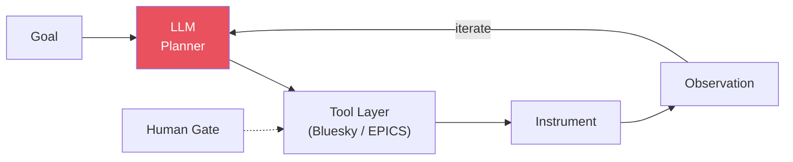

# LLM Agents for Beamline Operation

## Concept

Large-language-model **agents** — LLMs wrapped in a plan → execute → observe →
replan loop with instrument APIs exposed as callable tools — moved from
proposals to **demonstrated beamline operation** in 2025–2026. Unlike
Bayesian optimization or adaptive scanning (which optimize parameters inside
a fixed procedure), LLM agents automate the *procedure level*: choosing
steps, reacting to unexpected instrument states, and chaining heterogeneous
actions the way a human operator does.

```
Parameter automation (BO):     "what exposure/energy next?"
Procedure automation (agents): "what step next — align, calibrate,
                                rescan, flag a problem, ask a human?"
```

## Demonstrated systems (2025–2026)

| System | Facility / Task | Key result | Reference |
|--------|-----------------|-----------|-----------|
| **Agentic AI X-ray scientist** | SLAC-class beamline; single-crystal alignment on a six-circle diffractometer | Developed wholly in a virtual beamline, transferred to real hardware with minimal I/O changes; autonomously found reference reflections and determined the UB matrix | Chen et al., *Nat. Mach. Intell.* 8, 1075–1086 (2026), DOI 10.1038/s42256-026-01261-5 |
| **Agents that learn on the job** | APS X-ray nanoprobe + autonomous robotic station | Human-in-the-loop LLM-agent pipeline operating real instruments; agents accumulate operational knowledge across sessions | Vriza et al. (Argonne), *npj Comput. Mater.* 12, 160 (2026), DOI 10.1038/s41524-026-02005-0 (arXiv:2509.00098) |
| **PEAR** | Ptychography analysis automation | Multi-agent LLM framework (knowledge retrieval, code generation, parameter recommendation, image reasoning); robust even with small open models (LLaMA-3.1-8B) | Yin et al. (Argonne/Rice), arXiv:2410.09034 (2024) |
| **Modular human–AI framework** | NSLS-II, multi-beamline | Open-source agent orchestration inside **Bluesky**: reduction, clustering, GP modeling, BO-driven acquisition across beamlines | Corrao et al. (NSLS-II/NIST), arXiv:2509.22959 (2025) |

## Common architecture

```
Goal (natural language or protocol)
    │
    ├─→ LLM planner  ──────────────┐
    │       decides next action    │
    ├─→ Tool layer                 │  iterate
    │       instrument commands,   │  until goal
    │       analysis routines      │  (or human gate)
    ├─→ Observation                │
    │       motors, detectors,     │
    │       fit results as text ───┘
    │
    └─→ Artifacts: aligned sample, calibration, reduced data, log
```

Design patterns that recur across all four systems:

1. **Simulator-first development** ("virtual beamline" / digital twin) —
   agents are debugged against a simulated instrument, then transferred.
2. **Tools, not prompts, encode the physics** — instrument geometry lives in
   the tool layer; the LLM supplies procedural reasoning.
3. **Human-in-the-loop gates** for irreversible or safety-relevant actions;
   full autonomy only for machine-verifiable subtasks.
4. **Bluesky as the substrate** at DOE facilities — agents emit Bluesky
   plans rather than raw motor commands.

## Failure modes & guardrails

| Failure mode | Guardrail |
|--------------|-----------|
| Hallucinated instrument state | Ground every decision in fresh observations; structured (not free-text) tool returns |
| Unsafe motion / dose | Action allow-lists; limits enforced below the agent layer (EPICS/Bluesky) |
| Loop divergence | Step budgets, machine-checkable success criteria, human escalation |
| Silent cost blow-up | Latency/cost budgets per control-loop iteration |

## Relevance to APS BER Program

- **Alignment-heavy modalities first**: crystallography and diffraction
  endstations lose the most beam time to setup rituals — the demonstrated
  task class.
- **Bluesky-native path**: the NSLS-II framework and Argonne nanoprobe work
  both integrate with Bluesky, the same stack used at APS (see
  `05_tools_and_code/` and `review_ai_als_workshop_2024.md`).
- **Prerequisite investment**: virtual instruments (digital twins) for
  eBERlight endstations, since every demonstrated system was developed
  simulator-first.

## Cross-references

- `foundation_models_beamline.md` — foundation-model landscape this builds on
- `bayesian_optimization.md` / `knowledge_injected_bo.md` — the parameter-level
  automation agents orchestrate
- `04_publications/ai_ml_synchrotron/review_agentic_xray_scientist_2026.md` —
  full review of the Nature Machine Intelligence paper

## References

1. Chen, Z. et al. "An agentic artificially intelligent X-ray scientist."
   *Nat. Mach. Intell.* 8, 1075–1086 (2026). DOI: 10.1038/s42256-026-01261-5
2. Vriza, A., Prince, M. H., Zhou, T., Chan, H., Cherukara, M. J. "Operating
   advanced scientific instruments with AI agents that learn on the job."
   *npj Comput. Mater.* 12, 160 (2026). DOI: 10.1038/s41524-026-02005-0
3. Yin, X., Shi, C., Han, Y., Jiang, Y. "PEAR: A Robust and Flexible
   Automation Framework for Ptychography Enabled by Multiple Large Language
   Model Agents." arXiv:2410.09034 (2024).
4. Corrao, A. A. et al. "A modular framework for collaborative human-AI,
   multi-modal and multi-beamline synchrotron experiments." arXiv:2509.22959
   (2025).

## Architecture diagram


