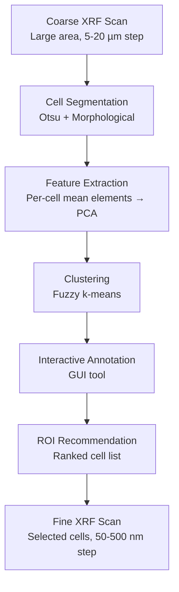

# ROI-Finder: ML-Guided ROI Selection for XRF

**Reference**: Chowdhury et al., J. Synchrotron Rad. 29 (2022)
**DOI**: 10.1107/S1600577522008876
**GitHub**: [https://github.com/arshadzahangirchowdhury/ROI-Finder](https://github.com/arshadzahangirchowdhury/ROI-Finder)

## Overview

ROI-Finder is an ML-guided tool for selecting regions of interest (ROIs) in X-ray
fluorescence (XRF) microscopy experiments. It analyzes coarse-resolution survey scans
to recommend specific cells or regions for detailed, high-resolution scanning.

## Motivation

XRF microscopy faces a trade-off between resolution and coverage:
- **Coarse scan**: Large area, low resolution (fast, complete coverage)
- **Fine scan**: Small area, high resolution (slow, limited to ROIs)

ROI-Finder automates the transition from coarse survey to targeted detailed scanning,
maximizing the scientific value of limited beam time.

## Complete Workflow



### Step 1: Coarse Survey Scan

- Scan entire sample area at coarse resolution (5-20 µm step)
- Collect full XRF spectra at each position
- Process with MAPS to generate elemental maps
- Typically 10-30 min for a 2×2 mm area

### Step 2: Cell Segmentation

Binary segmentation pipeline (see [image_segmentation/xrf_cell_segmentation.md](../image_segmentation/xrf_cell_segmentation.md)):

```python
# Select high-contrast channel (Zn, Fe, or P)
# → Otsu threshold
# → Morphological open/close
# → Connected component labeling
# → Area filtering
# Result: labeled cell mask with N individual cells
```

### Step 3: Feature Extraction

For each segmented cell, compute a feature vector:

```python
import numpy as np
from sklearn.decomposition import PCA

# Extract per-cell mean elemental concentrations
N_cells = filtered_labels.max()
N_elements = len(elements)
feature_matrix = np.zeros((N_cells, N_elements))

for cell_id in range(1, N_cells + 1):
    mask = filtered_labels == cell_id
    for j, elem in enumerate(elements):
        feature_matrix[cell_id - 1, j] = elemental_maps[elem][mask].mean()

# Standardize and apply PCA
from sklearn.preprocessing import StandardScaler
scaler = StandardScaler()
X_scaled = scaler.fit_transform(feature_matrix)

pca = PCA(n_components=min(5, N_elements))
X_pca = pca.fit_transform(X_scaled)

# Explained variance helps determine significant components
print(f"Explained variance: {pca.explained_variance_ratio_}")
```

### Step 4: Fuzzy K-Means Clustering

```python
import skfuzzy as fuzz

# Fuzzy c-means clustering
# m=2: fuzziness parameter
cntr, u, u0, d, jm, p, fpc = fuzz.cluster.cmeans(
    X_pca.T,          # data (features × samples)
    c=k,              # number of clusters
    m=2,              # fuzziness coefficient
    error=0.005,      # convergence threshold
    maxiter=1000,     # max iterations
    seed=42
)

# u: membership matrix (k × N_cells)
# u[i, j] = probability that cell j belongs to cluster i
# Σ_i u[i,j] = 1 for each cell j

# Assign each cell to highest-membership cluster
cluster_labels = np.argmax(u, axis=0)
```

**Why fuzzy k-means?**
- Cells may have mixed characteristics (partial membership)
- Membership values provide confidence measure
- More informative than hard k-means for heterogeneous populations

### Step 5: Interactive Annotation

GUI tool for:
- Visualizing cells colored by cluster membership
- Selecting/deselecting cells
- Adjusting cluster number k
- Annotating cells with custom labels
- Saving ROI selections for downstream scanning

### Step 6: ROI Recommendation

Ranking strategies:
- **Diversity-based**: Select representatives from each cluster
- **Outlier-based**: Prioritize cells far from cluster centers (unusual composition)
- **Uncertainty-based**: Select cells with highest fuzzy membership uncertainty
- **User-guided**: Combine algorithmic ranking with domain expert priorities

## Mathematical Background

### PCA Dimensionality Reduction

```
Given: X ∈ ℝ^(N×D) (N cells, D elements)
Standardize: X̃ = (X - μ) / σ

Covariance: C = X̃ᵀX̃ / (N-1)
Eigendecomposition: C = VΛVᵀ

Principal components: Y = X̃V[:, :k]  (project onto top-k eigenvectors)
```

PCA identifies element associations:
- PC1 often = total signal intensity
- PC2 might separate Fe-rich vs. Zn-rich cells
- PC3 might distinguish P/S content

### Fuzzy Membership Function

```
u_ij = 1 / Σ_k (||x_j - c_i||² / ||x_j - c_k||²)^(1/(m-1))

where:
  u_ij = membership of sample j in cluster i
  c_i = cluster center i
  m = fuzziness coefficient (m=2 standard)
  ||·|| = Euclidean distance
```

### Fuzzy Partition Coefficient (FPC)

```
FPC = Σ_i Σ_j u_ij² / N

FPC ∈ (1/c, 1]
FPC = 1 → perfectly separated clusters (hard partition)
FPC = 1/c → completely overlapping (no structure)
```

Use FPC to assess clustering quality and select optimal k.

## Extension Possibilities

### Alternative Clustering Methods
- **HDBSCAN**: No need to specify k, finds clusters of arbitrary shape
- **DBSCAN**: Density-based, identifies noise points
- **Hierarchical clustering**: Dendrogram-based, multi-scale analysis
- **Spectral clustering**: Graph-based, captures non-linear relationships

### Deep Learning Feature Extraction
- **Autoencoder**: Learn compressed representations of elemental profiles
- **Contrastive learning**: SimCLR/MoCo for self-supervised feature learning
- Replace PCA with learned non-linear features

### Instance Segmentation Upgrade
- **Cellpose**: Better handling of touching/overlapping cells
- **StarDist**: For convex cell shapes
- **Mask R-CNN**: Full instance segmentation with bounding boxes

### Web-Based Interface
- **Streamlit**: Interactive web UI for ROI selection (replace Tkinter)
- Remote access during beam time
- Cloud deployment for remote users

### 3D Extension
- Apply to XRF tomography (3D elemental volumes)
- 3D cell segmentation and feature extraction
- Volume-based clustering and ROI selection

## Strengths

1. **Unsupervised**: No labeled training data required
2. **Real-time beam time use**: Fast enough for during-experiment decisions
3. **GUI**: Interactive visualization and annotation
4. **Interpretable**: PCA loadings show which elements drive clustering
5. **Flexible**: Adjustable parameters (k, elements, area filters)

## Limitations

1. **PCA linearity**: Cannot capture non-linear element associations
2. **Binary segmentation**: Fails for overlapping/touching cells
3. **2D only**: No support for 3D XRF data
4. **Feature engineering**: PCA on means discards spatial information
5. **k selection**: Requires user to specify number of clusters
6. **GUI dependency**: Desktop application, not web-accessible
