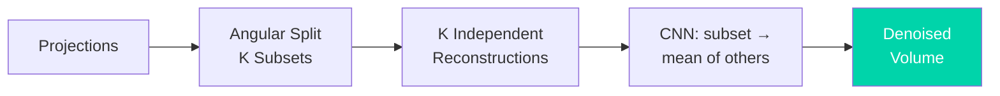

# Noise2Inverse: Self-Supervised Denoising for Tomographic Inverse Problems

**Reference**: Hendriksen, Pelt & Batenburg, IEEE Trans. Comput. Imaging 6, 1320–1335 (2020), DOI: [10.1109/TCI.2020.3019647](https://doi.org/10.1109/TCI.2020.3019647)

**Synchrotron application**: Obata, Parkinson, Pelt & Acevedo, J. Synchrotron Rad. 32, 690–699 (2025), DOI: [10.1107/S1600577525001833](https://doi.org/10.1107/S1600577525001833) — see `04_publications/ai_ml_synchrotron/review_noise2inverse_bone_2025.md`

## Concept

**Noise2Inverse** extends the Noise2Noise idea from image space to
**tomographic inverse problems**. Instead of needing two noisy photographs of
the same scene, it manufactures independent noisy views from a *single* CT
scan by splitting the projections:

```
Noise2Noise:     two noisy images of same scene   → train CNN
Noise2Void:      single noisy image, blind spot   → train CNN
Noise2Inverse:   single CT scan, angular split    → train CNN
                 (uses the physics of reconstruction)
```

The key insight: measurement noise is independent **per projection**, so
reconstructions from disjoint projection subsets share the same object but
carry independent noise realizations — exactly the Noise2Noise training
condition.

## Algorithm

```
Projections P = {p_1 ... p_N}
    │
    ├─→ Split into K angular subsets S_1 ... S_K   (e.g. K = 4, interleaved)
    │
    ├─→ Reconstruct each subset independently:  r_k = FBP(S_k)
    │       Each r_k = same object + independent noise
    │
    ├─→ Train CNN f_θ:
    │       input  = r_k          (one sub-reconstruction)
    │       target = mean(r_j≠k)  (average of the others)
    │       loss   = || f_θ(r_k) − mean(r_j≠k) ||²
    │
    └─→ Inference: denoised = mean_k f_θ(r_k)
```

### Why the split works

- Photon (Poisson) noise is independent across projections.
- The reconstruction operator is linear, so noise in `r_k` and `r_j` (k ≠ j)
  stays independent while the signal is common.
- Minimizing MSE against an independent noisy target converges to the clean
  signal expectation — the Noise2Noise theorem, now applied post-reconstruction.

## Comparison with the Noise2X family

| Method | Domain | Needs | Uses physics? | Structured noise (rings)? |
|--------|--------|-------|:-------------:|:-------------------------:|
| Noise2Noise | image | noisy pairs | No | No |
| Noise2Void | image | single image | No | No |
| **Noise2Inverse** | **sinogram→volume** | single scan | **Yes (forward model)** | No¹ |
| Supervised (TomoGAN) | image | paired low/high dose | No | Partially |

¹ Ring artifacts are detector-fixed and correlated across *all* projections,
violating the independence assumption — combine with a stripe filter
(see `09_noise_catalog/tomography/ring_artifact.md`).

## Practical notes (from the 2025 bone μCT application)

- **2–3× dose reduction** with preserved bone microstructure (lacunae
  volume/shape, mineralization).
- At aggressive (1/3-dose) reduction, microstructure *quantification* shifted
  significantly vs. full dose — validate with one full-dose scan before
  publishing absolute metrics from denoised volumes.
- Angular splitting costs per-reconstruction sampling: very sparse scans may
  not tolerate K-way splits.

## Applications to Synchrotron Data

```
Problem:  Dose-limited in-situ CT (bone under load, hydrated samples,
          time series) — cannot collect clean references.
N2I use:  Train per-scan on the scan's own projection splits.
          No acquisition change; purely post-processing.
Fit:      TomoPy/tomocupy pipelines — split, reconstruct K times,
          train small CNN (MS-D or U-Net), average.
```

## Strengths

1. **Single-scan self-supervised** — no clean data, no repeats
2. **Physics-aware** — exploits projection-domain noise independence
3. **Validated on real beamline data** for biological tissue (JSR 2025)
4. **Pipeline-friendly** — works after any linear reconstruction

## Limitations

1. Cannot remove structured/correlated noise (rings, stripes)
2. K-way split reduces angular sampling per sub-reconstruction
3. Training per scan adds GPU minutes to the pipeline
4. Learned-operator caveats apply to downstream quantification

## References

1. Hendriksen, A. A., Pelt, D. M., Batenburg, K. J. "Noise2Inverse: Self-
   Supervised Deep Convolutional Denoising for Tomography." IEEE Trans.
   Comput. Imaging 6, 1320–1335 (2020). DOI: 10.1109/TCI.2020.3019647
2. Obata, Y., Parkinson, D. Y., Pelt, D. M., Acevedo, C. "Enhancing
   synchrotron radiation micro-CT images using deep learning: an application
   of Noise2Inverse on bone imaging." J. Synchrotron Rad. 32, 690–699 (2025).
   DOI: 10.1107/S1600577525001833
3. Shi, J., Pelt, D. M., Batenburg, K. J. "Multi-stage deep learning artifact
   reduction for parallel-beam computed tomography." J. Synchrotron Rad.
   32(2), 442–456 (2025). DOI: 10.1107/S1600577525000359 — multi-stage DL
   companion that removes each artifact at the pipeline stage where it is
   easiest to remove.

**GitHub**: [https://github.com/ahendriksen/noise2inverse](https://github.com/ahendriksen/noise2inverse)

## Architecture diagram


