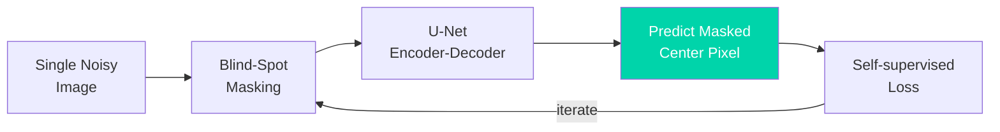

# Noise2Void: Self-Supervised Denoising from Single Noisy Images

**Reference**: Krull et al., CVPR (2019), DOI: [10.1109/CVPR.2019.00223](https://doi.org/10.1109/CVPR.2019.00223)

## Concept

**Noise2Void (N2V)** is a self-supervised denoising method that requires only a
**single noisy image** for training — no clean targets, no noisy pairs, and no
repeated measurements. It learns to predict each pixel from its surrounding
context using a blind-spot network that masks the center pixel during training.

```
Traditional supervised:   Noisy image + Clean target → Train CNN
Noise2Noise:              Noisy image + Noisy pair   → Train CNN
Noise2Void:               Single noisy image ONLY    → Train CNN
```

## Architecture

### Blind-Spot Network

```
Noisy input image (1ch, H×W)
    │
    ├─→ Random pixel sampling (per batch)
    │       Select N random pixel locations (i, j)
    │       For each: mask center pixel from receptive field
    │
    ├─→ U-Net encoder-decoder
    │       Conv→BN→ReLU (64)  ─────────────────────┐
    │       Conv→BN→ReLU (128) ──────────────┐       │
    │       Conv→BN→ReLU (256) ───────┐       │       │
    │       Conv→BN→ReLU (512)  ──┐   │       │       │
    │       │ [Bottleneck]        │   │       │       │
    │       TransConv + skip ─────┘   │       │       │
    │       TransConv + skip ─────────┘       │       │
    │       TransConv + skip ─────────────────┘       │
    │       TransConv + skip ─────────────────────────┘
    │
    └─→ Output: Predicted pixel values at masked locations

Key: The network NEVER sees the target pixel value during prediction.
     It must infer the clean value from surrounding context only.
```

### Blind-Spot Masking Strategy

```
Receptive field (5×5 example):

  Standard CNN:          Blind-spot CNN:
  ┌─┬─┬─┬─┬─┐          ┌─┬─┬─┬─┬─┐
  │x│x│x│x│x│          │x│x│x│x│x│
  ├─┼─┼─┼─┼─┤          ├─┼─┼─┼─┼─┤
  │x│x│x│x│x│          │x│x│x│x│x│
  ├─┼─┼─┼─┼─┤          ├─┼─┼─┼─┼─┤
  │x│x│■│x│x│          │x│x│ │x│x│  ← center pixel EXCLUDED
  ├─┼─┼─┼─┼─┤          ├─┼─┼─┼─┼─┤
  │x│x│x│x│x│          │x│x│x│x│x│
  ├─┼─┼─┼─┼─┤          ├─┼─┼─┼─┼─┤
  │x│x│x│x│x│          │x│x│x│x│x│
  └─┴─┴─┴─┴─┘          └─┴─┴─┴─┴─┘

The center pixel is replaced with a random neighbor value during training.
This prevents the trivial identity mapping solution.
```

## Loss Function

```
L = (1/N) Σ_i ||f_θ(x_masked)_i - x_i||²

where:
  f_θ       = blind-spot network
  x_masked  = input image with center pixel replaced by neighbor
  x_i       = original (noisy) pixel value at sampled location i
  N         = number of sampled pixels per image

Key insight: If noise is zero-mean and pixel-independent, minimizing this
loss is equivalent to minimizing MSE against the clean image.
```

### Why This Works (Statistical Argument)

```
Assumption: noise n_i is zero-mean, independent per pixel
  x_i = s_i + n_i   (noisy = clean + noise)

The network sees neighbors x_j = s_j + n_j for j ≠ i
Predicts: f_θ(context) ≈ E[s_i | {x_j, j ≠ i}]
Trains against: x_i = s_i + n_i

E[L] = E[||f_θ - s_i||²] + E[||n_i||²]
                ↑                    ↑
        minimized by training   constant (noise variance)

→ Network learns to predict the clean signal!
```

## Variants

### Noise2Self (Batson & Royer, 2019)

```
Generalizes blind-spot idea to arbitrary partitions:
- Partition pixels into J subsets (e.g., checkerboard)
- Train network on subset J_k to predict pixels not in J_k
- Mathematical framework unifying self-supervised denoising
```

### Neighbor2Neighbor (Huang et al., 2021)

```
Creates training pairs from a single noisy image:
- Subsample image into two complementary views
  (e.g., even/odd pixels in checkerboard pattern)
- Train a standard denoiser using the two views as input/target
- Avoids blind-spot architecture constraints
- Often better quality than N2V
```

### Noise2Void 2 / PN2V (Probabilistic)

```
- Extends N2V with a noise model (e.g., Gaussian mixture)
- Outputs a distribution, not a point estimate
- Provides pixel-wise uncertainty maps
- Better handling of signal-dependent noise (Poisson, mixed)
```

## Training Strategy

### Data Preparation

```
Single noisy synchrotron image (or volume)
    │
    ├─→ No clean reference needed
    ├─→ No repeated measurements needed
    ├─→ Can train on the SAME image being denoised
    │
    └─→ Optional: train on multiple noisy images of similar type
         for a more general model
```

### Training Details

- **Patch size**: 64×64 (randomly cropped from input image)
- **Masked pixels per patch**: 0.5-2% of pixels (e.g., 20-80 per 64×64 patch)
- **Batch size**: 64-128 patches
- **Optimizer**: Adam (lr=4×10⁻⁴)
- **Epochs**: 100-300 (can train on single image)
- **Augmentation**: Random flip, rotation (90 degree increments)
- **Training time**: 10-30 minutes on single GPU (per image)

## Quantitative Performance

| Metric | Noisy input | BM3D | Noise2Noise | **Noise2Void** | Supervised CNN |
|--------|------------|------|-------------|----------------|---------------|
| **PSNR (dB)** | 22.1 | 29.8 | 32.1 | **30.5** | 33.2 |
| **SSIM** | 0.61 | 0.87 | 0.92 | **0.89** | 0.94 |
| **NRMSE** | 0.152 | 0.062 | 0.041 | **0.053** | 0.035 |

*Values are representative for synchrotron CT data; actual performance varies by
noise level and dataset. N2V trades ~1-2 dB PSNR for the massive advantage of
requiring no clean or paired data.*

## Applications to Synchrotron Data

### Synchrotron CT

```
Problem:  Low-dose CT scans produce noisy reconstructions.
          No clean reference available (cannot re-scan at higher dose).
N2V use:  Train on the noisy reconstruction volume itself.
          Each 2D slice or 3D patch treated as training sample.
          Denoise entire volume without any additional data.
```

### Cryo-EM

```
Problem:  Extremely low SNR micrographs (SNR < 0.1).
          Biological samples cannot tolerate repeated exposure.
N2V use:  Train on collection of micrographs from same session.
          Leverages structural redundancy across particles.
          Improves particle picking and initial model quality.
```

### SAXS / WAXS

```
Problem:  Low-exposure scattering patterns have high Poisson noise.
          Time-resolved experiments cannot repeat measurements.
N2V use:  Train on series of SAXS frames.
          Reduces noise while preserving peak positions and shapes.
          Enables analysis of weaker scattering features.
```

## Strengths

1. **No clean data required**: Only needs the noisy image itself
2. **No repeated measurements**: Unlike Noise2Noise, does not need noisy pairs
3. **Applicable to any modality**: CT, cryo-EM, SAXS, XRF, ptychography
4. **Fast adaptation**: Can train directly on the target image in minutes
5. **Theoretically grounded**: Provably optimal under pixel-independent noise
6. **Open source**: Well-maintained implementation with broad community support

## Limitations

1. **Lower quality than supervised**: Trades 1-3 dB PSNR for data flexibility
2. **Noise independence assumption**: Degrades if noise is spatially correlated
3. **Blind-spot artifacts**: Can produce subtle checkerboard patterns
4. **No structured noise**: Cannot handle ring artifacts or systematic errors
5. **Hyperparameter sensitivity**: Masking ratio and patch size affect quality
6. **Signal-dependent noise**: Standard N2V assumes additive noise; Poisson noise
   requires probabilistic extension (PN2V)

## Code Example

```python
import torch
import torch.nn as nn
import numpy as np

class Noise2VoidUNet(nn.Module):
    """Simplified U-Net for Noise2Void self-supervised denoising."""

    def __init__(self, in_ch=1, out_ch=1, base_filters=64):
        super().__init__()
        # Encoder
        self.enc1 = self._block(in_ch, base_filters)
        self.enc2 = self._block(base_filters, base_filters * 2)
        self.enc3 = self._block(base_filters * 2, base_filters * 4)

        # Bottleneck
        self.bottleneck = self._block(base_filters * 4, base_filters * 8)

        # Decoder
        self.up3 = nn.ConvTranspose2d(base_filters * 8, base_filters * 4, 4, 2, 1)
        self.dec3 = self._block(base_filters * 8, base_filters * 4)
        self.up2 = nn.ConvTranspose2d(base_filters * 4, base_filters * 2, 4, 2, 1)
        self.dec2 = self._block(base_filters * 4, base_filters * 2)
        self.up1 = nn.ConvTranspose2d(base_filters * 2, base_filters, 4, 2, 1)
        self.dec1 = self._block(base_filters * 2, base_filters)

        self.final = nn.Conv2d(base_filters, out_ch, 1)
        self.pool = nn.MaxPool2d(2)

    def _block(self, in_ch, out_ch):
        return nn.Sequential(
            nn.Conv2d(in_ch, out_ch, 3, padding=1),
            nn.BatchNorm2d(out_ch),
            nn.ReLU(inplace=True),
            nn.Conv2d(out_ch, out_ch, 3, padding=1),
            nn.BatchNorm2d(out_ch),
            nn.ReLU(inplace=True),
        )

    def forward(self, x):
        e1 = self.enc1(x);    p1 = self.pool(e1)
        e2 = self.enc2(p1);   p2 = self.pool(e2)
        e3 = self.enc3(p2);   p3 = self.pool(e3)

        b = self.bottleneck(p3)

        d3 = self.dec3(torch.cat([self.up3(b), e3], 1))
        d2 = self.dec2(torch.cat([self.up2(d3), e2], 1))
        d1 = self.dec1(torch.cat([self.up1(d2), e1], 1))

        return self.final(d1)


def n2v_mask_batch(patches, mask_ratio=0.01):
    """Apply Noise2Void blind-spot masking to a batch of patches.

    For each patch, randomly select pixels, replace with neighbor value,
    and return the masked input, original values, and mask coordinates.
    """
    b, c, h, w = patches.shape
    n_masked = int(h * w * mask_ratio)

    masked_patches = patches.clone()
    target_values = torch.zeros(b, n_masked)
    mask_coords = torch.zeros(b, n_masked, 2, dtype=torch.long)

    for i in range(b):
        # Random pixel locations
        y_coords = torch.randint(0, h, (n_masked,))
        x_coords = torch.randint(0, w, (n_masked,))

        # Store original values as targets
        target_values[i] = patches[i, 0, y_coords, x_coords]
        mask_coords[i, :, 0] = y_coords
        mask_coords[i, :, 1] = x_coords

        # Replace with random neighbor
        for j in range(n_masked):
            dy, dx = np.random.choice([-1, 0, 1], size=2)
            ny = np.clip(y_coords[j].item() + dy, 0, h - 1)
            nx = np.clip(x_coords[j].item() + dx, 0, w - 1)
            masked_patches[i, 0, y_coords[j], x_coords[j]] = patches[i, 0, ny, nx]

    return masked_patches, target_values, mask_coords


def train_n2v(model, noisy_image, n_epochs=200, patch_size=64,
              batch_size=64, lr=4e-4, mask_ratio=0.01):
    """Train Noise2Void on a single noisy image."""
    optimizer = torch.optim.Adam(model.parameters(), lr=lr)
    h, w = noisy_image.shape[-2:]

    for epoch in range(n_epochs):
        # Extract random patches
        patches = []
        for _ in range(batch_size):
            y = np.random.randint(0, h - patch_size)
            x = np.random.randint(0, w - patch_size)
            patches.append(noisy_image[:, :, y:y+patch_size, x:x+patch_size])
        patches = torch.cat(patches, dim=0)

        # Apply blind-spot masking
        masked_input, targets, coords = n2v_mask_batch(patches, mask_ratio)

        # Forward pass
        output = model(masked_input)

        # Compute loss ONLY at masked pixel locations
        loss = 0
        for i in range(batch_size):
            pred_vals = output[i, 0, coords[i, :, 0], coords[i, :, 1]]
            loss += torch.mean((pred_vals - targets[i]) ** 2)
        loss /= batch_size

        optimizer.zero_grad()
        loss.backward()
        optimizer.step()

        if (epoch + 1) % 20 == 0:
            print(f"Epoch {epoch+1}/{n_epochs}, Loss: {loss.item():.6f}")

    return model
```

### Using the CAREamics/N2V Library

```python
# Installation: pip install careamics
from careamics import CAREamist
from careamics.config import create_n2v_configuration

# Create N2V configuration for 2D synchrotron data
config = create_n2v_configuration(
    experiment_name="synchrotron_ct_n2v",
    data_type="array",
    axes="YX",
    patch_size=[64, 64],
    batch_size=64,
    num_epochs=200,
)

# Train on noisy image stack
careamist = CAREamist(source=config)
careamist.train(train_source=noisy_slices)  # numpy array (N, H, W)

# Denoise
denoised = careamist.predict(source=noisy_slices)
```

## Relevance to APS BER Program

### Key Applications

- **In-situ experiments**: Denoise single-shot measurements where repeats are impossible
- **Dose-sensitive samples**: Biological and environmental samples (soils, roots, biofilms)
- **Time-resolved studies**: Each time frame is unique; cannot collect noisy pairs
- **High-throughput screening**: Train quickly on each sample without prior data collection

### Beamline Integration

- **2-BM**: Low-dose tomography of biological samples — N2V enables denoising without
  additional reference scans
- **26-ID**: Nanoprobe measurements where sample drift prevents repeated acquisitions
- **9-ID**: SAXS/WAXS time-series denoising for in-situ reaction monitoring
- Compatible with existing TomoPy/ALCF processing pipelines

### Comparison with TomoGAN

```
TomoGAN:     Needs paired low-dose/full-dose training data → Higher quality
Noise2Void:  Needs only the noisy data itself → More flexible, lower quality

Recommendation: Use TomoGAN when training data is available.
                Use N2V when only single noisy acquisitions exist.
```

## References

1. Krull, A., Buchholz, T.O., Jost, F. "Noise2Void — Learning Denoising from Single
   Noisy Images." CVPR 2019. DOI: [10.1109/CVPR.2019.00223](https://doi.org/10.1109/CVPR.2019.00223)
2. Batson, J., Royer, L. "Noise2Self: Blind Denoising by Self-Supervision."
   ICML 2019. arXiv: 1901.11365
3. Huang, T., et al. "Neighbor2Neighbor: Self-Supervised Denoising from Single
   Noisy Images." CVPR 2021. DOI: [10.1109/CVPR46437.2021.01454](https://doi.org/10.1109/CVPR46437.2021.01454)
4. Prakash, M., et al. "Fully Unsupervised Probabilistic Noise2Void."
   IEEE ISBI 2020. arXiv: 1911.12420

**GitHub**: [https://github.com/juglab/n2v](https://github.com/juglab/n2v) (BSD-3 License)

## Architecture diagram


