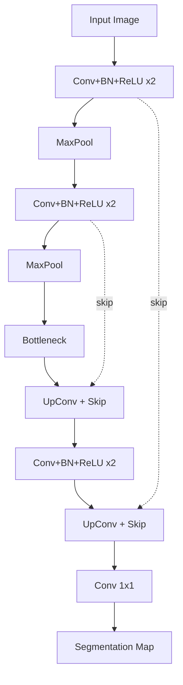

# U-Net Variants for Synchrotron Data

## Original U-Net Architecture

**Reference**: Ronneberger et al. (2015), "U-Net: Convolutional Networks for Biomedical Image Segmentation"

### Architecture

```
Input (1ch, 572×572)
    │
    ▼ [Encoder Path]
    Conv3×3→ReLU→Conv3×3→ReLU ─────────────────────────────┐ (skip connection)
    │ MaxPool 2×2                                            │
    Conv3×3→ReLU→Conv3×3→ReLU ──────────────────────┐       │
    │ MaxPool 2×2                                    │       │
    Conv3×3→ReLU→Conv3×3→ReLU ─────────────┐       │       │
    │ MaxPool 2×2                            │       │       │
    Conv3×3→ReLU→Conv3×3→ReLU ──────┐       │       │       │
    │ MaxPool 2×2                    │       │       │       │
    │                                │       │       │       │
    ▼ [Bottleneck]                   │       │       │       │
    Conv3×3→ReLU→Conv3×3→ReLU       │       │       │       │
    │                                │       │       │       │
    ▼ [Decoder Path]                 │       │       │       │
    UpConv 2×2 ──── Concatenate ─────┘       │       │       │
    Conv3×3→ReLU→Conv3×3→ReLU               │       │       │
    UpConv 2×2 ──── Concatenate ─────────────┘       │       │
    Conv3×3→ReLU→Conv3×3→ReLU                       │       │
    UpConv 2×2 ──── Concatenate ─────────────────────┘       │
    Conv3×3→ReLU→Conv3×3→ReLU                               │
    UpConv 2×2 ──── Concatenate ─────────────────────────────┘
    Conv3×3→ReLU→Conv3×3→ReLU
    │
    ▼
    Conv1×1 → Output (Nclass channels)
```

### Key Design Principles
- **Encoder**: Progressively extracts features at multiple scales
- **Decoder**: Progressively upsamples to original resolution
- **Skip connections**: Preserve fine spatial details from encoder
- **Symmetric structure**: Equal depth in encoder and decoder

### PyTorch Implementation (Minimal)

```python
import torch
import torch.nn as nn

class DoubleConv(nn.Module):
    def __init__(self, in_ch, out_ch):
        super().__init__()
        self.conv = nn.Sequential(
            nn.Conv2d(in_ch, out_ch, 3, padding=1),
            nn.BatchNorm2d(out_ch),
            nn.ReLU(inplace=True),
            nn.Conv2d(out_ch, out_ch, 3, padding=1),
            nn.BatchNorm2d(out_ch),
            nn.ReLU(inplace=True),
        )

    def forward(self, x):
        return self.conv(x)

class UNet(nn.Module):
    def __init__(self, in_channels=1, out_channels=2, features=[64, 128, 256, 512]):
        super().__init__()
        self.encoder = nn.ModuleList()
        self.decoder = nn.ModuleList()
        self.pool = nn.MaxPool2d(2, 2)

        # Encoder
        for f in features:
            self.encoder.append(DoubleConv(in_channels, f))
            in_channels = f

        # Bottleneck
        self.bottleneck = DoubleConv(features[-1], features[-1] * 2)

        # Decoder
        for f in reversed(features):
            self.decoder.append(nn.ConvTranspose2d(f * 2, f, 2, stride=2))
            self.decoder.append(DoubleConv(f * 2, f))

        self.final = nn.Conv2d(features[0], out_channels, 1)

    def forward(self, x):
        skips = []
        for enc in self.encoder:
            x = enc(x)
            skips.append(x)
            x = self.pool(x)

        x = self.bottleneck(x)

        skips = skips[::-1]
        for i in range(0, len(self.decoder), 2):
            x = self.decoder[i](x)      # upsample
            x = torch.cat([x, skips[i // 2]], dim=1)  # skip connection
            x = self.decoder[i + 1](x)  # double conv

        return self.final(x)
```

## Attention U-Net

**Enhancement**: Adds attention gates at skip connections to focus on relevant regions.

```
Skip connection → Attention Gate → Filtered features → Concatenation
                       ↑
              Decoder features (query)
```

### Attention Gate
```
g (decoder features) ──→ Conv1×1 ──┐
                                    ├──→ ReLU → Conv1×1 → Sigmoid → α
x (skip features) ─────→ Conv1×1 ──┘
                                         ↓
                              x_filtered = x × α
```

### Benefits for Synchrotron Data
- Suppresses irrelevant regions (background, artifacts)
- Focuses on structures of interest (cells, pores)
- Particularly useful when features are sparse in large volumes

## nnU-Net (Self-Configuring U-Net)

**Reference**: Isensee et al. (2021), Nature Methods

### Key Innovation
Automatically configures all U-Net hyperparameters based on dataset properties:

| Parameter | nnU-Net Decision Logic |
|-----------|----------------------|
| 2D vs 3D | Based on voxel spacing anisotropy |
| Patch size | Fits within GPU memory, covers largest structures |
| Batch size | Maximizes GPU utilization |
| Normalization | Instance norm (most cases) or batch norm |
| Loss function | Dice + Cross-entropy (default) |
| Data augmentation | Rotation, scaling, elastic deformation, gamma |
| Postprocessing | Connected component analysis, size filtering |

### Pipeline
```
Raw dataset (images + labels)
    │
    ├─→ Dataset fingerprinting (spacing, size, class distribution)
    │
    ├─→ Configuration selection (2D, 3D-fullres, 3D-lowres, cascade)
    │
    ├─→ Training (5-fold cross-validation)
    │
    ├─→ Postprocessing optimization
    │
    └─→ Ensemble selection (best individual or ensemble)
```

### Relevance to Synchrotron
- Handles anisotropic voxel sizes (common in tomography)
- Cascaded approach for large volumes: coarse 3D → fine 3D
- Consistently state-of-the-art across diverse segmentation tasks
- Reduces need for architecture search expertise

## 3D U-Net

### 2D vs 3D Trade-offs

| Aspect | 2D U-Net | 3D U-Net |
|--------|----------|----------|
| **Memory** | Low (~1 GB) | High (4-16 GB per patch) |
| **Context** | Single slice | 3D volumetric context |
| **Consistency** | May have slice-to-slice artifacts | Naturally consistent in z |
| **Training data** | More slices from fewer volumes | Needs more 3D labeled volumes |
| **Speed** | Fast | 5-10× slower |

### Strategies for Large Volumes (2048³)

1. **Patch-based inference**: Process overlapping 3D patches (64³ to 128³)
2. **Sliding window**: Overlap patches to avoid boundary artifacts
3. **Cascaded**: Low-resolution 3D → crop ROI → high-resolution 3D
4. **2.5D**: Use 3-5 adjacent slices as multi-channel 2D input

### Memory Management

```python
# Patch-based inference for large volumes
def segment_volume(model, volume, patch_size=128, overlap=32):
    """Segment large volume using overlapping patches."""
    result = np.zeros_like(volume, dtype=np.float32)
    count = np.zeros_like(volume, dtype=np.float32)
    step = patch_size - overlap

    for z in range(0, volume.shape[0] - patch_size + 1, step):
        for y in range(0, volume.shape[1] - patch_size + 1, step):
            for x in range(0, volume.shape[2] - patch_size + 1, step):
                patch = volume[z:z+patch_size, y:y+patch_size, x:x+patch_size]
                pred = model.predict(patch[np.newaxis, np.newaxis])[0, 0]
                result[z:z+patch_size, y:y+patch_size, x:x+patch_size] += pred
                count[z:z+patch_size, y:y+patch_size, x:x+patch_size] += 1

    return result / np.maximum(count, 1)
```

## Synchrotron-Specific Adaptations

### 1. Multi-Channel Input
- XRF: Use multiple elemental channels as input (like RGB for natural images)
- Tomography: Phase + absorption as dual-channel input
- Spectroscopy: Multiple energy images as channels

### 2. Loss Functions for Imbalanced Data
```python
# Dice loss (better for small structures)
def dice_loss(pred, target, smooth=1e-5):
    pred_flat = pred.flatten()
    target_flat = target.flatten()
    intersection = (pred_flat * target_flat).sum()
    return 1 - (2 * intersection + smooth) / (pred_flat.sum() + target_flat.sum() + smooth)

# Focal loss (down-weights easy examples)
def focal_loss(pred, target, alpha=0.25, gamma=2.0):
    ce = F.binary_cross_entropy(pred, target, reduction='none')
    pt = torch.where(target == 1, pred, 1 - pred)
    return (alpha * (1 - pt)**gamma * ce).mean()
```

### 3. Pre-training Strategies
- Pre-train on simulated synchrotron data (known ground truth)
- Transfer from medical imaging models (similar data characteristics)
- Self-supervised pre-training on unlabeled synchrotron volumes

## Strengths and Limitations

### Strengths
- High accuracy with relatively few labeled examples (50-200 for 2D)
- Preserves fine spatial details through skip connections
- Flexible architecture: adaptable to 2D, 3D, multi-channel
- Well-established ecosystem (nnU-Net automates configuration)

### Limitations
- Requires labeled training data (even if small amounts)
- Large 3D volumes require careful memory management
- Class imbalance can dominate training (need Dice/focal loss)
- Domain shift: model trained on one beamline may fail on another
- No built-in uncertainty quantification (need ensemble or MC dropout)

## Architecture diagram


