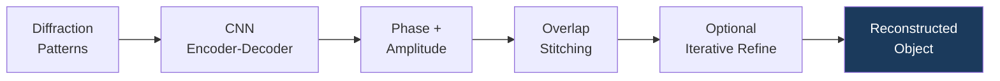

# Reconstruction Methods

## Overview

Reconstruction is the computational process of recovering an image or volume from
indirect measurements. In synchrotron science, this encompasses tomographic
reconstruction (projections → 3D volume) and phase retrieval (diffraction patterns →
complex image).

## Method Landscape

```
Reconstruction Methods
├── Classical Analytical
│   ├── FBP (Filtered Back Projection)
│   └── Gridrec (FFT-based FBP)
│
├── Classical Iterative
│   ├── SIRT, MLEM, CGLS
│   └── Model-based (MBIR)
│
├── GPU-Accelerated Classical
│   └── TomocuPy (20-30× speedup)
│
├── DL Post-Processing
│   └── FBPConvNet (FBP → CNN cleanup)
│
├── Learned Iterative
│   └── Unrolled optimization with learned components
│
├── Neural Representations
│   └── INR (continuous coordinate → value mapping)
│
├── Generative Models
│   └── Diffusion models for CT (score-based priors + data consistency)
│
└── Physics-Informed
    ├── PINNs (physical forward models as constraints)
    └── Neural Operators (FNO, DeepONet for PDE-based reconstruction)
```

## Directory Contents

| File | Content |
|------|---------|
| [tomocupy.md](tomocupy.md) | GPU-accelerated reconstruction (CuPy-based) |
| [ptychonet.md](ptychonet.md) | CNN-based ptychographic phase retrieval |
| [inr_dynamic.md](inr_dynamic.md) | Implicit Neural Representations for dynamic tomography |
| [diffusion_ct.md](diffusion_ct.md) | Score-based diffusion models for CT reconstruction |
| [pinns_xray.md](pinns_xray.md) | Physics-Informed Neural Networks and Neural Operators for X-ray reconstruction |

## Architecture diagram

_CNN replaces iterative phase retrieval: single forward pass produces initial reconstruction, optional refinement recovers fine details._


