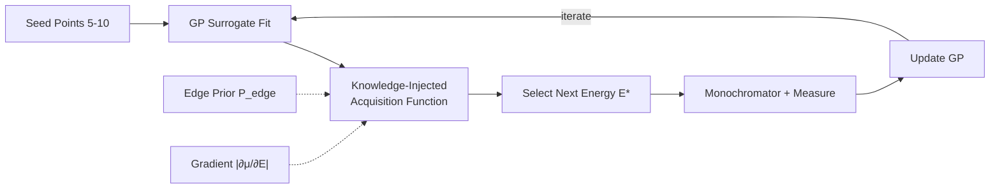

# Paper Review: Demonstration of an AI-Driven Workflow for Dynamic X-Ray Spectroscopy

## Metadata

| Field              | Value                                                                                  |
|--------------------|----------------------------------------------------------------------------------------|
| **Title**          | Demonstration of an AI-Driven Workflow for Dynamic X-Ray Spectroscopy                  |
| **Authors**        | Du, M.; Wolfman, M.; Sun, C.; Kelly, S. D.; Cherukara, M. J.                         |
| **Journal**        | npj Computational Materials, 11, 320                                                    |
| **Year**           | 2025                                                                                   |
| **DOI**            | [10.1038/s41524-025-01771-7](https://doi.org/10.1038/s41524-025-01771-7)               |
| **Beamline**       | APS 25-ID-C, 20-BM, 10-ID                                                             |
| **Modality**       | X-ray Absorption Spectroscopy (XANES)                                                  |

---

## TL;DR

This paper introduces a knowledge-injected Bayesian optimization approach for adaptive
XANES data collection that incorporates domain-specific understanding of spectral
features (absorption edges, pre-edge peaks, white lines). The method reconstructs
accurate XANES spectra using only 15--20% of the measurement points typically needed
by conventional sampling, while maintaining absorption edge errors below 0.1 eV and
overall RMSE below 0.005. Demonstrated live at APS beamline 25-ID-C on NMC battery
electrode discharge, the workflow integrates with Bluesky for fully autonomous
spectroscopy experiments.

---

## Background & Motivation

X-ray absorption near edge structure (XANES) spectroscopy is a powerful technique for
characterizing the chemical state and local symmetry of individual elements within
materials. Conventional XANES measurements require scanning through hundreds of energy
points across the absorption edge, which is time-consuming and limits temporal
resolution for dynamic experiments tracking chemical changes in batteries, catalysts,
and other operando systems.

**Key challenges**:

- **Under-sampling risk**: Too few energy points near the absorption edge causes
  important spectral features (pre-edge peaks, white line, edge inflection) to be
  missed, leading to incorrect chemical state assignments.
- **Over-sampling waste**: Flat pre-edge and post-edge regions are sampled at the same
  density as the rapidly varying edge region, wasting precious beam time.
- **Dynamic experiments**: In-situ studies of battery cycling, catalytic reactions, and
  phase transformations require high temporal resolution, making slow sequential
  scanning a fundamental bottleneck.
- **Human expertise dependency**: Optimal energy grid design requires expert knowledge
  of each element's edge structure, creating a barrier to high-throughput and
  autonomous operation.

**Prior approaches**:

- Standard BO with Gaussian Process surrogates can adaptively sample spectra, but
  generic acquisition functions (variance-only, UCB) are unaware of XANES physics.
  They waste samples in uninteresting regions and may miss sharp edge features.
- Pre-defined grids (k-space, log-spaced) encode some domain knowledge but are static
  and cannot adapt to unexpected spectral features or varying edge shapes across
  different samples.

---

## Method

### Data

| Item | Details |
|------|---------|
| **Data source** | APS beamlines 25-ID-C, 20-BM, 10-ID; both simulated and live experimental data |
| **Sample types** | Pt/Al₂O₃ catalyst (reduction), LTO (lithium titanate) electrode, NMC (LiNi₁/₃Mn₁/₃Co₁/₃O₂) battery electrode |
| **Data dimensions** | 1D energy-absorption spectra, typically 200--500 energy points spanning 100--300 eV range |
| **Preprocessing** | Energy normalization, background subtraction, edge-step normalization |

### Model / Algorithm

**Gaussian Process Surrogate**: A GP with Matérn kernel models the unknown XANES
spectrum as a function of incident X-ray energy. The posterior mean provides the
best estimate of the spectrum at unmeasured energies, while the posterior variance
quantifies uncertainty.

**Knowledge-Injected Acquisition Function**: The key innovation is a custom
acquisition function that combines GP uncertainty with domain-specific knowledge
about XANES spectral structure:

1. **Gradient-aware term**: The acquisition function is proportional to the estimated
   rate of change of absorption with energy, directing more samples to rapidly varying
   regions (absorption edge, pre-edge peaks) and fewer to flat regions (pre-edge
   baseline, post-edge continuum).
2. **Edge-detection term**: A learned prior on absorption edge location focuses
   sampling around the expected edge energy, while still allowing exploration of
   unexpected features.
3. **Uncertainty term**: Standard GP variance ensures global coverage and prevents
   large gaps.

```
α(E) = w₁ · |∂μ(E)/∂E| + w₂ · σ(E) + w₃ · P_edge(E)

where:
  μ(E) = GP posterior mean at energy E
  σ(E) = GP posterior standard deviation
  P_edge(E) = prior probability of edge region
  w₁, w₂, w₃ = weighting parameters
```

**Integration with Bluesky**: The algorithm communicates with the beamline via the
Bluesky experimental framework. After each measurement, the measured absorption is
fed back to update the GP, and the acquisition function determines the next energy
point. The Bluesky RunEngine executes the monochromator move and data collection
automatically.

### Pipeline

```
Initial broad sweep (5-10 seed points)
  --> GP surrogate fit
  --> Knowledge-injected acquisition function evaluation
  --> Select next energy point E*
  --> Monochromator moves to E*, collect I₀ and I_t
  --> Compute absorption μ(E*) = -ln(I_t/I₀)
  --> Update GP with new observation
  --> Repeat until convergence or budget exhausted
  --> Interpolate final spectrum from GP posterior mean
  --> (Optional) Linear combination fitting for species quantification
```

---

## Key Results

| Metric                                      | Value / Finding                                         |
|---------------------------------------------|--------------------------------------------------------|
| Measurement reduction                       | 80--85% fewer energy points than conventional grid      |
| Absorption edge energy error                | < 0.1 eV                                               |
| White line peak energy error                | < 0.03 eV                                              |
| Overall RMSE vs. conventional               | < 0.005 (normalized absorption units)                   |
| LTO: species fraction tracking error        | Max 0.2% error in percentage trajectory                 |
| Pt catalyst: edge position accuracy         | Reproduces reduction kinetics within experimental error |
| NMC live experiment                         | Successful in-situ discharge tracking at 25-ID-C       |
| Bluesky integration                         | Real-time closed-loop operation demonstrated            |

### Key Figures

- **Figure 2**: Comparison of conventional vs. adaptive sampling on a Pt L₃-edge
  XANES spectrum, showing how the knowledge-injected BO places more points near the
  white line and absorption edge while sparse-sampling the flat pre-edge and post-edge.
- **Figure 4**: LTO XANES spectra at multiple states of charge reconstructed from
  adaptive sampling (15--20% of points) overlaid with conventional dense scans,
  demonstrating near-identical spectral shapes and accurate edge-shift tracking.
- **Figure 6**: Live NMC battery discharge experiment at APS 25-ID-C, showing the
  autonomous workflow collecting Ni K-edge XANES spectra during electrochemical
  cycling with accurate oxidation state tracking.

---

## Data & Code Availability

| Resource       | Link / Note                                                           |
|----------------|-----------------------------------------------------------------------|
| **Code**       | Expected to be released via Argonne GitHub                            |
| **Data**       | Available upon request from APS                                       |
| **License**    | Not yet stated                                                        |

**Reproducibility Score**: **3 / 5** -- Method is well-described with sufficient
detail for reimplementation. The Bluesky integration is documented. Live experiment
data and code availability will improve upon formal release.

---

## Strengths

- **Domain knowledge injection**: The custom acquisition function leverages XANES
  physics (edge structure, gradient sensitivity) to dramatically outperform generic
  BO, reducing measurement count by 80--85% while preserving spectral accuracy.
- **Live beamline demonstration**: Unlike many adaptive sampling papers that only
  show simulation results, this work demonstrates end-to-end autonomous operation
  at APS 25-ID-C with real electrochemical experiments.
- **Bluesky integration**: The workflow is built on the standard Bluesky/Ophyd
  framework used at APS, NSLS-II, and other light sources, making adoption
  straightforward for existing beamline infrastructure.
- **Dynamic experiment capability**: The 5x speedup directly enables time-resolved
  XANES with finer temporal resolution, critical for operando battery, catalysis,
  and environmental science experiments.
- **Quantitative validation**: Rigorous comparison against conventional sampling
  with well-defined error metrics (edge position, white line, RMSE, species fraction).
- **Argonne pedigree**: All authors from APS, ensuring direct applicability to
  BER program beamlines and compatibility with existing infrastructure.

---

## Limitations & Gaps

- **Element-specific tuning**: The edge-detection prior and gradient weighting may
  need adjustment for different elements and edge types (K-edge vs. L-edge vs.
  M-edge), requiring some expert configuration per element.
- **Multi-edge experiments**: The current implementation handles single-edge XANES;
  extension to multi-edge or EXAFS (which requires different sampling strategies
  in k-space) is not addressed.
- **Convergence criteria**: The stopping criterion for determining when enough points
  have been collected is not rigorously defined; the GP uncertainty threshold is
  heuristic.
- **Beam stability assumption**: The method assumes stable beam intensity during
  the adaptive scan; beam trips or intensity fluctuations during long operando
  experiments could affect GP predictions.
- **No comparison with deep learning approaches**: The paper does not compare against
  emerging neural network methods for spectral reconstruction or interpolation.

---

## Relevance to APS BER Program

This paper is directly produced by the APS team and demonstrates technology immediately
deployable at BER program beamlines:

- **Applicable beamlines**: 25-ID-C (demonstrated), 20-BM, 10-ID, and any APS
  beamline performing XANES spectroscopy (9-BM, 12-BM). Particularly relevant for
  operando experiments at environmental and energy science beamlines.
- **Bluesky-native**: The Bluesky integration means this workflow can be deployed
  at any BER program beamline already running the Bluesky framework with minimal
  additional development.
- **Operando science enabler**: The 5x measurement speedup directly enables the
  BER program's operando battery, catalysis, and environmental remediation research
  to achieve finer time resolution during dynamic processes.
- **Adaptive experiment paradigm**: This work exemplifies the BER program's vision
  of AI-driven autonomous experiments, complementing ROI-Finder (spatial) and
  AI-NERD (XPCS dynamics) with spectroscopic adaptive sampling.
- **APS-U synergy**: The increased flux at APS-U will demand faster, smarter
  data collection strategies; this knowledge-injected BO approach scales naturally
  with higher photon rates.
- **Priority**: **High** -- Immediate deployment potential with proven Bluesky
  integration, directly addresses BER program's autonomous experiment goals, and
  produced by the APS scientific computing team.

---

## Actionable Takeaways

1. **Deploy at BER spectroscopy beamlines**: The Bluesky-native implementation
   can be installed at 20-BM and 9-BM for immediate use in operando XANES
   experiments.
2. **Extend to EXAFS**: Develop a k-space-aware acquisition function variant
   that adaptively samples the extended fine structure region using appropriate
   weighting in k-space rather than energy-space.
3. **Multi-edge mode**: Implement sequential or parallel adaptive sampling
   across multiple absorption edges for multi-element operando studies.
4. **Couple with AI-NERD**: Combine spectroscopic adaptive sampling with
   AI-NERD's dynamics classification for joint spatiotemporal-spectral
   autonomous experiments.
5. **Uncertainty propagation**: Propagate the GP uncertainty through linear
   combination fitting to provide confidence intervals on species fractions,
   enabling automated quality control for autonomous experiments.
6. **Training data for ML**: Use the efficiently collected spectra as training
   data for neural network spectral classifiers, creating a virtuous cycle
   between adaptive collection and ML analysis.

---

## BibTeX Citation

```bibtex
@article{du2025aidriven_xanes,
  title     = {Demonstration of an {AI}-driven workflow for dynamic x-ray
               spectroscopy},
  author    = {Du, Ming and Wolfman, Mark and Sun, Chengjun and Kelly, Shelly D.
               and Cherukara, Mathew J.},
  journal   = {npj Computational Materials},
  volume    = {11},
  pages     = {320},
  year      = {2025},
  publisher = {Nature Publishing Group},
  doi       = {10.1038/s41524-025-01771-7}
}
```

---

## Notes & Discussion

This paper represents a significant step in the APS team's autonomous experiment
portfolio. Together with AI-NERD (autonomous XPCS dynamics, 2024) and ROI-Finder
(autonomous XRF region selection, 2022), the knowledge-injected BO for XANES
completes a triad of AI-driven experimental workflows spanning three major
synchrotron modalities. The Bluesky integration pattern established here provides
a template for deploying other adaptive algorithms at APS beamlines.

Cross-references:
- See `review_ai_nerd_2024.md` for complementary autonomous dynamics workflow
- See `review_roi_finder_2022.md` for autonomous spatial ROI selection
- See `03_ai_ml_methods/autonomous_experiment/bayesian_optimization.md` for BO fundamentals

---

## Review Metadata

| Field | Value |
|-------|-------|
| **Reviewed by** | APS BER AI/ML Team |
| **Review date** | 2026-03-06 |
| **Last updated** | 2026-03-06 |
| **Tags** | XANES, Bayesian-optimization, adaptive-sampling, autonomous, spectroscopy, operando, Bluesky |

## Architecture diagram


