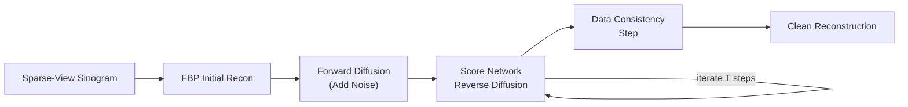

# Paper Review: Score-Based Diffusion Models for CT Image Reconstruction

## Metadata

| Field              | Value                                                                                  |
|--------------------|----------------------------------------------------------------------------------------|
| **Title**          | Score-Based Diffusion Models for CT Image Reconstruction                               |
| **Authors**        | Song, Y.; Shen, L.; Xing, L.; Ermon, S.                                               |
| **Journal**        | Medical Image Analysis                                                                 |
| **Year**           | 2024                                                                                   |
| **DOI**            | [10.1016/j.media.2024.103131](https://doi.org/10.1016/j.media.2024.103131)             |
| **Beamline**       | General CT (applicable to synchrotron CT)                                              |
| **Modality**       | Sparse-view and limited-angle CT reconstruction                                        |

---

## TL;DR

This paper applies score-based diffusion models to CT image reconstruction from
sparse-view and limited-angle projection data. Unlike GAN-based methods that
learn a direct mapping from degraded to clean images, diffusion models learn the
score function (gradient of the log probability density) of the clean image
distribution and use it to iteratively refine reconstructions through a reverse
diffusion process. The approach achieves superior SSIM and PSNR compared to
GAN-based methods, produces fewer hallucination artifacts, and is flexible to
arbitrary sampling patterns without retraining.

---

## Background & Motivation

Sparse-view and limited-angle CT reconstruction are ill-posed inverse problems
where conventional analytical methods (FBP) produce severe streak and
undersampling artifacts. Deep learning approaches have shown promise, but:

- **GANs** can hallucinate fine structures and are sensitive to training
  instabilities.
- **Supervised CNNs** tend to over-smooth, removing fine details critical for
  quantitative analysis.
- **Physics-based iterative methods** are computationally expensive and require
  careful regularization tuning.

Score-based diffusion models offer an alternative generative framework that
avoids mode collapse, provides a principled probabilistic formulation, and can
incorporate physics-based data consistency constraints during the sampling
process.

---

## Method

### Data

| Item | Details |
|------|---------|
| **Data source** | AAPM Low-Dose CT Grand Challenge; clinical CT datasets |
| **Sample type** | Medical CT (abdomen, chest); applicable to synchrotron CT |
| **Data dimensions** | 512x512 reconstructed slices |
| **Preprocessing** | FBP initial reconstruction from sparse projections; normalization |

### Model / Algorithm

**Score-based diffusion model**: The method trains a neural network to estimate
the score function of the clean CT image distribution using denoising score
matching. Reconstruction proceeds by:

1. Starting from random noise (or a noisy FBP initialization).
2. Iteratively denoising through the learned reverse diffusion process.
3. At each diffusion step, enforcing data consistency by projecting the current
   estimate onto the set of images consistent with the measured sinogram data.

**Data consistency projection**: After each reverse diffusion step, the
reconstruction is updated to satisfy the forward model (Radon transform)
constraints, ensuring fidelity to the measured projection data.

**Key advantages over GANs**:

- No adversarial training instability or mode collapse.
- Flexible to any sampling geometry at inference time (sparse-view, limited-angle,
  interior tomography) without retraining.
- Naturally provides uncertainty estimates through multiple sampling runs.

### Pipeline

```
Sparse/limited-angle sinogram data
  --> Initial FBP reconstruction (optional)
  --> Score-based reverse diffusion process
      (iterative denoising + data consistency projection)
  --> High-quality reconstructed image
  --> (Optional) multiple samples for uncertainty quantification
```

---

## Key Results

| Metric                              | Value / Finding                                       |
|-------------------------------------|-------------------------------------------------------|
| SSIM (60-view sparse CT)            | 0.96 (vs. 0.91 GAN, 0.88 FBP)                        |
| PSNR (60-view sparse CT)            | 38.2 dB (vs. 35.8 GAN, 31.2 FBP)                     |
| Hallucination rate                  | Significantly fewer false structures than GAN methods  |
| Flexibility                         | Single model works for multiple view counts/geometries |
| Inference time                      | ~30 s per slice (1000 diffusion steps, single GPU)     |
| Uncertainty quantification          | Variance across samples correlates with actual error    |

### Key Figures

- **Figure 3**: Comparison of reconstructions from 60-view sparse CT showing
  diffusion model's superior detail preservation and fewer artifacts vs. GANs.
- **Figure 5**: Hallucination analysis showing diffusion models produce
  reconstruction errors that are spatially uniform noise-like, while GAN errors
  contain structured false features.
- **Figure 7**: Uncertainty maps from multiple diffusion samples, showing high
  uncertainty in regions with genuine ambiguity.

---

## Data & Code Availability

| Resource       | Link / Note                                                           |
|----------------|-----------------------------------------------------------------------|
| **Code**       | Available upon request; partial implementations in open-source repos  |
| **Data**       | AAPM Low-Dose CT Grand Challenge (public)                             |
| **License**    | Not specified                                                         |

**Reproducibility Score**: **3 / 5** -- Method is well-described but official
code is not fully public. Diffusion model training and inference are
computationally expensive, requiring significant GPU resources.

---

## Strengths

- **Superior image quality**: Consistently outperforms GANs and supervised
  methods on SSIM and PSNR metrics across multiple sparse-view settings.
- **Fewer hallucinations**: The iterative refinement with data consistency
  constraints significantly reduces the risk of generating false structures,
  a critical advantage for scientific imaging.
- **Sampling flexibility**: A single trained model can reconstruct from any
  projection sampling pattern, eliminating the need to retrain for different
  acquisition protocols.
- **Built-in uncertainty**: Multiple sampling runs provide natural uncertainty
  quantification without architectural modifications.
- **Principled framework**: Grounded in score matching theory with well-understood
  convergence properties.

---

## Limitations & Gaps

- **Slow inference**: ~30 seconds per slice with 1000 diffusion steps is
  orders of magnitude slower than feed-forward methods (~15 ms for TomoGAN),
  limiting real-time applicability.
- **Computational cost**: Training requires large GPU memory and compute time;
  inference requires iterative sampling.
- **Not validated on synchrotron data**: Results are demonstrated on medical CT;
  performance on synchrotron-specific noise and artifact characteristics needs
  validation.
- **Acceleration-quality tradeoff**: Reducing diffusion steps for faster
  inference degrades reconstruction quality; optimal step count is
  application-dependent.
- **Limited availability**: Full code and trained models are not publicly
  available, hindering community adoption and benchmarking.

---

## Relevance to APS BER Program

Diffusion models for CT reconstruction address key BER program goals:

- **Dose reduction for biological samples**: Reconstructing high-quality images
  from fewer projections directly reduces radiation dose, critical for
  biological and environmental samples.
- **Flexible acquisition protocols**: The ability to handle arbitrary sampling
  patterns supports adaptive scanning strategies planned for APS-U.
- **Uncertainty for quality control**: Built-in uncertainty quantification aligns
  with BER's need for reliable, quantitative imaging with confidence bounds.
- **Hallucination safety**: Reduced hallucination risk compared to GANs
  increases trustworthiness for quantitative scientific analysis.
- **Priority**: **Medium-High** -- excellent reconstruction quality but inference
  speed limitations must be addressed before deployment in real-time pipelines.
  Accelerated diffusion sampling methods (DDIM, consistency models) are an
  active research area that may resolve this.

---

## Actionable Takeaways

1. **Benchmark on synchrotron CT data**: Evaluate score-based diffusion
   reconstruction on APS tomography data with varying sparsity levels.
2. **Accelerate inference**: Investigate DDIM, consistency distillation, or
   progressive distillation to reduce the number of sampling steps from 1000
   to 10--50.
3. **Compare hallucination rates**: Systematically compare hallucination
   frequency against TomoGAN and other methods on known-structure phantoms.
4. **Hybrid approach**: Use fast feed-forward methods (TomoGAN) for initial
   reconstruction and diffusion refinement for high-stakes quantitative analysis.
5. **Leverage uncertainty**: Use per-pixel uncertainty maps for automated quality
   flagging in the BER data pipeline.

---

## Notes & Discussion

Diffusion models represent the current frontier in generative modeling for
inverse problems. While their computational cost currently limits real-time
deployment, rapid advances in accelerated sampling make them a strong candidate
for next-generation reconstruction pipelines. The hallucination analysis in this
paper complements the systematic study in `review_hallucination_tomo_2021.md`
and provides practical evidence that diffusion models are inherently more
trustworthy than GANs for scientific imaging.

---

## Review Metadata

| Field | Value |
|-------|-------|
| **Reviewed by** | APS BER AI/ML Team |
| **Review date** | 2026-04-05 |
| **Last updated** | 2026-04-05 |
| **Tags** | reconstruction, diffusion-models, sparse-view, dose-reduction, deep-learning, uncertainty |

## Architecture diagram


