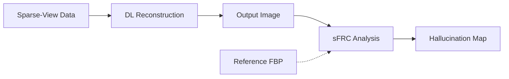

# Paper Review: On Hallucinations in Tomographic Image Reconstruction

## Metadata

| Field              | Value                                                                                  |
|--------------------|----------------------------------------------------------------------------------------|
| **Title**          | On Hallucinations in Tomographic Image Reconstruction                                  |
| **Authors**        | Bhadra, S.; Kelkar, V. A.; Brooks, F. J.; Anastasio, M. A.                            |
| **Journal**        | IEEE Transactions on Medical Imaging                                                   |
| **Year**           | 2021                                                                                   |
| **DOI**            | [10.1109/TMI.2021.3077857](https://doi.org/10.1109/TMI.2021.3077857)                  |
| **Beamline**       | General (applicable to synchrotron CT)                                                 |
| **Modality**       | Tomographic image reconstruction (CT)                                                  |

---

## TL;DR

This paper presents a systematic study of hallucination artifacts -- false
structures generated by deep learning-based tomographic reconstruction methods
that appear plausible but have no physical basis. The authors quantify the
conditions under which DL methods (including U-Net, GAN-based, and
learned iterative approaches) hallucinate, demonstrating that hallucinations
increase with undersampling severity and are correlated with training
distribution mismatch. They propose the sectored Fourier Ring Correlation (sFRC)
metric for detecting hallucinations without ground truth, providing a practical
tool for quality control in deployed DL reconstruction systems.

---

## Background & Motivation

Deep learning methods for tomographic reconstruction have shown impressive
improvements in image quality metrics (PSNR, SSIM) over classical methods,
but concerns about their reliability for scientific imaging remain:

- **Hallucination risk**: DL methods can generate realistic-looking structures
  that do not exist in the actual sample. In scientific imaging, such artifacts
  could lead to incorrect scientific conclusions.
- **Metric limitations**: Standard metrics (PSNR, SSIM) measure average image
  quality but do not specifically detect localized hallucinations -- a
  reconstruction with high SSIM can still contain hallucinated features in
  scientifically critical regions.
- **Deployment barrier**: Without tools to detect and quantify hallucinations,
  the scientific community cannot confidently deploy DL reconstruction methods
  for quantitative analysis.
- **Lack of systematic analysis**: Prior work acknowledged hallucination risk
  anecdotally but did not provide rigorous, quantitative characterization.

---

## Method

### Data

| Item | Details |
|------|---------|
| **Data source** | Simulated CT data with known ground truth; clinical CT datasets |
| **Sample type** | Numerical phantoms (Shepp-Logan, realistic anatomy); clinical images |
| **Data dimensions** | 256x256 and 512x512 reconstructed images |
| **Preprocessing** | Simulated sparse-view and limited-angle sinograms from ground truth images |

### Experimental Design

The authors systematically vary:

1. **Undersampling level**: Number of projection views (sparse-view) and
   angular range (limited-angle) to characterize hallucination onset.
2. **Network architecture**: U-Net (post-processing), conditional GAN, learned
   primal-dual (iterative unrolling) to compare hallucination behavior across
   method classes.
3. **Training-test distribution shift**: Test images drawn from distributions
   different from training data to characterize out-of-distribution
   hallucination behavior.

### Hallucination Detection: Sectored Fourier Ring Correlation (sFRC)

The sFRC metric extends the standard Fourier Ring Correlation (FRC) by:

- Computing FRC in angular sectors of Fourier space rather than full rings.
- Identifying directionally dependent resolution loss and hallucinated
  frequency content.
- Comparing the sFRC profile of a DL reconstruction against that expected
  from the measurement geometry, flagging sectors where the reconstruction
  contains information not supported by the data.

### Pipeline

```
Known ground truth images
  --> Simulated sparse/limited sinograms (forward model)
  --> DL reconstruction (U-Net, GAN, learned primal-dual)
  --> Comparison with ground truth (hallucination identification)
  --> sFRC analysis (hallucination detection without ground truth)
  --> Quantification of hallucination frequency vs. undersampling level
```

---

## Key Results

| Metric                              | Value / Finding                                       |
|-------------------------------------|-------------------------------------------------------|
| Hallucination frequency (severe undersampling) | Present in all tested DL methods         |
| GAN hallucination rate              | Highest among tested architectures                     |
| U-Net hallucination rate            | Moderate; tends to smooth rather than hallucinate      |
| Learned iterative (primal-dual)     | Lowest hallucination rate due to data consistency      |
| sFRC detection sensitivity          | Successfully identifies hallucinated frequency content |
| Distribution shift effect           | Out-of-distribution test data dramatically increases hallucinations |
| PSNR vs. hallucination correlation  | Weak -- high PSNR does not guarantee absence of hallucinations |

### Key Figures

- **Figure 2**: Examples of hallucinated structures in DL reconstructions from
  sparse-view CT, showing plausible but false anatomical features.
- **Figure 4**: Hallucination frequency as a function of undersampling level,
  demonstrating a threshold effect where hallucinations sharply increase below
  a critical number of views.
- **Figure 6**: sFRC maps showing how the metric identifies directional
  hallucinated content not supported by the measurement geometry.
- **Figure 8**: Distribution shift experiments showing dramatically increased
  hallucination rates when test data differs from training distribution.

---

## Data & Code Availability

| Resource       | Link / Note                                                           |
|----------------|-----------------------------------------------------------------------|
| **Code**       | sFRC implementation available from authors                            |
| **Data**       | Numerical phantoms (reproducible); clinical data restricted           |
| **License**    | Not specified                                                         |

**Reproducibility Score**: **4 / 5** -- Methodology is well-described and
numerical phantom experiments are fully reproducible. sFRC code available.
Clinical data experiments require access to restricted datasets.

---

## Strengths

- **Systematic and rigorous**: First comprehensive quantitative study of
  hallucinations across multiple DL reconstruction architectures and
  undersampling regimes.
- **Practical detection tool**: The sFRC metric provides a practical,
  ground-truth-free method for detecting hallucinations in deployed systems.
- **Architecture comparison**: Demonstrates that hallucination behavior varies
  significantly across method classes, providing guidance for method selection.
- **Distribution shift analysis**: Quantifies the critical impact of
  training-test mismatch on hallucination rates, highlighting the importance
  of representative training data.
- **Important for scientific imaging**: Directly addresses the trust barrier
  that prevents adoption of DL methods in quantitative scientific imaging.

---

## Limitations & Gaps

- **2D only**: Analysis is limited to 2D reconstructions; 3D hallucination
  characterization would be more relevant for volumetric tomography.
- **Simulated data focus**: Most experiments use numerical phantoms; real
  experimental data introduces additional noise and artifact characteristics
  not captured in simulation.
- **sFRC limitations**: The sFRC metric is effective for detecting frequency
  content not supported by the measurement geometry but may miss spatially
  localized hallucinations within the supported frequency band.
- **No mitigation strategies**: The paper characterizes but does not propose
  solutions for reducing hallucinations beyond architecture selection.
- **Limited to CT**: Analysis focuses on CT reconstruction; extension to other
  synchrotron modalities (ptychography, XRF) is not addressed.

---

## Relevance to APS BER Program

This paper is critically important for the BER program's DL deployment strategy:

- **Safety analysis for DL deployment**: Provides the quantitative framework
  needed to assess hallucination risk before deploying DL reconstruction at
  APS beamlines.
- **Quality control tool**: The sFRC metric can be integrated into BER
  processing pipelines as an automated quality check for DL reconstructions.
- **Method selection guidance**: The architecture comparison informs selection
  of DL methods for BER applications, favoring learned iterative methods
  (lower hallucination) over GANs (higher hallucination) for quantitative
  imaging.
- **Training data requirements**: The distribution shift analysis provides
  concrete guidance on training data diversity requirements for BER ML models.
- **Priority**: **Critical** -- hallucination detection is a prerequisite for
  trustworthy deployment of any DL reconstruction method in scientific imaging.

---

## Actionable Takeaways

1. **Implement sFRC in BER pipeline**: Integrate the sFRC metric as a standard
   quality control step in all BER DL reconstruction pipelines.
2. **Benchmark BER methods**: Characterize hallucination rates of TomoGAN,
   diffusion models, and other BER methods on APS-specific phantoms and data.
3. **Prefer data-consistent architectures**: Favor learned iterative methods
   with explicit data consistency enforcement over pure post-processing
   networks for quantitative imaging tasks.
4. **Training data diversity**: Ensure BER training datasets cover the full
   range of sample types and imaging conditions encountered at APS beamlines
   to minimize distribution shift.
5. **Develop 3D sFRC**: Extend the sFRC metric to 3D for volumetric
   tomographic reconstructions.
6. **Establish hallucination tolerance thresholds**: Work with domain scientists
   to define acceptable hallucination rates for different BER application areas.

---

## Notes & Discussion

This paper should be required reading for anyone deploying DL-based
reconstruction in scientific imaging. The finding that high PSNR does not
guarantee absence of hallucinations is particularly important -- it means that
standard image quality metrics are insufficient for validating DL methods in
scientific applications. The sFRC metric fills a critical gap but should be
complemented with additional hallucination detection strategies (uncertainty
quantification, ensemble disagreement) for comprehensive quality control.
The diffusion model approach reviewed in `review_diffusion_ct_2024.md` shows
promising hallucination reduction, which should be validated using the sFRC
framework proposed here.

---

## Review Metadata

| Field | Value |
|-------|-------|
| **Reviewed by** | APS BER AI/ML Team |
| **Review date** | 2026-04-05 |
| **Last updated** | 2026-04-05 |
| **Tags** | reconstruction, hallucination, quality-control, deep-learning, safety, tomography |

## Architecture diagram


