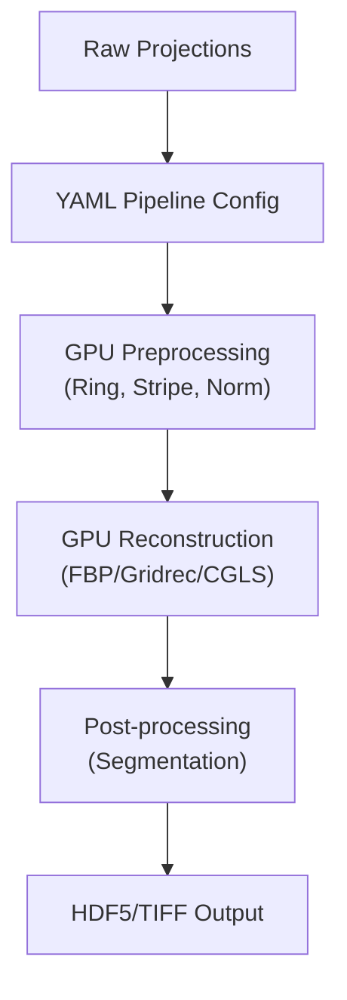

# Paper Review: HTTomo -- High Throughput Tomography Pipeline

## Metadata

| Field              | Value                                                                                  |
|--------------------|----------------------------------------------------------------------------------------|
| **Title**          | HTTomo: High Throughput Tomography Pipeline                                            |
| **Authors**        | Sherrell, D. et al. (Diamond Light Source)                                             |
| **Journal**        | Journal of Synchrotron Radiation                                                       |
| **Year**           | 2024                                                                                   |
| **DOI**            | [10.1107/S1600577524005095](https://doi.org/10.1107/S1600577524005095)                 |
| **Beamline**       | Diamond Light Source imaging beamlines                                                 |
| **Modality**       | Synchrotron X-ray Tomography (high-throughput)                                         |

---

## TL;DR

HTTomo is a modular, GPU-accelerated tomography processing pipeline designed for
high-throughput synchrotron beamlines. It addresses the data rate challenge posed
by modern high-speed detectors by providing a YAML-based configuration system
for chaining preprocessing, reconstruction, and post-processing steps as a
plugin architecture. HTTomo achieves near real-time processing of TB-scale
datasets and is designed for easy integration of new algorithms as plugins
without modifying the core framework.

---

## Background & Motivation

Modern synchrotron tomography beamlines generate data at rates that overwhelm
traditional processing pipelines:

- **Data rates**: High-speed detectors at upgraded facilities (Diamond-II, APS-U,
  ESRF-EBS) produce data at multi-GB/s, generating TB-scale datasets per
  experiment.
- **Processing bottleneck**: Sequential, monolithic processing scripts cannot
  keep pace, creating backlogs that delay scientific feedback.
- **Algorithm diversity**: Different experiments require different combinations
  of preprocessing, reconstruction, and post-processing steps, demanding
  flexible pipeline configuration.
- **Reproducibility**: Ad hoc scripts are difficult to reproduce, share, and
  version-control.

HTTomo addresses these challenges with a modular framework that leverages GPU
acceleration and a declarative configuration approach.

---

## Method

### Architecture

| Item | Details |
|------|---------|
| **Framework** | Python-based pipeline orchestrator with GPU-accelerated backends |
| **Configuration** | YAML-based workflow definition specifying processing chain |
| **Plugin system** | Modular plugins for each processing step (preprocessing, reconstruction, post-processing) |
| **GPU backends** | CuPy, TomoPy (GPU), custom CUDA kernels |
| **I/O** | HDF5/NeXus input; chunked processing for memory-efficient handling of large datasets |

### Pipeline Design

HTTomo uses a YAML configuration file to define the processing workflow:

```yaml
- method: normalize
  module_path: httomo.methods.preprocessing
  parameters:
    cutoff: 10

- method: find_center_vo
  module_path: httomo.methods.misc

- method: recon
  module_path: httomo.methods.reconstruction
  parameters:
    algorithm: FBP_CUDA
    center: auto
```

**Key design principles**:

- **Plugin architecture**: Each processing step is a self-contained plugin with
  standardized input/output interfaces. New algorithms can be added without
  modifying the core framework.
- **Chunk-based processing**: Large datasets are divided into chunks that fit in
  GPU memory, enabling processing of arbitrarily large volumes.
- **Automatic data transfer**: The framework manages CPU-GPU data transfer,
  minimizing boilerplate in plugin code.
- **MPI parallelism**: Distributed processing across multiple GPUs and nodes
  via MPI for cluster deployment.

### Pipeline

```
Raw projection data (HDF5/NeXus)
  --> YAML workflow configuration
  --> HTTomo pipeline orchestrator
      --> Preprocessing plugins (normalization, ring removal, phase retrieval)
      --> Reconstruction plugins (FBP, iterative, AI-based)
      --> Post-processing plugins (segmentation, quantification)
  --> Reconstructed volume (HDF5)
```

---

## Key Results

| Metric                              | Value / Finding                                       |
|-------------------------------------|-------------------------------------------------------|
| Processing throughput               | Near real-time for standard tomography datasets        |
| Dataset scale                       | TB-scale datasets processed without out-of-memory      |
| Configuration complexity            | Simple YAML files replace complex Python scripts       |
| Plugin development                  | New algorithms integrated in hours, not days           |
| Reproducibility                     | YAML configs serve as complete, version-controllable records |

### Key Figures

- **Figure 1**: Architecture diagram showing the plugin-based pipeline design
  with YAML configuration driving the processing chain.
- **Figure 3**: Throughput benchmarks demonstrating near real-time processing
  on representative Diamond Light Source datasets.

---

## Data & Code Availability

| Resource       | Link / Note                                                           |
|----------------|-----------------------------------------------------------------------|
| **Code**       | [github.com/DiamondLightSource/httomo](https://github.com/DiamondLightSource/httomo) |
| **Data**       | Example datasets included in repository                               |
| **License**    | Apache-2.0                                                            |

**Reproducibility Score**: **5 / 5** -- Fully open-source with comprehensive
documentation, example datasets, and active development. YAML-based
configuration inherently supports reproducibility.

---

## Strengths

- **Modular and extensible**: Plugin architecture allows easy addition of new
  algorithms (including AI/ML methods) without framework changes.
- **GPU-accelerated**: Leverages CuPy and CUDA backends for high-throughput
  processing compatible with modern data rates.
- **Declarative configuration**: YAML-based workflow definition is human-readable,
  version-controllable, and inherently reproducible.
- **Scalable**: Chunk-based processing and MPI support enable handling of
  arbitrarily large datasets across multi-GPU clusters.
- **Active development**: Maintained by Diamond Light Source with regular updates
  and community contributions.
- **Facility-proven**: Deployed and validated at Diamond Light Source beamlines.

---

## Limitations & Gaps

- **Diamond-centric defaults**: While generalizable, the default plugins and
  data formats are optimized for Diamond Light Source conventions; adaptation
  to APS data formats requires configuration.
- **Limited AI/ML integration**: Current plugin library focuses on classical
  algorithms; deep learning reconstruction and denoising plugins are still
  under development.
- **Documentation gaps**: Some advanced features (custom plugin development,
  MPI configuration) have limited documentation.
- **Single-modality focus**: Designed for tomography; extension to other
  synchrotron techniques (ptychography, XRF) would require significant work.

---

## Relevance to APS BER Program

HTTomo is directly applicable to the APS-U data processing challenge:

- **APS-U data rates**: The GPU-accelerated, chunk-based architecture is
  designed for exactly the TB-scale data rates expected at APS-U beamlines.
- **Pipeline standardization**: YAML-based configuration could standardize
  tomography processing across APS beamlines, improving reproducibility and
  reducing beamline scientist burden.
- **AI plugin integration**: The plugin architecture provides a natural framework
  for deploying BER program AI/ML methods (TomoGAN, diffusion models) as
  processing steps within a production pipeline.
- **Bluesky/Tiled integration**: HTTomo's modular design is compatible with
  integration into the Bluesky ecosystem as a processing backend.
- **Priority**: **High** -- directly addresses the APS-U data throughput
  challenge with a mature, facility-proven framework.

---

## Actionable Takeaways

1. **Evaluate for APS-U deployment**: Benchmark HTTomo on representative APS
   datasets and compare with existing APS processing pipelines.
2. **Develop APS-specific plugins**: Create plugins for APS data formats,
   beamline-specific preprocessing, and BER AI/ML methods.
3. **Integrate with Bluesky/Tiled**: Develop connectors for triggering HTTomo
   pipelines from Bluesky and storing results in Tiled catalogs.
4. **Add AI/ML plugins**: Package TomoGAN, Noise2Void, and other BER program
   methods as HTTomo plugins for production deployment.
5. **Benchmark against TomocuPy**: Compare throughput and reconstruction quality
   with TomocuPy on identical datasets to inform tool selection.

---

## Notes & Discussion

HTTomo represents a mature approach to the high-throughput tomography processing
challenge that is common across upgraded synchrotron facilities worldwide. Its
plugin architecture makes it a natural candidate for deploying the AI/ML methods
reviewed in this collection. The companion tool entry in
`05_tools_and_code/httomo/README.md` provides setup and usage details.

---

## Review Metadata

| Field | Value |
|-------|-------|
| **Reviewed by** | APS BER AI/ML Team |
| **Review date** | 2026-04-05 |
| **Last updated** | 2026-04-05 |
| **Tags** | reconstruction, pipeline, GPU, high-throughput, tomography, modular |

## Architecture diagram


