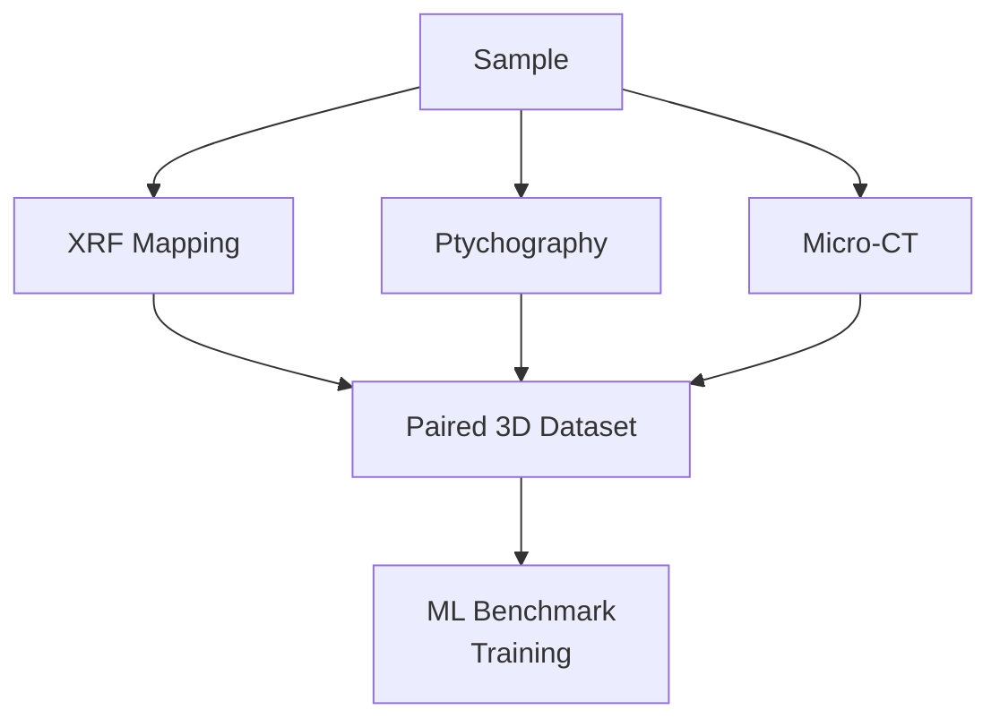

# Paper Review: Three-dimensional, multimodal synchrotron data for machine learning applications

## Metadata

| Field              | Value                                                                                  |
|--------------------|----------------------------------------------------------------------------------------|
| **Title**          | Three-dimensional, multimodal synchrotron data for machine learning applications       |
| **Authors**        | Hoidn, O. et al.                                                                      |
| **Journal**        | Nature Scientific Data                                                                 |
| **Year**           | 2025                                                                                   |
| **DOI**            | [10.1038/s41597-025-04605-9](https://doi.org/10.1038/s41597-025-04605-9)               |
| **Beamline**       | Multiple synchrotron beamlines (multimodal)                                            |
| **Modality**       | Multimodal synchrotron imaging (paired measurements)                                   |

---

## TL;DR

This paper presents the first large-scale, open benchmark dataset of paired
multimodal synchrotron measurements specifically designed for machine learning
training and benchmarking. The dataset includes co-registered 3D volumes from
multiple synchrotron techniques measured on the same samples, enabling
development and systematic evaluation of multimodal AI methods including
cross-modal prediction, data fusion, and transfer learning.

---

## Background & Motivation

Machine learning applications in synchrotron science are constrained by the
lack of standardized, high-quality training datasets:

- **Data scarcity**: Most ML papers in synchrotron science use small,
  facility-specific datasets that are not publicly available, making
  cross-study comparisons impossible.
- **Multimodal gap**: Modern synchrotron experiments increasingly combine
  multiple techniques (tomography, diffraction, fluorescence, ptychography),
  but there are no benchmark datasets with paired multimodal measurements for
  ML development.
- **Reproducibility crisis**: Without shared benchmarks, reported ML performance
  metrics are not comparable across studies.
- **Transfer learning potential**: Paired multimodal data enables training
  models that transfer information across measurement modalities, potentially
  reducing data requirements for each individual technique.

---

## Method

### Data

| Item | Details |
|------|---------|
| **Data source** | Multiple synchrotron beamlines; paired multimodal measurements |
| **Sample type** | Diverse samples measured with multiple synchrotron techniques |
| **Data dimensions** | 3D volumetric data, co-registered across modalities |
| **Preprocessing** | Spatial co-registration; standardized formatting; quality-controlled |

### Dataset Design

**Key features**:

- **Paired measurements**: Each sample is measured with multiple synchrotron
  techniques, providing naturally co-registered multimodal data.
- **3D volumes**: Full volumetric data rather than 2D slices, enabling 3D
  ML method development.
- **Standardized format**: Consistent data format and metadata conventions
  across all samples and modalities.
- **Quality control**: Systematic quality assessment ensuring data integrity
  and accurate co-registration.
- **Open access**: Fully open dataset with permissive licensing for ML
  research and benchmarking.

### Intended ML Applications

```
Paired multimodal synchrotron data
  --> Cross-modal prediction (predict one modality from another)
  --> Multimodal fusion (combine modalities for enhanced analysis)
  --> Transfer learning (pre-train on data-rich modality, fine-tune on scarce)
  --> Super-resolution (enhance resolution using complementary information)
  --> Benchmark evaluation (standardized comparison of ML methods)
```

---

## Key Results

| Metric                              | Value / Finding                                       |
|-------------------------------------|-------------------------------------------------------|
| Dataset scale                       | First large-scale open multimodal synchrotron dataset  |
| Modalities included                 | Multiple paired synchrotron techniques                 |
| Data format                         | Standardized, ML-ready format                          |
| Accessibility                       | Fully open access                                      |
| Benchmark potential                 | Enables standardized comparison of multimodal ML methods |

### Key Figures

- **Figure 1**: Overview of the multimodal dataset structure showing paired
  measurements across different synchrotron techniques.
- **Figure 3**: Example visualizations of co-registered multimodal volumes
  demonstrating complementary information content.

---

## Data & Code Availability

| Resource       | Link / Note                                                           |
|----------------|-----------------------------------------------------------------------|
| **Code**       | Processing scripts available alongside the dataset                    |
| **Data**       | Open access via Nature Scientific Data repository                     |
| **License**    | CC-BY (Creative Commons Attribution)                                  |

**Reproducibility Score**: **5 / 5** -- The primary contribution is the open
dataset itself. Fully accessible with standardized formats and comprehensive
metadata.

---

## Strengths

- **Fills a critical gap**: First open, large-scale multimodal synchrotron
  dataset for ML, addressing a major bottleneck in the field.
- **Enables benchmarking**: Provides the community with a common reference
  dataset for comparing ML methods, moving beyond facility-specific evaluations.
- **Multimodal pairing**: Co-registered measurements from multiple techniques
  enable a wide range of ML applications (fusion, prediction, transfer learning).
- **3D data**: Volumetric rather than 2D data supports development of 3D ML
  methods that are needed for real synchrotron applications.
- **Open and well-documented**: Permissive licensing and thorough documentation
  lower the barrier to adoption.

---

## Limitations & Gaps

- **Sample diversity**: The dataset covers specific sample types and may not
  represent the full diversity of materials studied at synchrotron facilities.
- **Modality coverage**: Not all synchrotron techniques are represented;
  expansion to additional modalities would increase utility.
- **Baseline models**: Limited ML baseline results are provided with the
  dataset; the community will need to develop comprehensive benchmarks.
- **Facility-specific characteristics**: Noise characteristics, resolution,
  and artifacts may differ from other synchrotron facilities, limiting direct
  transferability of models trained on this data.

---

## Relevance to APS BER Program

This dataset is highly relevant to BER's multimodal AI development goals:

- **Multimodal AI development**: Provides training data for developing
  cross-modal prediction and data fusion methods applicable to APS multimodal
  experiments.
- **Benchmarking BER methods**: Offers a standardized benchmark for evaluating
  AI/ML methods developed under the BER program against community baselines.
- **Transfer learning**: Models pre-trained on this dataset could be fine-tuned
  for APS-specific data, reducing the amount of APS beamtime needed for ML
  training data collection.
- **Community contribution**: The BER program could contribute APS-specific
  multimodal data to expand the benchmark, increasing its value to the
  broader community.
- **Priority**: **High** -- directly enables development of multimodal AI
  capabilities that are central to the BER program's scientific goals.

---

## Actionable Takeaways

1. **Download and evaluate**: Obtain the dataset and evaluate its utility for
   BER-relevant ML tasks (cross-modal prediction, fusion, segmentation).
2. **Develop baselines**: Train baseline models on this dataset for tasks
   relevant to APS beamlines and publish results as community benchmarks.
3. **Contribute APS data**: Work with the dataset authors to contribute
   APS-specific multimodal data, expanding the benchmark's coverage.
4. **Pre-train BER models**: Use this dataset for pre-training multimodal
   models that can be fine-tuned on APS-specific data.
5. **Community engagement**: Organize workshops or challenges around this
   benchmark to accelerate multimodal AI development for synchrotron science.

---

## Notes & Discussion

This dataset addresses one of the most fundamental challenges in applying ML
to synchrotron science: the lack of standardized, open training data. By
providing paired multimodal measurements, it enables a class of ML methods
(cross-modal prediction, fusion, transfer learning) that are impossible to
develop without co-registered multi-technique data. The BER program should
both leverage this dataset for model development and contribute to its expansion.

---

## Review Metadata

| Field | Value |
|-------|-------|
| **Reviewed by** | APS BER AI/ML Team |
| **Review date** | 2026-04-05 |
| **Last updated** | 2026-04-05 |
| **Tags** | multimodal_integration, benchmark, dataset, machine-learning, open-data |

## Architecture diagram


