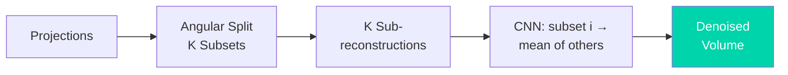

# Paper Review: Noise2Inverse for Low-Dose Synchrotron Micro-CT of Bone

## Metadata

| Field              | Value                                                                                  |
|--------------------|----------------------------------------------------------------------------------------|
| **Title**          | Enhancing synchrotron radiation micro-CT images using deep learning: an application of Noise2Inverse on bone imaging |
| **Authors**        | Obata, Y.; Parkinson, D. Y.; Pelt, D. M.; Acevedo, C.                                  |
| **Journal**        | Journal of Synchrotron Radiation, 32(3), 690--699                                      |
| **Year**           | 2025                                                                                   |
| **DOI**            | [10.1107/S1600577525001833](https://doi.org/10.1107/S1600577525001833)                 |
| **Beamline**       | Advanced Light Source (ALS), micro-CT beamline (LBNL)                                  |
| **Modality**       | Synchrotron radiation micro-computed tomography (SRμCT)                                |

---

## TL;DR

This paper applies **Noise2Inverse** — a self-supervised, physics-aware denoising
framework for tomographic inverse problems — to low-dose in-situ synchrotron
micro-CT of bone. Instead of requiring clean reference scans, Noise2Inverse
splits the projection data into subsets, reconstructs each independently, and
trains a CNN to map one sub-reconstruction to the others, exploiting the fact
that noise is independent across subsets while the underlying anatomy is
shared. The authors show that bone microstructural features (lacunae volume and
shape, mineralization) are preserved while radiation dose is reduced by
**2--3×**, making self-supervised denoising practical for dose-sensitive
biological tissue where re-scanning at high dose is impossible.

---

## Background & Motivation

- In-situ mechanical testing of bone under synchrotron micro-CT requires many
  sequential scans of the same sample; accumulated dose degrades the collagen
  network and alters the very mechanical properties being measured.
- Supervised denoisers (e.g., TomoGAN) need paired low-dose/high-dose data,
  which is exactly what a dose-limited experiment cannot provide.
- Noise2Void-style blind-spot methods operate in image space and ignore the
  tomographic forward model; Noise2Inverse (Hendriksen et al., 2020) was
  designed for inverse problems but had seen little uptake on real
  beamline data for biological samples.

---

## Method

### Data

| Item | Details |
|------|---------|
| **Data source** | Synchrotron radiation micro-CT of bone samples (ALS) |
| **Sample type** | Bone (biological, dose-sensitive tissue) |
| **Preprocessing** | Standard flat/dark correction; FBP-type sub-reconstructions from projection splits |

### Model / Algorithm

- **Noise2Inverse protocol**: split projections into K angular subsets;
  reconstruct each subset separately; train a CNN with one sub-reconstruction
  as input and the mean of the others as target.
- Noise in the projection domain is independent between splits, so the network
  cannot learn the noise — only the shared signal.
- No clean references or repeated scans are needed; training data comes from
  the same acquisition being denoised.

### Pipeline

```
Projections --> Angular split (K subsets) --> K sub-reconstructions
    --> CNN training (subset i -> mean of others) --> Denoised volume
    --> Bone microstructure quantification (lacunae, mineralization)
```

---

## Key Results

| Finding | Detail |
|---------|--------|
| Dose reduction | 2--3× lower dose with preserved image quality |
| Feature preservation | Lacunae volume/shape and mineralization statistics preserved after denoising |
| Caveat on quantification | At 1/3-dose simulations, all bone microstructure parameters shifted significantly vs. full dose — a separate validation scan is recommended before using denoised volumes for absolute microstructure quantification |

---

## Data & Code Availability

| Item | Available? | Link |
|------|-----------|------|
| **Source code** | Yes (Noise2Inverse reference implementation) | https://github.com/ahendriksen/noise2inverse |
| **Training data** | Partially | See paper's data availability statement |

**Reproducibility score**: 4 / 5 — method builds on an open reference
implementation and standard beamline reconstruction tooling.

---

## Strengths

- First careful validation of Noise2Inverse on real biological SRμCT data with
  domain-relevant quantitative endpoints (bone microstructure), not just
  PSNR/SSIM.
- Honest negative result: denoising preserves visual quality but can bias
  microstructural quantification at aggressive dose reduction — a caution
  most denoising papers omit.
- Requires no changes to the acquisition; purely a post-processing gain.

## Limitations & Gaps

- Angular splitting reduces per-reconstruction angular sampling; very sparse
  scans may not tolerate the split.
- Assumes noise independence across projection subsets — violated by ring
  artifacts and other detector-fixed structured noise, which the method does
  not remove.
- Validation limited to bone; transfer to soft tissue or lower-contrast
  samples untested.

---

## Relevance to APS BER Program

- **Applicable beamlines**: APS 2-BM / 7-BM tomography endstations; any
  dose-limited in-situ or biological CT campaign.
- **Integration potential**: The Interactive Lab's low-dose recipes
  (`experiments/tomography/low_dose/`) demonstrate the classical baseline this
  method surpasses; Noise2Inverse is the natural self-supervised upgrade and
  slots into TomoPy-based pipelines after reconstruction.
- **Priority**: High — self-supervised, no training-data burden, directly
  matches BER's dose-sensitive biological/environmental samples.

---

## Actionable Takeaways

1. Prefer Noise2Inverse over image-space blind-spot methods (Noise2Void) for
   tomography — it uses the physics of the inverse problem.
2. Always validate denoised volumes against a full-dose scan before publishing
   absolute quantitative microstructure metrics.
3. Pair with a ring-artifact filter (e.g., Vo sorting-based) since structured
   detector noise survives the projection-split trick.

---

## Notes & Discussion

See `03_ai_ml_methods/denoising/noise2inverse.md` for the method background,
and `review_tomogan_2020.md` for the supervised alternative this method
replaces when paired training data is unavailable.

---

## Review Metadata

| Field | Value |
|-------|-------|
| **Review date** | 2026-08-28 |
| **Last updated** | 2026-08-28 |
| **Tags** | tomography, denoising, self-supervised, low-dose, bone, Noise2Inverse |

## Architecture diagram


