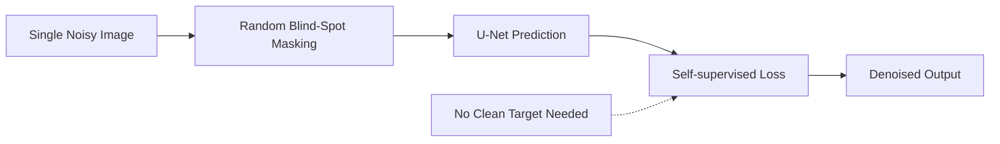

# Paper Review: Noise2Void -- Learning Denoising from Single Noisy Images

## Metadata

| Field              | Value                                                                                  |
|--------------------|----------------------------------------------------------------------------------------|
| **Title**          | Noise2Void - Learning Denoising from Single Noisy Images                               |
| **Authors**        | Krull, A.; Buchholz, T.-O.; Jost, F.                                                  |
| **Journal**        | CVPR 2019                                                                              |
| **Year**           | 2019                                                                                   |
| **DOI**            | [10.1109/CVPR.2019.00223](https://doi.org/10.1109/CVPR.2019.00223)                    |
| **Beamline**       | General (applicable to any imaging modality)                                           |
| **Modality**       | Microscopy, CT, general image denoising                                                |

---

## TL;DR

Noise2Void introduces a self-supervised denoising method that requires only
single noisy images for training -- no clean targets or paired noisy data are
needed. By using a blind-spot network architecture that masks the center pixel
of each receptive field during training, the model learns to predict each pixel
from its surrounding context alone, effectively learning to denoise without ever
seeing a clean image. Performance is comparable to the supervised Noise2Noise
approach and significantly outperforms classical methods, making it particularly
valuable for dose-sensitive synchrotron imaging where repeated measurements are
impractical.

---

## Background & Motivation

Traditional supervised denoising methods require paired datasets of noisy and
clean images. In practice, obtaining clean ground truth is often impossible or
prohibitively expensive, especially in synchrotron imaging where:

- **Dose constraints** prevent repeated acquisitions of the same sample at high
  dose to generate clean reference images.
- **Dynamic samples** change between acquisitions, making temporal averaging
  invalid.
- **Rare or unique samples** cannot be re-measured.

Noise2Noise (Lehtinen et al., 2018) relaxed the requirement from clean targets
to paired noisy images of the same scene, but still requires two independent
noisy observations. Noise2Void eliminates even this requirement by training on
the noisy images themselves.

---

## Method

### Data

| Item | Details |
|------|---------|
| **Data source** | Fluorescence microscopy (Planaria, Mouse skull nuclei); adaptable to CT |
| **Sample type** | Biological tissue, general imaging |
| **Data dimensions** | 2D images of varying resolution |
| **Preprocessing** | Random patch extraction; blind-spot masking during training |

### Model / Algorithm

**Blind-spot network**: A standard U-Net architecture is modified so that the
receptive field for predicting each pixel excludes the pixel itself. During
training, a subset of pixels is selected as prediction targets; for each target
pixel, its value is masked and replaced with a random neighbor's value in the
input. The network must predict the original value of the masked pixel using only
surrounding context.

**Training strategy**:

- Self-supervised: the noisy image serves as both input and target.
- The blind-spot constraint prevents the network from learning the identity
  function, forcing it to learn the underlying clean signal structure.
- Loss: L2 (mean squared error) between predicted and original noisy pixel
  values at masked positions.

**Key insight**: If noise is pixel-wise independent (zero-mean, i.i.d.), the
optimal prediction for a masked pixel given its neighbors is the conditional
expectation of the clean signal, effectively performing denoising.

### Pipeline

```
Single noisy image(s)
  --> Random patch extraction
  --> Blind-spot masking (replace selected center pixels)
  --> U-Net prediction of masked pixel values
  --> Self-supervised loss (predicted vs. original noisy value)
  --> Trained denoiser
  --> Apply to new noisy images (standard forward pass, no masking)
```

---

## Key Results

| Metric                              | Value / Finding                                       |
|-------------------------------------|-------------------------------------------------------|
| PSNR (Planaria dataset)             | Within 0.5 dB of Noise2Noise (supervised)             |
| PSNR vs. BM3D                       | Comparable or superior on structured biological images |
| Training data requirement           | Single noisy image (no pairs, no clean references)     |
| Inference time                      | Comparable to standard U-Net (~ms per patch on GPU)    |
| Generalization                      | Demonstrated on microscopy; applicable to CT, MRI      |

### Key Figures

- **Figure 2**: Schematic of the blind-spot training scheme, illustrating how
  the center pixel is masked during training to prevent identity learning.
- **Figure 4**: Visual comparison of Noise2Void, Noise2Noise, and classical
  denoising on fluorescence microscopy data, showing comparable quality without
  paired data.

---

## Data & Code Availability

| Resource       | Link / Note                                                           |
|----------------|-----------------------------------------------------------------------|
| **Code**       | [github.com/juglab/n2v](https://github.com/juglab/n2v)               |
| **Data**       | Public microscopy datasets (Planaria, Mouse nuclei)                   |
| **License**    | BSD-3-Clause                                                          |

**Reproducibility Score**: **5 / 5** -- Self-supervised approach requires only
the user's own noisy data for training. Code is well-maintained with pip install
support and extensive documentation.

---

## Strengths

- **No clean data required**: Eliminates the most significant practical barrier
  to applying deep learning denoising in synchrotron imaging, where ground truth
  is often unobtainable.
- **Single-image training**: Can train on the very dataset that needs denoising,
  enabling sample-specific and experiment-specific models.
- **Theoretically principled**: The blind-spot approach has a clear statistical
  justification under the assumption of pixel-wise independent noise.
- **Easy adoption**: Drop-in replacement for supervised denoisers with minimal
  changes to existing pipelines.
- **Well-maintained code**: Active open-source project with broad community
  adoption.

---

## Limitations & Gaps

- **i.i.d. noise assumption**: Performance degrades when noise has spatial
  correlations (e.g., structured streak artifacts in tomographic
  reconstructions), which violates the pixel-independence assumption.
- **Slightly lower PSNR**: Compared to supervised methods with clean targets,
  Noise2Void typically achieves 0.3--1.0 dB lower PSNR -- a modest but
  measurable gap.
- **No uncertainty quantification**: Like most single-output denoisers, provides
  no pixel-wise confidence estimates.
- **Blind-spot artifacts**: In some cases, the blind-spot masking can introduce
  subtle checkerboard-like artifacts, especially at high noise levels.
- **Training per dataset**: For optimal results, the network should be retrained
  or fine-tuned for each new noise level or imaging condition.

---

## Relevance to APS BER Program

Noise2Void is highly relevant to the BER program's goals of enabling AI-driven
analysis with minimal overhead:

- **Dose-sensitive biological samples**: Eliminates the need for high-dose
  reference scans, which is critical for biological and environmental samples
  studied under BER.
- **In-situ and operando imaging**: For time-resolved experiments where each
  frame is unique, self-supervised denoising is the only viable DL approach.
- **Reduced data collection burden**: No need to allocate beamtime for collecting
  paired training datasets -- every noisy dataset is its own training set.
- **Combination with TomoGAN**: Could serve as a pre-training or fallback
  strategy when paired data is unavailable, complementing supervised approaches.
- **Priority**: **High** -- addresses a fundamental practical barrier to DL
  denoising deployment at BER beamlines.

---

## Actionable Takeaways

1. **Benchmark on APS tomography data**: Evaluate Noise2Void on reconstructed
   tomographic slices from APS beamlines, characterizing performance vs.
   supervised methods at various dose levels.
2. **Address correlated noise**: Investigate extensions (e.g., Noise2Void with
   structN2V) for handling spatially correlated noise in tomographic
   reconstructions.
3. **Integrate with streaming pipeline**: Package as a Bluesky callback for
   on-the-fly self-supervised denoising during data acquisition.
4. **Combine with uncertainty**: Explore ensemble or dropout-based extensions to
   provide confidence maps alongside denoised outputs.

---

## Notes & Discussion

Noise2Void represents a paradigm shift in denoising for scientific imaging by
completely removing the requirement for clean reference data. This is
particularly impactful in synchrotron science where the dose-quality tradeoff
makes clean references impractical for many experiments. The method complements
supervised approaches like TomoGAN (reviewed in `review_tomogan_2020.md`) by
providing a fallback when paired training data cannot be collected.

---

## Review Metadata

| Field | Value |
|-------|-------|
| **Reviewed by** | APS BER AI/ML Team |
| **Review date** | 2026-04-05 |
| **Last updated** | 2026-04-05 |
| **Tags** | denoising, self-supervised, blind-spot, dose-reduction, deep-learning |

## Architecture diagram


