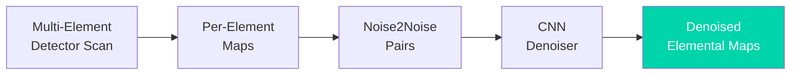

# Paper Review: Self-Supervised Denoising for XRF Microscopy with Multi-Element Detectors

## Metadata

| Field              | Value                                                                                  |
|--------------------|----------------------------------------------------------------------------------------|
| **Title**          | Self-Supervised Deep-Learning Denoising for X-ray Fluorescence Microscopy with Multi-Element Detectors |
| **Authors**        | Shishkov, R.; Laugros, A.; Viganò, N.; Bohic, S.; Karpov, D.; Cloetens, P.             |
| **Journal**        | Analytical Chemistry, 98(11), 8070--8080                                               |
| **Year**           | 2026 (preprint: ChemRxiv 10.26434/chemrxiv-2025-lsxpc, 2025)                           |
| **DOI**            | [10.1021/acs.analchem.5c05552](https://doi.org/10.1021/acs.analchem.5c05552)           |
| **Beamline**       | ESRF nano-imaging (Cloetens group, ID16A-class instrumentation)                        |
| **Modality**       | X-ray fluorescence (XRF) microscopy                                                    |

---

## TL;DR

The first demonstration of machine-learning denoising purpose-built for
**XRF microscopy**: a self-supervised pipeline that exploits the intrinsic
redundancy of **multi-element detectors**. Each detector element records a
statistically independent noisy view of the same fluorescence signal, so
element-wise maps form natural Noise2Noise-style training pairs — no clean
targets, no repeated scans. The trained network recovers elemental maps from
low-flux / short-dwell scans, directly attacking the acquisition-time and
radiation-damage bottlenecks of scanning XRF.

---

## Background & Motivation

- Scanning XRF provides nanoscale chemical maps, but dwell-time per pixel
  makes large maps slow, and dose accumulates in radiation-sensitive
  (biological, environmental) samples.
- Adding detector elements recovers some signal but is limited by geometry
  and cost; classical per-pixel spectral fitting cannot recover counts that
  were never collected.
- The Noise2X family (Noise2Noise, Noise2Void) had reached tomography and
  electron microscopy, but XRF lacked an ML denoiser exploiting its specific
  hardware redundancy.

---

## Method

### Data

| Item | Details |
|------|---------|
| **Data source** | Multi-element silicon drift detector XRF scans (synchrotron nanoprobe) |
| **Key idea** | Per-element sub-maps of the same scan = independent noise realizations of the same scene |
| **Preprocessing** | Standard spectral binning / elemental map extraction per detector element |

### Model / Algorithm

- CNN trained in the **Noise2Noise** regime: input = map from one detector
  element (or subset), target = map from a disjoint subset.
- Because photon noise is independent between detector elements while the
  fluorescence signal is common, the network converges to the underlying
  clean signal without ever seeing it.
- Inference denoises the summed all-element map, retaining full collected
  statistics.

### Pipeline

```
Multi-element XRF scan --> Per-element maps --> Noise2Noise training pairs
    --> CNN denoiser --> Denoised elemental maps --> Quantitative analysis
```

---

## Key Results

| Finding | Detail |
|---------|--------|
| Signal recovery | Recovers usable elemental maps from low-flux / short-dwell scans that are unusable raw |
| Acquisition speedup | Enables shorter dwell times, i.e. faster maps at fixed quality or lower dose at fixed time |
| No clean data needed | Fully self-supervised — training data comes from the measurement itself |

(A companion demo dataset, *SetkaFluo*, with training inputs for Noise2Noise
denoising of multi-element XRF maps, is published on Zenodo.)

---

## Data & Code Availability

| Item | Available? | Link |
|------|-----------|------|
| **Demo dataset** | Yes | Zenodo record 17871605 (SetkaFluo) |
| **Preprint** | Yes | ChemRxiv 10.26434/chemrxiv-2025-lsxpc |

**Reproducibility score**: 4 / 5 — preprint, published dataset, and a
standard Noise2Noise training recipe.

---

## Strengths

- Elegant use of hardware redundancy that every modern XRF endstation
  already has — no protocol change, no extra scans.
- Self-supervised: sidesteps the paired-training-data problem that blocks
  supervised denoisers at user facilities.
- Directly relevant to dose-limited biological and environmental XRF, the
  core BER sample classes.

## Limitations & Gaps

- Per-element maps have low counts; very short dwells may leave too little
  signal even for Noise2Noise convergence.
- Correlated backgrounds (scatter peaks, pile-up) violate the independence
  assumption between elements and can survive denoising.
- Quantification after denoising (absolute concentrations) needs the same
  careful validation as any learned operator.

---

## Relevance to APS BER Program

- **Applicable beamlines**: APS 2-ID-E / 2-ID-D microprobes, 26-ID nanoprobe,
  and the eBERlight XRF portfolio — all use multi-element detectors.
- **Integration potential**: Works as a post-processing step on existing
  per-element MAPS/PyXRF outputs; the Lab's XRF spectra samples
  (`10_interactive_lab/datasets/xrf/`) illustrate the raw-data starting point.
- **Priority**: High — first-of-its-kind for XRF and immediately deployable
  on archived multi-element data.

---

## Actionable Takeaways

1. Archive per-element (not just summed) XRF maps — they are free training
   data for this method.
2. Evaluate on eBERlight environmental samples where dwell time is the
   throughput bottleneck.
3. Compare against deep-residual XRF resolution enhancement
   (`review_deep_residual_xrf_2023.md`) — the two attack orthogonal limits
   (noise vs. probe size) and may compose.

---

## Notes & Discussion

Fills the gap noted in `03_ai_ml_methods/denoising/` — the Noise2X family
had no XRF-native member until this work.

---

## Review Metadata

| Field | Value |
|-------|-------|
| **Review date** | 2026-08-28 |
| **Last updated** | 2026-08-28 |
| **Tags** | XRF, denoising, self-supervised, Noise2Noise, multi-element detector, low-dose |

## Architecture diagram


