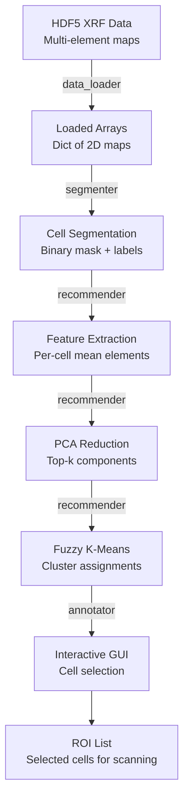

# ROI-Finder: Reverse Engineering

## Repository Structure

```
ROI-Finder/
├── roifinder/                  # Main package
│   ├── __init__.py
│   ├── segmenter.py           # Cell segmentation module
│   ├── annotator.py           # GUI annotation tool
│   ├── recommender.py         # PCA + clustering + recommendation
│   ├── data_loader.py         # HDF5 data loading utilities
│   └── utils.py               # Helper functions
│
├── notebooks/                  # Example Jupyter notebooks
│   ├── demo_segmentation.ipynb
│   ├── demo_clustering.ipynb
│   └── ...
│
├── examples/                   # Example scripts
│   └── run_pipeline.py
│
├── data/                       # Sample data (or links)
│   └── sample_xrf.h5
│
├── tests/                      # Unit tests (if present)
│
├── requirements.txt
├── setup.py
└── README.md
```

*Note: Actual structure may differ — verify against the current repository.*

## Data Flow Diagram



## Module Analysis

### 1. data_loader.py

**Purpose**: Load XRF data from MAPS-produced HDF5 files.

**Key Functions**:
```python
def load_xrf_data(filepath, elements=None):
    """
    Load elemental maps from MAPS HDF5 file.

    Parameters:
        filepath: str, path to HDF5 file
        elements: list of str, elements to load (None = all)

    Returns:
        dict: {element_name: 2D numpy array}
    """
    with h5py.File(filepath, 'r') as f:
        channel_names = f['/MAPS/XRF_Analyzed/Fitted/Channel_Names'][:]
        maps = f['/MAPS/XRF_Analyzed/Fitted/Counts_Per_Sec'][:]
        # Returns dict mapping element names to 2D arrays
```

**Design Notes**:
- Reads MAPS-specific HDF5 path structure
- Handles both NNLS and ROI fitting results
- Element selection filters by user-specified elements

### 2. segmenter.py

**Purpose**: Segment individual cells from elemental maps.

**Algorithm Flow**:
```
1. Select reference channel (user-specified or auto-selected)
2. Normalize to uint8 range [0, 255]
3. Gaussian smoothing (optional, sigma parameter)
4. Otsu thresholding → binary mask
5. Morphological opening (remove noise)
6. Morphological closing (fill holes)
7. Connected component labeling
8. Area filtering (remove too-small and too-large objects)
9. Return labeled mask
```

**Key Functions**:
```python
def segment_cells(channel_map, min_area=50, max_area=5000,
                  morph_kernel=5, sigma=1.0):
    """
    Segment cells using thresholding + morphological operations.

    Returns:
        labels: 2D int array (0=background, 1..N=cell IDs)
        properties: list of regionprops objects
    """

def auto_select_channel(elemental_maps):
    """Select channel with highest contrast (coefficient of variation)."""
```

**Design Patterns**:
- Functional style (stateless functions)
- OpenCV for thresholding and morphology
- scikit-image for connected components and region properties
- Parameters exposed for user tuning

### 3. recommender.py

**Purpose**: Extract features, cluster cells, and recommend ROIs.

**Algorithm Flow**:
```
1. For each segmented cell:
   - Extract mean concentration of each element
   - Optional: extract additional features (std, area, shape)
2. Build feature matrix: (N_cells × N_elements)
3. Standardize features (zero mean, unit variance)
4. PCA dimensionality reduction → top-k components
5. Fuzzy k-means clustering on PCA scores
6. Compute recommendation ranking:
   - Diversity: select from each cluster
   - Outliers: distance from cluster centers
   - Uncertainty: high fuzzy membership entropy
```

**Key Functions**:
```python
def extract_features(elemental_maps, labels, elements):
    """
    Extract per-cell feature vectors from elemental maps.

    Returns:
        feature_matrix: (N_cells, N_elements) array
        cell_ids: list of cell IDs corresponding to rows
    """

def cluster_cells(features, n_clusters=5, n_pca_components=3):
    """
    PCA + fuzzy k-means clustering.

    Returns:
        cluster_labels: (N_cells,) hard assignments
        membership: (N_clusters, N_cells) fuzzy membership matrix
        pca_scores: (N_cells, n_pca_components) projected features
        cluster_centers: (N_clusters, n_pca_components)
    """

def recommend_rois(membership, cluster_labels, n_per_cluster=3):
    """
    Recommend top ROIs based on cluster diversity.

    Returns:
        recommended_ids: list of cell IDs to scan
        scores: recommendation scores
    """
```

**Design Patterns**:
- scikit-learn for PCA and preprocessing
- scikit-fuzzy for fuzzy c-means
- Recommendation strategies as separate functions

### 4. annotator.py

**Purpose**: Interactive GUI for visualizing and selecting cells.

**Architecture**:
```
Tkinter Main Window
├── Canvas (matplotlib embedded)
│   ├── Elemental map display (selectable channel)
│   ├── Cell boundaries overlay
│   └── Cluster color coding
│
├── Control Panel
│   ├── Channel selector dropdown
│   ├── Cluster number slider
│   ├── Cell info display
│   └── Selection buttons (select/deselect)
│
└── Output Panel
    ├── Selected cell list
    ├── Export button (save ROI list)
    └── Statistics display
```

**Key Design**:
- Tkinter-based desktop GUI
- Matplotlib embedded canvas for scientific visualization
- Click-to-select cell interaction
- Export selections as CSV/JSON for beamline control system

### 5. utils.py

**Utility Functions**:
```python
def normalize_map(channel, method='minmax'):
    """Normalize elemental map to [0, 1] range."""

def rgb_composite(maps, r_elem, g_elem, b_elem):
    """Create RGB composite from three elemental channels."""

def save_roi_list(cell_ids, positions, filename):
    """Export ROI positions for beamline scanning."""
```

## Code Quality Assessment

| Aspect | Rating | Notes |
|--------|--------|-------|
| **Documentation** | ★★★ | README present, docstrings vary |
| **Test coverage** | ★★ | Limited unit tests |
| **Modularity** | ★★★★ | Clear module separation |
| **Code style** | ★★★ | Generally clean, some inconsistency |
| **Error handling** | ★★ | Basic, could be more robust |
| **Dependencies** | ★★★★ | Common scientific Python stack |
| **Reproducibility** | ★★★ | Sample data and notebooks provided |
| **Installation** | ★★★ | Conda/pip, but may need manual setup |

## Key Design Decisions

1. **Tkinter GUI**: Simple but limited — desktop only, no web access
2. **PCA for features**: Linear method — simple but misses non-linear patterns
3. **Fuzzy k-means**: Good for soft clustering but requires specifying k
4. **Per-cell means**: Discards spatial information within cells
5. **Binary segmentation**: Simple but cannot handle overlapping cells
6. **MAPS dependency**: Assumes MAPS-format HDF5 input
