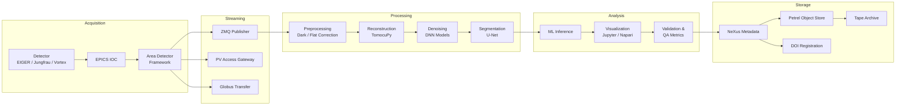

# Data Pipeline Architecture Overview

## Introduction

The APS BER data pipeline spans the full lifecycle of synchrotron experimental
data, from photon detection at the beamline to curated datasets stored in
long-term archives. The pipeline is designed around five principal stages:
**Acquisition**, **Streaming**, **Processing**, **Analysis**, and **Storage**.

Each stage is loosely coupled through well-defined interfaces, enabling
independent scaling, technology upgrades, and fault isolation.

## Pipeline Stages at a Glance

| Stage | Primary Systems | Typical Latency |
|---|---|---|
| Acquisition | EPICS IOC, Area Detector | Real-time (us-ms) |
| Streaming | ZMQ, PV Access, Globus | Sub-second to minutes |
| Processing | TomocuPy, DNN pipelines | Seconds to hours |
| Analysis | ML inference, Jupyter | Minutes to hours |
| Storage | Globus, Petrel, Tape | Archival (async) |

## End-to-End Mermaid Diagram

## Design Principles

1. **Streaming-first** -- Data flows through ZMQ and PV Access as soon as
   frames leave the detector, enabling near-real-time feedback loops.
2. **GPU-accelerated processing** -- Reconstruction and denoising stages exploit
   NVIDIA A100 / H100 GPUs at ALCF to keep pace with detector throughput.
3. **Metadata-driven provenance** -- Every transformation appends entries to a
   NeXus-compliant metadata record, ensuring full reproducibility.
4. **Federated storage** -- Hot data lives on Petrel for immediate access while
   cold data migrates to tape, with Globus managing transfers transparently.
5. **Fault tolerance** -- Each stage writes checkpoints; the pipeline can resume
   from the last successful stage after a failure.

## Directory Contents

| File | Description |
|---|---|
| [acquisition.md](acquisition.md) | Detector hardware, EPICS IOC, triggering |
| [streaming.md](streaming.md) | Real-time transport: ZMQ, PV Access, Globus |
| [processing.md](processing.md) | Reconstruction, denoising, segmentation |
| [analysis.md](analysis.md) | ML inference, visualization, validation |
| [storage.md](storage.md) | Archival, metadata standards, DOI assignment |
| [architecture_diagram.md](architecture_diagram.md) | Comprehensive Mermaid system diagrams |

## Key Technologies

- **EPICS** -- Experimental Physics and Industrial Control System
- **TomocuPy** -- GPU-accelerated tomographic reconstruction
- **Globus** -- Research data management and transfer platform
- **NeXus/HDF5** -- Self-describing scientific data format
- **Petrel** -- Argonne's data storage and sharing service

## Related Sections

- `03_beamline_controls/` -- EPICS configuration and beamline operation
- `05_hpc_computing/` -- ALCF compute allocation and job scheduling
- `06_ml_ai/` -- Model training pipelines that feed into the analysis stage

## Revision History

| Date | Author | Change |
|---|---|---|
| 2025-06-15 | APS BER Team | Initial pipeline specification |
| 2025-09-01 | APS BER Team | Added Globus streaming path |
| 2025-12-10 | APS BER Team | Updated GPU strategy for ALCF Aurora |
