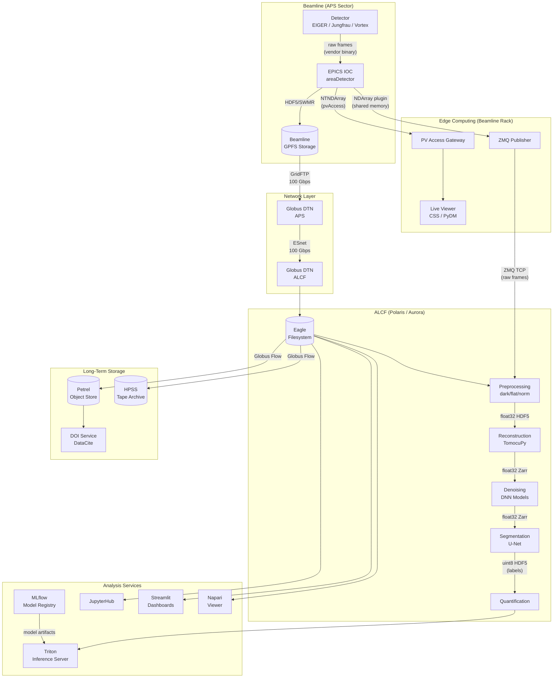
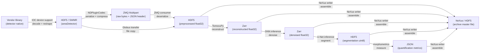
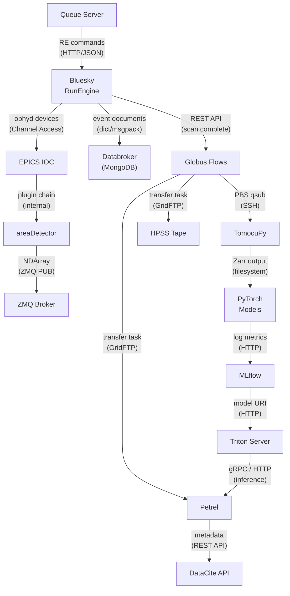
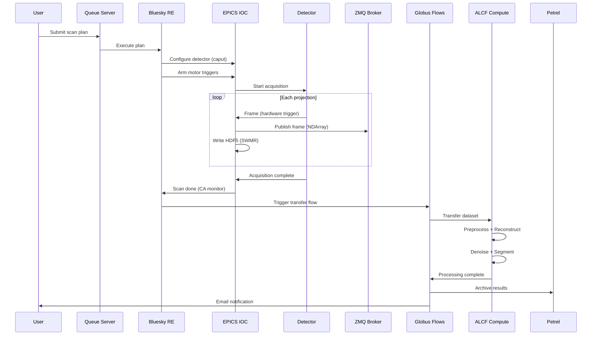
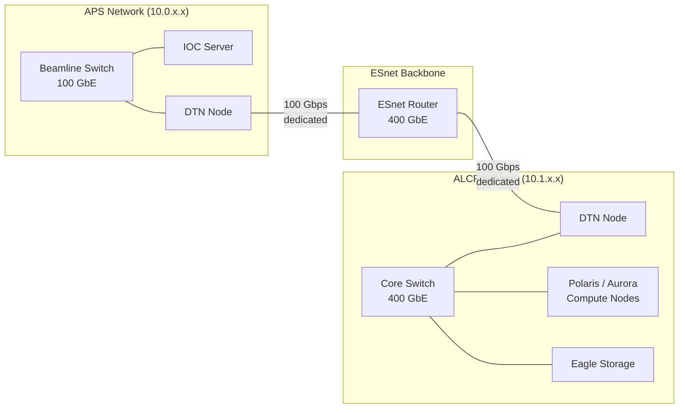

# System Architecture Diagrams

## Overview

This document provides comprehensive Mermaid-based diagrams of the eBERlight
data pipeline architecture, focusing on component interactions, data format
conversion points, and interfaces between systems.

## Full System Architecture

## Data Format Conversion Points

The pipeline performs several format transformations as data moves through
stages. The following diagram highlights each conversion.

## Interface Map

Each arrow below represents a distinct interface protocol or API between
eBERlight subsystems.

## Component Interaction: Scan Lifecycle

This sequence diagram shows the interaction between components during a
single tomography scan.

## Network Topology

## Legend

| Symbol | Meaning |
|---|---|
| Rectangle | Compute service or application |
| Cylinder | Storage system (filesystem, database, archive) |
| Arrow label | Protocol or data format at the interface |
| Subgraph | Network or logical boundary |

## Related Documents

- [README.md](README.md) -- Pipeline overview and stage summary
- [acquisition.md](acquisition.md) -- Detector and IOC details
- [streaming.md](streaming.md) -- Transport protocol configuration
- [processing.md](processing.md) -- Reconstruction and ML pipeline
- [analysis.md](analysis.md) -- Inference and visualization
- [storage.md](storage.md) -- Archival and DOI workflow
