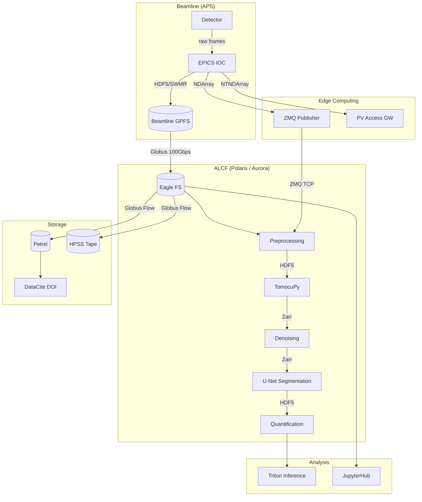
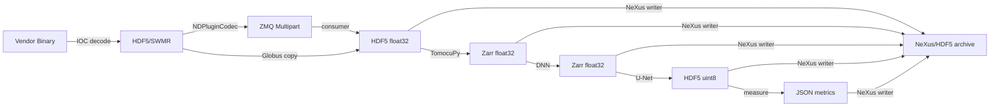
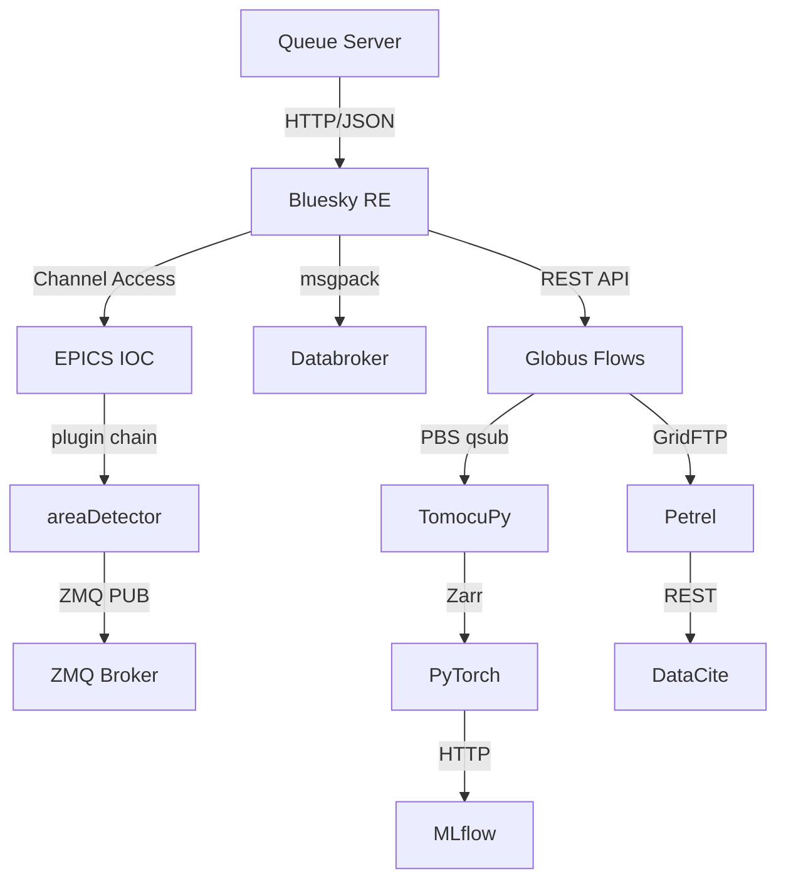
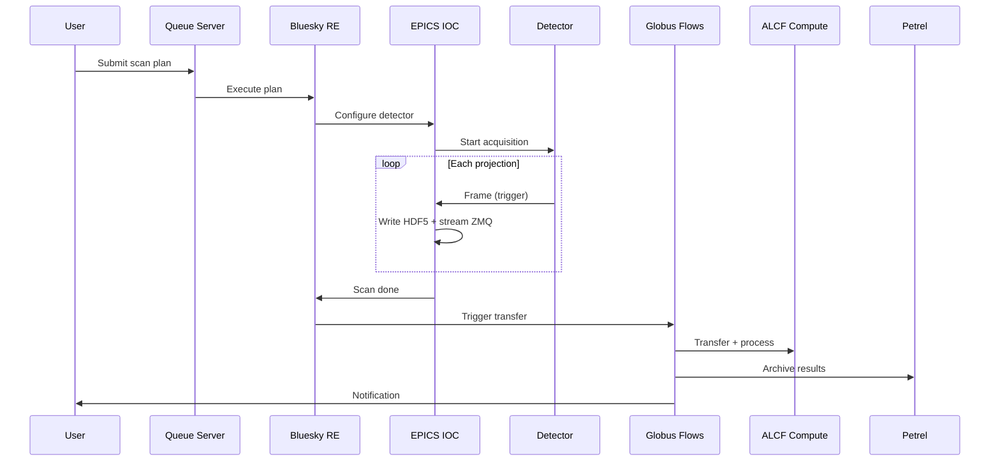
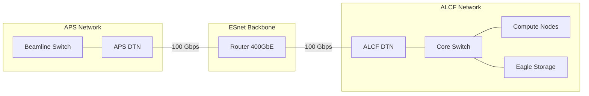

# System Architecture Diagrams

## Overview

Comprehensive Mermaid-based diagrams of the eBERlight data pipeline showing
component interactions, data format conversions, and system interfaces.

## Full System Architecture

## Data Format Conversion Points

## Interface Protocol Map

## Scan Lifecycle Sequence

## Network Topology

## Legend

| Symbol | Meaning |
|---|---|
| Rectangle | Compute service or application |
| Cylinder | Storage system (filesystem, database, archive) |
| Arrow label | Protocol or data format at the interface |
| Subgraph | Network or logical boundary |

## Related Documents

- [README.md](README.md) -- Pipeline overview
- [acquisition.md](acquisition.md) -- Detector and IOC details
- [streaming.md](streaming.md) -- Transport protocols
- [processing.md](processing.md) -- Reconstruction and ML pipeline
- [analysis.md](analysis.md) -- Inference and visualization
- [storage.md](storage.md) -- Archival and DOI workflow
