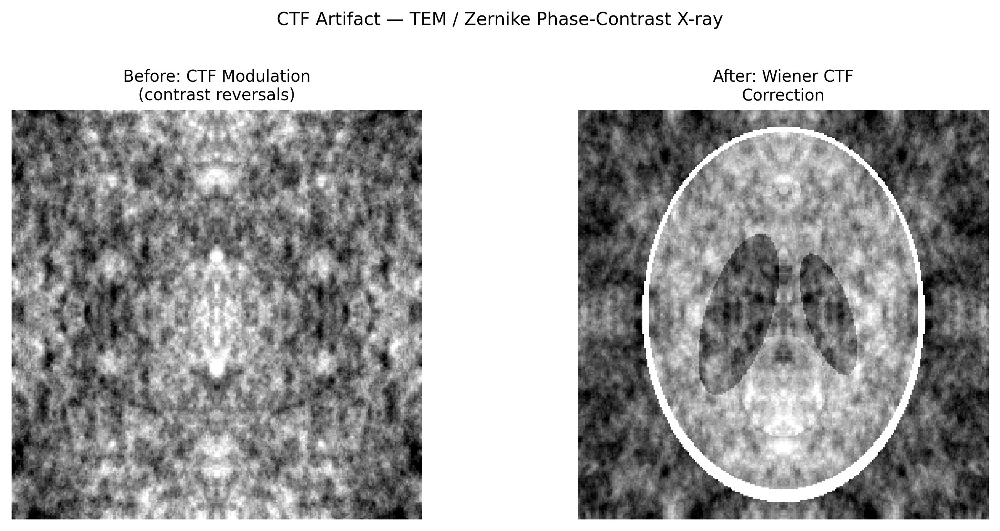

# CTF Artifact (Contrast Transfer Function)

## Classification

| Attribute | Value |
|-----------|-------|
| **Modality** | TEM / Cryo-EM |
| **Noise Type** | Instrumental |
| **Severity** | Critical |
| **Frequency** | Always |
| **Detection Difficulty** | Moderate |
| **Origin Domain** | Transmission Electron Microscopy |

## Visual Examples



> **Image source:** Synthetic phantom with CTF modulation in Fourier space. Left: contrast reversals from oscillating transfer function. Right: after Wiener CTF correction. MIT license.

## Description

The Contrast Transfer Function (CTF) is the oscillating transfer function of the TEM imaging system that modulates spatial frequencies with alternating positive and negative contrast. Uncorrected CTF causes contrast reversals (features can appear bright or dark depending on defocus), information loss at zero-crossings, and envelope-function damping of high-frequency information. Proper CTF estimation and correction is the single most important step in high-resolution cryo-EM.

**Synchrotron relevance:** Analogous to the optical transfer function (OTF) in X-ray microscopy, propagation-based phase contrast, and the modulation transfer function (MTF) of X-ray detectors. CTF correction concepts directly apply to Zernike phase-contrast X-ray microscopy.

## Root Cause

- TEM lens aberrations (primarily defocus and spherical aberration Cs) create phase shifts
- CTF = sin(χ(q)) where χ(q) = π·λ·Δf·q² - π/2·Cs·λ³·q⁴
- CTF oscillates between +1 and -1 → contrast reversals at different spatial frequencies
- Zero-crossings: frequencies where CTF = 0 → complete information loss
- Envelope functions (spatial/temporal coherence) damp high-q information

### Mathematical Form

```
CTF(q) = -sin(χ(q)) · E_s(q) · E_t(q)

where:
  χ(q) = π·λ·Δf·q² - π/2·Cs·λ³·q⁴
  E_s = spatial coherence envelope
  E_t = temporal coherence envelope
  Δf = defocus, Cs = spherical aberration, λ = wavelength
```

## Quick Diagnosis

```python
import numpy as np

def compute_power_spectrum(micrograph):
    """Compute 2D power spectrum (shows CTF Thon rings)."""
    F = np.fft.fftshift(np.fft.fft2(micrograph))
    power = np.log1p(np.abs(F)**2)
    return power

def radial_average_ps(power_spectrum):
    """Radially average power spectrum to see CTF oscillations."""
    ny, nx = power_spectrum.shape
    cy, cx = ny // 2, nx // 2
    Y, X = np.ogrid[-cy:ny-cy, -cx:nx-cx]
    r = np.sqrt(X**2 + Y**2).astype(int)
    r_max = min(cy, cx)
    radial = np.array([power_spectrum[r == ri].mean() for ri in range(r_max)])
    return radial
```

## Detection Methods

### Visual Indicators

- **Thon rings:** Concentric rings visible in 2D power spectrum of micrograph
- Ring spacing depends on defocus — wider spacing = less defocus
- Asymmetric rings indicate astigmatism
- Rings fade at high frequency due to envelope function damping
- Contrast reversals: features appear with inverted contrast at certain defocus values

### Automated Detection

```python
import numpy as np
from scipy.optimize import minimize

def fit_ctf_1d(radial_profile, pixel_size_A, voltage_kV=300):
    """Fit CTF to radially averaged power spectrum."""
    wavelength = 12.26 / np.sqrt(voltage_kV * 1e3 * (1 + voltage_kV * 1e3 / 1.022e6))
    q = np.arange(len(radial_profile)) / (len(radial_profile) * 2 * pixel_size_A)
    def ctf_model(params):
        defocus, Cs = params
        chi = np.pi * wavelength * defocus * q**2 - 0.5 * np.pi * Cs * wavelength**3 * q**4
        ctf = np.sin(chi)**2
        return np.sum((radial_profile / radial_profile.max() - ctf)**2)
    result = minimize(ctf_model, [1e4, 2.7e7], method='Nelder-Mead')
    return result.x  # [defocus_A, Cs_A]
```

## Correction Methods

### Traditional Approaches

1. **CTF estimation:** CTFFIND4, Gctf — estimate defocus and astigmatism from Thon rings
2. **Phase flipping:** Multiply by sign(CTF) to correct contrast reversals (simple but lossy)
3. **Wiener filtering:** CTF correction with noise regularization: `F_corr = CTF* / (|CTF|² + 1/SNR)`
4. **CTF refinement:** Per-particle defocus refinement in RELION/CryoSPARC

```python
def wiener_ctf_correction(image_fft, ctf, snr=10.0):
    """Apply Wiener filter CTF correction."""
    wiener = np.conj(ctf) / (np.abs(ctf)**2 + 1.0 / snr)
    corrected_fft = image_fft * wiener
    return corrected_fft
```

### AI/ML Approaches

- **DeepCTF:** Neural network CTF estimation
- **CryoDRGN:** Implicit CTF handling in deep generative reconstruction
- **CTFGAN:** GAN-based CTF correction for single-particle images

## Key References

- **Rohou & Grigorieff (2015)** — "CTFFIND4: Fast and accurate defocus estimation from electron micrographs"
- **Zhang (2016)** — "Gctf: Real-time CTF determination and correction"
- **Wade (1992)** — "A brief look at imaging and contrast transfer" — pedagogical introduction
- **Frank (2006)** — "Three-Dimensional Electron Microscopy of Macromolecular Assemblies" — textbook
- **Vulovic et al. (2013)** — "Image formation modeling in cryo-EM"

## Relevance to Synchrotron Data

| Scenario | Relevance |
|----------|-----------|
| Zernike phase-contrast X-ray microscopy | Directly analogous CTF with Zernike phase ring |
| Propagation-based phase contrast | Free-space propagation creates similar oscillating transfer function |
| X-ray detector MTF | Frequency-dependent detector response analogous to CTF envelope |
| Ptychography | Phase retrieval inherently handles CTF-like effects |
| Correlative cryo-EM + synchrotron | Understanding CTF needed for multi-modal data fusion |

## Real-World Before/After Examples

The following published sources provide real experimental before/after comparisons:

| Source | Type | Figure | Description | License |
|--------|------|--------|-------------|---------|
| [Rohou & Grigorieff 2015 — CTFFIND4](https://doi.org/10.1016/j.jsb.2015.08.008) | Paper | Fig 1 | Fast and accurate defocus estimation from electron micrographs — Thon ring fitting examples | -- |
| RELION documentation | Software docs | CTF correction tutorial | CTF correction examples showing before/after Wiener filtering in single-particle reconstruction | GPL-2.0 |

> **Recommended reference**: [Rohou & Grigorieff 2015 — CTFFIND4 (J. Struct. Biol.)](https://doi.org/10.1016/j.jsb.2015.08.008)

## Related Resources

- [Partial coherence](../ptychography/partial_coherence.md) — Coherence envelope effects in ptychography
- [Gibbs ringing](../medical_imaging/gibbs_ringing.md) — Related frequency-space truncation artifacts
- [Probe blurring](../xrf_microscopy/probe_blurring.md) — PSF/OTF-related resolution limits
