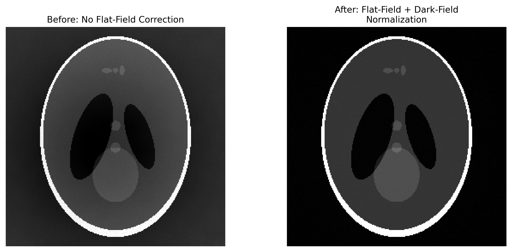

# Flat-Field Issues

## Classification

| Attribute | Value |
|-----------|-------|
| **Modality** | Tomography |
| **Noise Type** | Instrumental |
| **Severity** | Major |
| **Frequency** | Common |
| **Detection Difficulty** | Moderate |

## Visual Examples



## Description

Flat-field issues manifest as smooth intensity shading, bright or dark patches, or localized intensity inhomogeneities across the reconstructed slices. Unlike ring artifacts (which produce concentric patterns), flat-field problems create broad, slowly varying intensity gradients or patchy regions that distort the apparent attenuation values. In severe cases, the reconstruction may show a bright or dark halo near the edges of the field of view, or distinct blob-like regions of incorrect intensity.

## Root Cause

Flat-field correction normalizes raw projections by dividing by a "flat" image (beam without sample) and subtracting a "dark" image (no beam). Problems arise when the flat-field images do not accurately represent the beam conditions during sample acquisition. Common causes include: scintillator defects (cracks, delamination, thickness variations), dust particles on the scintillator or optical elements, spatial non-uniformity of the incident beam, temporal drift of beam intensity or profile between flat-field acquisition and sample measurement, scintillator afterglow or radiation damage changing response over time, and insufficient averaging of flat-field frames (retaining statistical noise in the normalization).

## Quick Diagnosis

```python
import numpy as np

# Compare flat-field to expected uniform illumination
flat = flat_field_image.astype(float)
# Normalize to [0, 1] range
flat_norm = flat / np.max(flat)
# Check uniformity: coefficient of variation
cv = np.std(flat_norm) / np.mean(flat_norm)
print(f"Flat-field coefficient of variation: {cv:.4f}")
print(f"Flat-field non-uniformity issues likely: {cv > 0.05}")
```

## Detection Methods

### Visual Indicators

- Smooth intensity gradients across the reconstructed slice that do not correspond to sample structure.
- Bright or dark patches that persist across multiple slices at the same spatial location.
- Edge-brightening or vignetting effects in the reconstruction.
- Blob-like artifacts from dust particles on optical elements.
- Comparison of early and late projections shows different background intensity patterns.

### Automated Detection

```python
import numpy as np
from scipy import ndimage


def detect_flatfield_issues(flat_images, dark_image=None, threshold_cv=0.05):
    """
    Analyze flat-field images for non-uniformity and defects.

    Parameters
    ----------
    flat_images : np.ndarray
        3D array of shape (num_flats, height, width) or 2D single flat.
    dark_image : np.ndarray or None
        Dark current image for subtraction.
    threshold_cv : float
        Coefficient of variation threshold for flagging non-uniformity.

    Returns
    -------
    dict with keys:
        'coefficient_of_variation' : float
        'has_issues' : bool
        'defect_mask' : np.ndarray — mask of problematic pixels
        'issues_found' : list of str
    """
    if flat_images.ndim == 2:
        flat_images = flat_images[np.newaxis, ...]

    # Average flat-fields
    flat_avg = np.mean(flat_images, axis=0).astype(np.float64)

    # Subtract dark if provided
    if dark_image is not None:
        flat_avg = flat_avg - dark_image.astype(np.float64)
        flat_avg = np.clip(flat_avg, 1.0, None)

    # Normalize
    flat_norm = flat_avg / np.median(flat_avg)

    # Overall uniformity
    cv = np.std(flat_norm) / np.mean(flat_norm)

    issues = []

    # Check for dead/hot pixels
    median_val = np.median(flat_norm)
    mad = np.median(np.abs(flat_norm - median_val))
    defect_mask = np.abs(flat_norm - median_val) > 5 * 1.4826 * mad
    num_defects = np.sum(defect_mask)

    if num_defects > 0.001 * flat_norm.size:
        issues.append(f"Excessive defective pixels: {num_defects}")

    # Check for large-scale gradients (dust, beam non-uniformity)
    smoothed = ndimage.gaussian_filter(flat_norm, sigma=50)
    gradient_range = np.max(smoothed) - np.min(smoothed)
    if gradient_range > 0.1:
        issues.append(f"Large-scale intensity gradient: {gradient_range:.3f}")

    # Check flat-to-flat consistency
    if flat_images.shape[0] > 1:
        flat_std = np.std(flat_images.astype(np.float64), axis=0)
        temporal_cv = np.mean(flat_std) / np.mean(flat_avg)
        if temporal_cv > 0.02:
            issues.append(f"High temporal flat-field variation: {temporal_cv:.4f}")

    if cv > threshold_cv:
        issues.append(f"High overall non-uniformity (CV={cv:.4f})")

    return {
        "coefficient_of_variation": float(cv),
        "has_issues": len(issues) > 0,
        "defect_mask": defect_mask,
        "issues_found": issues,
    }
```

## Solutions and Mitigation

### Prevention (Before Data Collection)

- Acquire flat-field images immediately before and after the sample scan (not hours earlier).
- Collect many flat-field frames (20-100) and average them to suppress statistical noise.
- Inspect the scintillator for dust, scratches, and delamination before the experiment.
- Check beam stability before beginning the scan; wait for beam equilibrium after injection.
- Use a clean, uniform scintillator and replace degraded ones promptly.

### Correction — Traditional Methods

Dynamic flat-fielding interpolates flat-field images acquired before and after the scan to account for temporal drift. Defective regions can also be masked and interpolated.

```python
import numpy as np
from scipy import ndimage


def dynamic_flatfield_correction(projections, flats_before, flats_after,
                                  dark_image):
    """
    Apply dynamic flat-field correction by linearly interpolating
    between flat-fields acquired before and after the scan.

    Parameters
    ----------
    projections : np.ndarray
        3D projection stack (num_proj, height, width).
    flats_before : np.ndarray
        Flat-field images taken before scan (num_flats, height, width).
    flats_after : np.ndarray
        Flat-field images taken after scan.
    dark_image : np.ndarray
        Dark current image (height, width).

    Returns
    -------
    np.ndarray — corrected projection stack (float64).
    """
    flat_pre = np.mean(flats_before, axis=0).astype(np.float64)
    flat_post = np.mean(flats_after, axis=0).astype(np.float64)
    dark = dark_image.astype(np.float64)

    num_proj = projections.shape[0]
    corrected = np.zeros_like(projections, dtype=np.float64)

    for i in range(num_proj):
        # Linear interpolation weight
        weight = i / max(num_proj - 1, 1)
        flat_interp = (1 - weight) * flat_pre + weight * flat_post
        flat_interp = flat_interp - dark
        flat_interp = np.clip(flat_interp, 1.0, None)

        proj = projections[i].astype(np.float64) - dark
        corrected[i] = proj / flat_interp

    return corrected


# Post-hoc correction: smooth residual shading with low-pass filter
def correct_residual_shading(sinogram, sigma=100):
    """Remove residual shading by dividing out low-frequency component."""
    smoothed = ndimage.gaussian_filter(sinogram.astype(np.float64),
                                        sigma=(0, sigma))
    smoothed = np.clip(smoothed, 1e-10, None)
    return sinogram / smoothed * np.mean(smoothed)
```

### Correction — AI/ML Methods

No established AI/ML methods specifically target flat-field correction artifacts. The slowly varying nature of flat-field errors makes them amenable to traditional low-frequency filtering approaches. However, general-purpose image restoration networks may incidentally correct mild shading as part of broader artifact removal pipelines.

## Impact If Uncorrected

Flat-field issues introduce spatially varying bias into the reconstructed attenuation values, making quantitative density measurements unreliable. Regions with incorrect normalization appear as false density variations, causing segmentation errors — uniform materials may be split into multiple phases, or distinct phases may merge. Ring artifacts are amplified when flat-field pixel defects are not properly corrected. Downstream analyses including porosity measurement, material identification, and dimensional metrology are all affected.

## Related Resources

- [Tomography EDA notebook](../../06_data_structures/eda/tomo_eda.md) — flat-field quality inspection
- Related artifact: [Ring Artifact](ring_artifact.md) — often caused or amplified by flat-field pixel defects
- Related artifact: [Beam Intensity Drop](beam_intensity_drop.md) — temporal beam changes that flat-fielding cannot correct

## Key Takeaway

Flat-field correction is the foundation of quantitative tomography — invest time in acquiring high-quality, contemporaneous flat and dark images. When beam conditions drift during a scan, dynamic flat-fielding with interpolated flat images before and after the scan significantly improves normalization quality.
