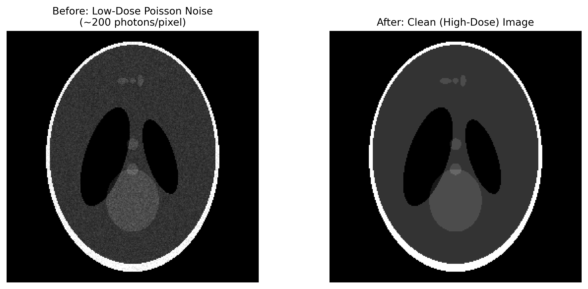

# Low-Dose Poisson Noise

## Classification

| Attribute | Value |
|-----------|-------|
| **Modality** | Tomography |
| **Noise Type** | Statistical |
| **Severity** | Major |
| **Frequency** | Common |
| **Detection Difficulty** | Easy |

## Visual Examples



> **Image source:** Real synchrotron CT data from [TomoGAN](https://github.com/lzhengchun/TomoGAN) (Liu et al. 2020), BSD-2 license. Left: noisy low-dose reconstruction. Right: GAN-denoised output preserving structural features.
>
> **External references:**
> - [TomoGAN — low-dose CT denoising with GANs (Liu et al.)](https://github.com/lzhengchun/TomoGAN)
> - [Noise2Noise — learning to denoise without clean data (Lehtinen et al.)](https://arxiv.org/abs/1803.04189)

## Description

Low-dose Poisson noise manifests as a grainy, speckled appearance throughout the reconstructed volume, reducing contrast between features and obscuring fine structural details. The noise is spatially uncorrelated in the projection domain but becomes correlated after filtered back-projection, producing a characteristic salt-and-pepper texture with radial streaky undertones. The noise level is inversely proportional to the square root of the photon count per pixel.

## Root Cause

X-ray detection is a photon-counting process governed by Poisson statistics, where the variance equals the mean signal. When the photon flux is low — due to short exposure times, low beam current, highly absorbing samples, or dose-limited experiments (e.g., biological specimens) — each detector pixel records very few photons. The resulting high relative noise (SNR ~ sqrt(N)) in each projection propagates through the reconstruction algorithm, amplified by the ramp filter in filtered back-projection. The noise floor increases further toward the center of the reconstruction due to the accumulation of noise from all projection angles.

## Quick Diagnosis

```python
import numpy as np

# Estimate noise level from a flat region in the reconstruction
roi = reconstruction[200:250, 200:250]  # select uniform region
snr = np.mean(roi) / np.std(roi)
print(f"ROI mean: {np.mean(roi):.2f}, std: {np.std(roi):.2f}")
print(f"Estimated SNR: {snr:.1f}")
print(f"Likely low-dose noise: {snr < 5}")
```

## Detection Methods

### Visual Indicators

- Grainy, speckled texture uniformly distributed across the reconstructed slice.
- Loss of contrast between adjacent features with similar attenuation.
- Fine structural details (thin walls, small pores) become difficult to resolve.
- Noise texture may show subtle radial streaks due to the FBP ramp filter.

### Automated Detection

```python
import numpy as np
from scipy import ndimage


def detect_low_dose_noise(reconstruction, flat_roi=None):
    """
    Assess the noise level in a reconstructed CT slice.

    Parameters
    ----------
    reconstruction : np.ndarray
        2D reconstructed slice.
    flat_roi : tuple or None
        (row_start, row_end, col_start, col_end) defining a uniform region.
        If None, the function estimates noise from the whole image.

    Returns
    -------
    dict with keys:
        'snr_estimate' : float — estimated signal-to-noise ratio
        'noise_std' : float — standard deviation of noise
        'is_noisy' : bool — True if SNR is below threshold
        'noise_level' : str — 'severe', 'moderate', 'mild', 'acceptable'
    """
    if flat_roi is not None:
        r0, r1, c0, c1 = flat_roi
        roi = reconstruction[r0:r1, c0:c1]
    else:
        # Estimate noise using difference of image and median-filtered version
        smoothed = ndimage.median_filter(reconstruction, size=5)
        noise_map = reconstruction - smoothed
        noise_std = np.std(noise_map)
        signal_range = np.percentile(reconstruction, 97) - np.percentile(reconstruction, 3)
        snr = signal_range / (noise_std + 1e-10)

        if snr < 3:
            level = "severe"
        elif snr < 8:
            level = "moderate"
        elif snr < 15:
            level = "mild"
        else:
            level = "acceptable"

        return {
            "snr_estimate": float(snr),
            "noise_std": float(noise_std),
            "is_noisy": snr < 8,
            "noise_level": level,
        }

    # ROI-based estimation
    noise_std = np.std(roi)
    signal_mean = np.mean(roi)
    snr = signal_mean / (noise_std + 1e-10)

    if snr < 3:
        level = "severe"
    elif snr < 8:
        level = "moderate"
    elif snr < 15:
        level = "mild"
    else:
        level = "acceptable"

    return {
        "snr_estimate": float(snr),
        "noise_std": float(noise_std),
        "is_noisy": snr < 8,
        "noise_level": level,
    }
```

## Solutions and Mitigation

### Prevention (Before Data Collection)

- Increase exposure time per projection to collect more photons (limited by dose constraints and scan time budget).
- Increase beam flux by adjusting undulator gap or mirror coatings.
- Use a more efficient detector (higher quantum efficiency scintillator).
- Average multiple frames per projection angle before recording.
- Optimize beam energy for the sample to maximize contrast-to-noise ratio.

### Correction — Traditional Methods

Non-local means (NLM) and block-matching 3D (BM3D) denoising are effective post-reconstruction filters that preserve edges while suppressing noise.

```python
import numpy as np
from skimage.restoration import denoise_nl_means, estimate_sigma


def denoise_reconstruction_nlm(reconstruction, patch_size=5, patch_distance=6):
    """
    Apply non-local means denoising to a reconstructed CT slice.
    """
    # Estimate noise standard deviation
    sigma_est = estimate_sigma(reconstruction)

    # Apply NLM denoising
    denoised = denoise_nl_means(
        reconstruction,
        h=1.15 * sigma_est,       # filter strength
        patch_size=patch_size,      # size of local patches
        patch_distance=patch_distance,  # search window half-size
        fast_mode=True,
    )
    return denoised


# Alternative: sinogram-domain denoising before reconstruction
def denoise_sinogram_gaussian(sinogram, sigma=1.0):
    """
    Light Gaussian smoothing along the angular direction of the sinogram
    to suppress high-frequency noise while preserving detector-column structure.
    """
    from scipy.ndimage import gaussian_filter1d
    # Smooth along angle axis (axis=0) only
    return gaussian_filter1d(sinogram, sigma=sigma, axis=0)
```

### Correction — AI/ML Methods

Deep learning denoising has become the state-of-the-art for low-dose CT. **TomoGAN** uses a generative adversarial network trained on paired low-dose/high-dose tomography data to produce high-quality reconstructions from noisy inputs. **Noise2Noise** enables training without clean reference data by using pairs of independent noisy measurements of the same object. Both approaches operate either on 2D slices post-reconstruction or on sinogram patches. Self-supervised methods such as Noise2Self and Noise2Void further relax data requirements by training on the noisy data itself using blind-spot masking strategies.

## Impact If Uncorrected

Low-dose noise degrades all downstream quantitative analyses. Segmentation algorithms struggle to distinguish material boundaries, leading to inaccurate volume fraction, porosity, and particle-size measurements. Feature detection (edges, interfaces) becomes unreliable, and 3D surface meshes generated from noisy data contain spurious roughness. In time-resolved or in-situ experiments where dose must be distributed across many time points, the per-frame noise can render individual reconstructions unusable without denoising.

## Related Resources

- [TomoGAN denoising](../../03_ai_ml_methods/denoising/tomogan.md) — GAN-based low-dose CT denoising
- [Noise2Noise denoising](../../03_ai_ml_methods/denoising/noise2noise.md) — self-supervised denoising without clean targets
- [Tomography EDA notebook](../../06_data_structures/eda/tomo_eda.md) — noise assessment and SNR estimation
- Related artifact: [Sparse-Angle Artifact](sparse_angle_artifact.md) — another under-sampling regime that benefits from DL reconstruction
- Related artifact: [Zinger](zinger.md) — transient noise spikes that compound low-dose noise effects

## Real-World Before/After Examples

The following published sources provide real experimental before/after comparisons:

| Source | Type | Figure | Description | License |
|--------|------|--------|-------------|---------|
| [TomoGAN (GitHub)](https://github.com/tomography/TomoGAN) | Repository | Figs 4--6 in paper | Real APS synchrotron data — noisy vs GAN-denoised tomographic slices | BSD-2 |
| [Liu et al. 2020](https://doi.org/10.1364/JOSAA.375595) | Paper | Fig 4 | Noisy vs denoised tomographic slices from real synchrotron acquisitions | -- |
| [TomoBank](https://tomobank.readthedocs.io/) | Data repository | Multiple datasets | Real APS synchrotron data with varying dose levels for benchmarking | Public Domain |
| [Lehtinen et al. 2018 — Noise2Noise](https://doi.org/10.48550/arXiv.1803.04189) | Paper | Fig. 3 | Noise2Noise: Learning Image Restoration without Clean Data — denoising without clean targets | -- |
| [NVlabs Noise2Noise (GitHub)](https://github.com/NVlabs/noise2noise) | Repository | Example outputs | Official Noise2Noise implementation with example denoised outputs | CC BY-NC 4.0 |

**Key references with published before/after comparisons:**
- **Liu et al. (2020)**: TomoGAN — real APS synchrotron low-dose CT before/after GAN denoising. DOI: 10.1364/JOSAA.375595
- **Lehtinen et al. (2018)**: Noise2Noise — Fig. 3 shows denoising results achieved without clean training targets. DOI: 10.48550/arXiv.1803.04189

> **Recommended reference**: [TomoGAN GitHub — real APS synchrotron low-dose denoising examples](https://github.com/tomography/TomoGAN)

## Key Takeaway

Low-dose Poisson noise is an inherent limitation of photon-counting detectors and becomes the dominant image quality factor in dose-limited experiments. When increasing photon flux is not feasible, modern deep learning denoisers like TomoGAN and Noise2Noise can recover substantial image quality — apply denoising before segmentation or quantitative analysis.
