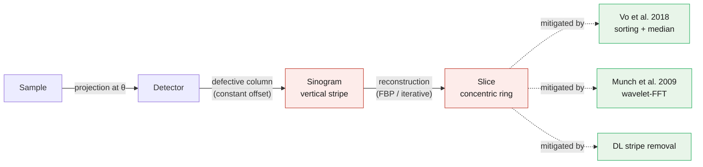

# Ring Artifact

## Classification

| Attribute | Value |
|-----------|-------|
| **Modality** | Tomography |
| **Noise Type** | Instrumental |
| **Severity** | Critical |
| **Frequency** | Common |
| **Detection Difficulty** | Easy |

## Visual Examples


> **Image source:** Real neutron CT data from [Sarepy](https://github.com/nghia-vo/sarepy) (Vo et al.), BSD-3 license. Left: reconstruction with ring artifacts from defective detector columns. Right: after Sarepy combined ring removal algorithm.
>
> **External references:**
> - [Sarepy — ring artifact removal](https://github.com/nghia-vo/sarepy)
> - [Algotom — data processing algorithms for tomography](https://github.com/algotom/algotom)

## Description

Ring artifacts appear as concentric circular patterns centered on the rotation axis in reconstructed CT slices. They manifest as bright or dark rings that can partially or fully encircle the reconstruction center. The rings directly correspond to defective or miscalibrated detector pixel columns that produce consistent intensity errors across all projection angles.



The Interactive Lab page (`/Experiment`) ships two of these mitigations as runnable recipes on the bundled Sarepy sinograms — see [`10_interactive_lab/datasets/tomography/ring_artifact/`](../../10_interactive_lab/datasets/tomography/ring_artifact/).

## Root Cause

Dead, hot, or miscalibrated detector pixels produce constant-value or anomalous-response columns in the sinogram. Because each detector column maps to a specific radial distance from the rotation center during filtered back-projection, a faulty column creates a systematic error at that radius in every reconstructed slice. The effect is amplified by flat-field normalization when the flat image itself contains pixel defects, and can also arise from non-uniform scintillator response or dust particles on the detector.

## Quick Diagnosis

```python
import numpy as np

# Load sinogram (2D: angles x detector_columns)
# Check for vertical stripes by computing column-wise standard deviation
col_std = np.std(sinogram, axis=0)
col_mean = np.mean(sinogram, axis=0)
# Anomalous columns have abnormally low std or extreme mean
outlier_cols = np.where(np.abs(col_std - np.median(col_std)) > 3 * np.std(col_std))[0]
print(f"Suspicious columns: {outlier_cols}")
```

## Detection Methods

### Visual Indicators

- Concentric rings visible in axial (transverse) reconstructed slices, centered on the rotation axis.
- Vertical stripes visible in the sinogram view — each stripe corresponds to one ring in the reconstruction.
- Rings persist across all slices at the same radial position.
- The artifact is most visible in uniform or low-contrast regions of the sample.

### Automated Detection

```python
import numpy as np
from scipy import ndimage


def detect_ring_artifacts(sinogram, threshold_sigma=3.0):
    """
    Detect potential ring artifact sources in a sinogram by
    identifying anomalous detector columns.

    Parameters
    ----------
    sinogram : np.ndarray
        2D array of shape (num_angles, num_columns).
    threshold_sigma : float
        Number of standard deviations from median to flag a column.

    Returns
    -------
    dict with keys:
        'bad_columns' : list of int — indices of suspect columns
        'column_scores' : np.ndarray — anomaly score per column
        'has_ring_artifacts' : bool
    """
    num_angles, num_cols = sinogram.shape

    # Compute per-column statistics
    col_means = np.mean(sinogram, axis=0)
    col_stds = np.std(sinogram, axis=0)

    # Median-based robust scoring for means
    median_mean = np.median(col_means)
    mad_mean = np.median(np.abs(col_means - median_mean))
    mad_mean = mad_mean if mad_mean > 0 else 1e-10

    # Median-based robust scoring for stds
    median_std = np.median(col_stds)
    mad_std = np.median(np.abs(col_stds - median_std))
    mad_std = mad_std if mad_std > 0 else 1e-10

    # Anomaly score: combination of mean and std deviations
    score_mean = np.abs(col_means - median_mean) / (1.4826 * mad_mean)
    score_std = np.abs(col_stds - median_std) / (1.4826 * mad_std)
    column_scores = np.maximum(score_mean, score_std)

    bad_columns = np.where(column_scores > threshold_sigma)[0].tolist()

    return {
        "bad_columns": bad_columns,
        "column_scores": column_scores,
        "has_ring_artifacts": len(bad_columns) > 0,
    }
```

## Solutions and Mitigation

### Prevention (Before Data Collection)

- Perform detector pixel calibration and flat-field correction immediately before the experiment.
- Use a clean, defect-free scintillator and inspect for dust or scratches.
- Acquire multiple flat-field images and average them to reduce pixel-level noise.
- Slightly jitter the sample position between projections (random offset acquisition) to smear out per-pixel errors.

### Correction — Traditional Methods

Fourier-wavelet based stripe removal and Vo et al. combined sorting/filtering methods are the most widely used. TomoPy provides several built-in functions.

```python
import tomopy
import numpy as np

# Load sinogram stack: shape (num_slices, num_angles, num_columns)
# proj = ...  # normalized projection data

# Method 1: Fourier-wavelet based stripe removal (Munch et al.)
proj_clean = tomopy.remove_stripe_fw(
    proj,
    level=7,       # wavelet decomposition level
    wname='db5',   # wavelet name
    sigma=2,       # damping parameter
    pad=True,
)

# Method 2: Vo's combined stripe removal (sorting + filtering)
proj_clean = tomopy.remove_all_stripe(
    proj,
    snr=3,         # signal-to-noise ratio for large stripe detection
    la_size=61,    # window size for large stripes
    sm_size=21,    # window size for small stripes
)

# Method 3: Direct sinogram column interpolation for known bad pixels
bad_cols = [512, 1023, 1024]  # known defective columns
for col in bad_cols:
    left = max(col - 1, 0)
    right = min(col + 1, proj.shape[2] - 1)
    proj[:, :, col] = 0.5 * (proj[:, :, left] + proj[:, :, right])

# Reconstruct after stripe removal
recon = tomopy.recon(proj_clean, theta, center=center, algorithm='gridrec')
```

### Correction — AI/ML Methods

Deep learning approaches treat ring removal as a sinogram-to-sinogram translation or inpainting task. A U-Net or similar encoder-decoder network is trained on pairs of corrupted and clean sinograms (often generated synthetically by inserting artificial stripes). At inference time, the network predicts the clean sinogram from the corrupted input. This approach generalizes well to complex, non-uniform ring patterns that challenge traditional frequency-domain filters.

## Impact If Uncorrected

Ring artifacts severely degrade quantitative analysis in tomographic data. They introduce false density variations at specific radial distances, corrupting segmentation of material phases and invalidating porosity or particle-size measurements. In medical/biological imaging, rings can mimic or obscure anatomical structures. Downstream 3D analysis such as surface meshing and finite-element modeling will incorporate the ring geometry as spurious features.

## Related Resources

- [Tomography EDA notebook](../../06_data_structures/eda/tomo_eda.md) — sinogram inspection and quality checks
- [TomoPy reverse engineering](../../05_tools_and_code/tomopy/reverse_engineering.md) — stripe removal internals
- [Sarepy (GitHub)](https://github.com/nghia-vo/sarepy) — Vo et al. ring removal implementations
- [Algotom (GitHub)](https://github.com/algotom/algotom) — comprehensive tomography processing toolkit
- Related artifact: [Flat-Field Issues](flatfield_issues.md) — improper flat-fielding can introduce or amplify ring artifacts
- Related artifact: [Rotation Center Error](rotation_center_error.md) — off-center rings can be confused with ring artifacts

## Real-World Before/After Examples

The following published sources provide real experimental before/after comparisons:

| Source | Type | Figure | Description | License |
|--------|------|--------|-------------|---------|
| [Sarepy documentation](https://sarepy.readthedocs.io/toc/section3.html) | Software docs | Figs 3.1--3.6 | Sinogram stripe detection and removal on real neutron CT data | BSD-3 |
| [Algotom documentation](https://algotom.readthedocs.io/en/latest/toc/section4/section4_4.html) | Software docs | Section 4.4 | Comparison of multiple ring removal methods on experimental data | Apache-2.0 |
| [Vo et al. 2018](https://doi.org/10.1364/OE.26.028396) | Paper | Figs 3--7 | Superior techniques for eliminating ring artifacts in X-ray micro-tomography — before/after sinograms and reconstructions | CC BY 4.0 |

> **Recommended reference**: [Sarepy Section 3 — ring artifact removal on real neutron CT data](https://sarepy.readthedocs.io/toc/section3.html)

## Key Takeaway

Ring artifacts are among the most common and visually striking tomography artifacts. Always inspect the sinogram for vertical stripes before reconstruction — catching them early allows targeted column correction or stripe-removal filtering, which is far more effective than post-reconstruction cleanup.
