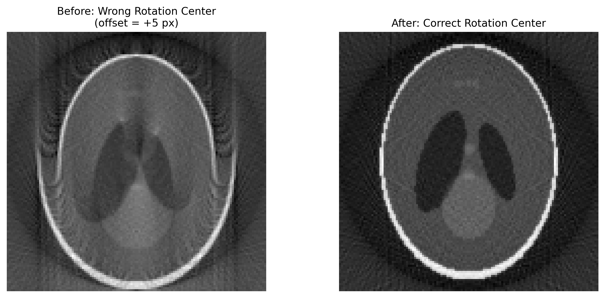

# Rotation Center Error

## Classification

| Attribute | Value |
|-----------|-------|
| **Modality** | Tomography |
| **Noise Type** | Systematic |
| **Severity** | Critical |
| **Frequency** | Common |
| **Detection Difficulty** | Moderate |

## Visual Examples



## Description

Rotation center errors produce characteristic artifacts in reconstructed CT slices including cupping or doming of intensity profiles across the field of view, tuning-fork-like doubling of sharp edges, and off-center concentric ring or arc patterns. Small errors (sub-pixel) cause subtle blurring and resolution loss, while larger errors (several pixels) create obvious double-image or crescent-shaped artifacts around features. The severity scales with the magnitude of the center offset.

## Root Cause

Filtered back-projection and most iterative reconstruction algorithms require precise knowledge of the rotation axis position relative to the detector. The rotation center is the detector column that corresponds to the projection of the rotation axis. Errors arise from: mechanical misalignment of the rotation stage, encoder drift or backlash in the positioning system, thermal expansion shifting the rotation axis over the course of a scan, incorrect metadata or manual input of the center value, and asymmetric sample mounting that shifts the effective center of mass. Even sub-pixel errors degrade reconstruction quality for high-resolution datasets.

## Quick Diagnosis

```python
import numpy as np

# Compare projection at 0° with horizontally flipped projection at 180°
proj_0 = projections[0].astype(float)
proj_180 = projections[num_proj // 2].astype(float)
proj_180_flipped = np.fliplr(proj_180)
# Cross-correlate to find shift — shift/2 gives center offset
from scipy.ndimage import shift as ndi_shift
correlation = np.correlate(np.mean(proj_0, axis=0), np.mean(proj_180_flipped, axis=0), mode='full')
offset = np.argmax(correlation) - (proj_0.shape[1] - 1)
print(f"Estimated center offset: {offset / 2:.1f} pixels")
```

## Detection Methods

### Visual Indicators

- Cupping or doming of intensity across the reconstruction (bowl-shaped profile in uniform regions).
- Tuning-fork doubling — sharp edges appear as two closely spaced parallel lines.
- Off-center semicircular arcs or partial rings (not true ring artifacts, which are centered).
- Blurring that improves on one side of the image and worsens on the other.
- Reconstruction appears to shift or oscillate when scrolling through slices.

### Automated Detection

```python
import numpy as np
from scipy.signal import correlate


def detect_rotation_center_error(projections, expected_center=None):
    """
    Detect rotation center error by comparing 0° and 180° projections.

    Parameters
    ----------
    projections : np.ndarray
        3D projection stack (num_proj, height, width).
    expected_center : float or None
        Expected center position. If None, assumes detector midpoint.

    Returns
    -------
    dict with keys:
        'estimated_center' : float — estimated true rotation center
        'center_offset' : float — offset from expected center in pixels
        'has_error' : bool — True if offset exceeds 0.5 pixels
        'severity' : str — 'none', 'mild', 'moderate', 'severe'
    """
    num_proj = projections.shape[0]
    num_cols = projections.shape[2]

    if expected_center is None:
        expected_center = num_cols / 2.0

    # Use 0° and 180° projections
    proj_0 = np.mean(projections[0].astype(np.float64), axis=0)
    proj_180 = np.mean(projections[num_proj // 2].astype(np.float64), axis=0)
    proj_180_flip = proj_180[::-1]

    # Sub-pixel cross-correlation
    corr = correlate(proj_0, proj_180_flip, mode='full')
    # Parabolic interpolation around peak
    peak_idx = np.argmax(corr)
    if 1 <= peak_idx <= len(corr) - 2:
        y0, y1, y2 = corr[peak_idx - 1], corr[peak_idx], corr[peak_idx + 1]
        delta = 0.5 * (y0 - y2) / (y0 - 2 * y1 + y2 + 1e-10)
        refined_peak = peak_idx + delta
    else:
        refined_peak = float(peak_idx)

    # Convert correlation peak to center position
    estimated_center = (refined_peak - num_cols + 1) / 2.0 + num_cols / 2.0
    center_offset = estimated_center - expected_center

    abs_offset = abs(center_offset)
    if abs_offset < 0.5:
        severity = "none"
    elif abs_offset < 2.0:
        severity = "mild"
    elif abs_offset < 5.0:
        severity = "moderate"
    else:
        severity = "severe"

    return {
        "estimated_center": float(estimated_center),
        "center_offset": float(center_offset),
        "has_error": abs_offset > 0.5,
        "severity": severity,
    }
```

## Solutions and Mitigation

### Prevention (Before Data Collection)

- Carefully align the rotation axis using alignment tools before the experiment.
- Acquire a 180° projection pair and verify alignment in real time before the full scan.
- Use fiducial markers (e.g., a small sphere) to calibrate the rotation center.
- Monitor stage encoder readings for drift during long scans.
- Allow thermal equilibration of the rotation stage before scanning.

### Correction — Traditional Methods

TomoPy provides several automated rotation center finding algorithms that can be applied before reconstruction.

```python
import tomopy
import numpy as np


def find_and_apply_rotation_center(projections, theta):
    """
    Find the correct rotation center and reconstruct with it.
    Compares multiple methods for robustness.
    """
    # Method 1: Vo's method (most robust for general data)
    center_vo = tomopy.find_center_vo(projections)
    print(f"Vo method center: {center_vo:.2f}")

    # Method 2: Phase correlation between 0° and 180° projections
    center_pc = tomopy.find_center_pc(
        projections[0], projections[projections.shape[0] // 2]
    )
    print(f"Phase correlation center: {center_pc:.2f}")

    # Method 3: Entropy-based optimization (slower but reliable)
    center_entropy = tomopy.find_center(
        projections, theta, ind=projections.shape[1] // 2, tol=0.25
    )
    print(f"Entropy method center: {center_entropy:.2f}")

    # Use Vo method as primary (most robust)
    center = center_vo

    # Reconstruct with correct center
    recon = tomopy.recon(
        projections, theta, center=center, algorithm='gridrec'
    )
    recon = tomopy.circ_mask(recon, axis=0, ratio=0.95)

    return recon, center


# Fine-tuning: sweep a small range around the estimated center
def sweep_rotation_center(projections, theta, center_estimate, half_range=3.0,
                           step=0.25, slice_idx=None):
    """Reconstruct a single slice at multiple center values for visual comparison."""
    if slice_idx is None:
        slice_idx = projections.shape[1] // 2

    sino = projections[:, slice_idx:slice_idx + 1, :]
    centers = np.arange(center_estimate - half_range,
                        center_estimate + half_range + step, step)
    results = {}
    for c in centers:
        recon = tomopy.recon(sino, theta, center=c, algorithm='gridrec')
        results[c] = recon[0]
    return results
```

### Correction — AI/ML Methods

No established AI/ML methods specifically for rotation center finding. The problem is well-solved by traditional cross-correlation and optimization methods. However, learned reconstruction networks that jointly optimize reconstruction and geometric parameters can implicitly handle small center offsets as part of their training.

## Impact If Uncorrected

Rotation center error degrades spatial resolution uniformly across the reconstruction and introduces false intensity variations. Quantitative attenuation values become inaccurate due to the cupping/doming artifact. Edge-based measurements (wall thickness, particle size) are biased by the doubling effect. The error compounds with other artifacts — ring artifacts shift off-center, and streak artifacts change character. Even a 1-pixel error can noticeably reduce resolution in high-resolution micro-CT datasets.

## Related Resources

- [Tomography EDA notebook](../../06_data_structures/eda/tomo_eda.md) — rotation center verification
- Related artifact: [Ring Artifact](ring_artifact.md) — off-center rings can indicate rotation center error
- Related artifact: [Motion Artifact](motion_artifact.md) — rotation axis drift during scan mimics center error

## Key Takeaway

The rotation center is the single most critical parameter for tomographic reconstruction quality. Always verify the center using automated methods like `find_center_vo()` before running full reconstruction, and perform a center sweep on a test slice when results look suspicious — a sub-pixel correction can dramatically improve image quality.
