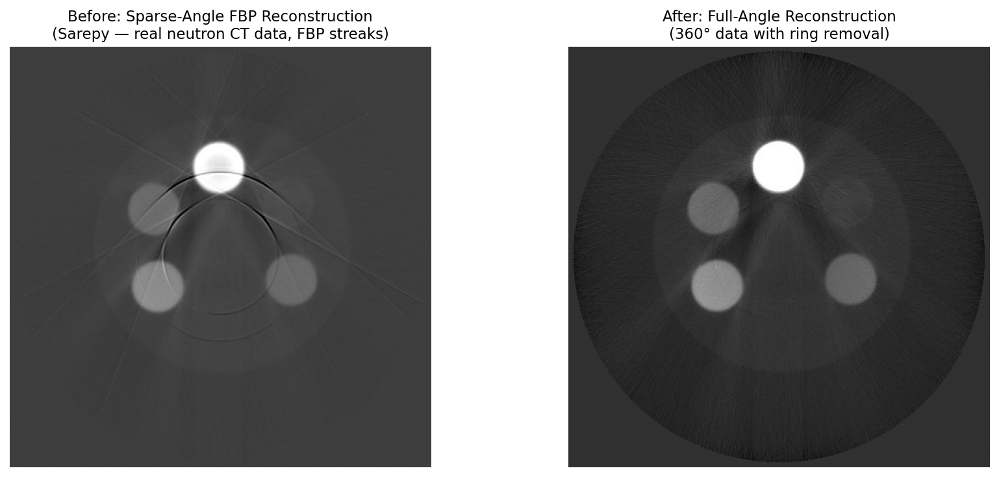

# Sparse-Angle Artifact

## Classification

| Attribute | Value |
|-----------|-------|
| **Modality** | Tomography |
| **Noise Type** | Computational |
| **Severity** | Major |
| **Frequency** | Occasional |
| **Detection Difficulty** | Moderate |

## Visual Examples



> **Image source:** Sarepy neutron CT data — FBP reconstruction with sparse projections showing streak artifacts vs full 360° acquisition with ring removal.

## Description

Sparse-angle artifacts manifest as streak and star-like patterns superimposed on the reconstructed image, with streaks oriented along directions corresponding to the missing projection angles. The reconstructed image appears blurred along certain directions while retaining sharpness along others, creating a characteristic angular aliasing pattern. Fine features may appear duplicated or smeared, and uniform regions exhibit oscillating intensity variations.

## Root Cause

Standard filtered back-projection requires a sufficient number of evenly spaced projection angles to satisfy the Nyquist sampling condition. The minimum number of projections needed scales with the number of detector pixels (approximately pi/2 * N for an N-pixel detector). When too few projections are acquired — due to scan time constraints, dose limitations, fast dynamic processes, or limited angular range — the angular sampling is insufficient. The missing angular information creates null spaces in the Fourier domain, and the reconstruction algorithm fills these gaps with aliasing artifacts. The severity increases as the angular gap between projections grows.

## Quick Diagnosis

```python
import numpy as np

# Check if number of projections is sufficient for detector width
num_angles = sinogram.shape[0]
num_columns = sinogram.shape[1]
nyquist_angles = int(np.ceil(np.pi / 2 * num_columns))
ratio = num_angles / nyquist_angles
print(f"Projections: {num_angles}, Nyquist requirement: {nyquist_angles}")
print(f"Sampling ratio: {ratio:.2f}")
print(f"Sparse-angle regime: {ratio < 0.5}")
```

## Detection Methods

### Visual Indicators

- Star-like or radial streak patterns in the reconstructed slice.
- Directional blurring — features appear sharp along some orientations and blurred along others.
- Fine features show angular aliasing or ringing.
- Streak directions correspond to the angular gaps between acquired projections.

### Automated Detection

```python
import numpy as np


def detect_sparse_angle_artifacts(reconstruction, num_projections, num_detector_pixels):
    """
    Assess whether a reconstruction suffers from sparse-angle artifacts
    based on angular sampling and image quality metrics.

    Parameters
    ----------
    reconstruction : np.ndarray
        2D reconstructed slice.
    num_projections : int
        Number of projection angles used.
    num_detector_pixels : int
        Number of detector columns.

    Returns
    -------
    dict with keys:
        'nyquist_ratio' : float — ratio of actual to required projections
        'is_undersampled' : bool
        'streak_score' : float — measure of directional artifacts
        'severity' : str — 'severe', 'moderate', 'mild', 'none'
    """
    # Angular sampling check
    nyquist_required = int(np.ceil(np.pi / 2 * num_detector_pixels))
    nyquist_ratio = num_projections / nyquist_required

    # Detect directional artifacts via Fourier analysis
    fft_2d = np.fft.fftshift(np.fft.fft2(reconstruction))
    magnitude = np.abs(fft_2d)
    log_mag = np.log1p(magnitude)

    # Compute angular variance in Fourier domain
    cy, cx = np.array(log_mag.shape) // 2
    y, x = np.mgrid[:log_mag.shape[0], :log_mag.shape[1]]
    r = np.sqrt((x - cx)**2 + (y - cy)**2)
    theta = np.arctan2(y - cy, x - cx)

    # Bin by angle and compute variance of radially-averaged power
    num_angle_bins = 180
    angle_bins = np.linspace(-np.pi, np.pi, num_angle_bins + 1)
    radial_power = np.zeros(num_angle_bins)

    for k in range(num_angle_bins):
        mask = (theta >= angle_bins[k]) & (theta < angle_bins[k + 1]) & (r > 5)
        if np.sum(mask) > 0:
            radial_power[k] = np.mean(log_mag[mask])

    # High angular variance in Fourier power indicates directional artifacts
    streak_score = np.std(radial_power) / (np.mean(radial_power) + 1e-10)

    if nyquist_ratio < 0.2:
        severity = "severe"
    elif nyquist_ratio < 0.5:
        severity = "moderate"
    elif nyquist_ratio < 0.8:
        severity = "mild"
    else:
        severity = "none"

    return {
        "nyquist_ratio": float(nyquist_ratio),
        "is_undersampled": nyquist_ratio < 0.8,
        "streak_score": float(streak_score),
        "severity": severity,
    }
```

## Solutions and Mitigation

### Prevention (Before Data Collection)

- Acquire at least pi/2 * N projections for an N-pixel-wide detector to satisfy Nyquist.
- If scan time is limited, reduce detector resolution (binning) to lower the required projection count.
- Use golden-ratio angular spacing instead of uniform spacing to distribute missing information more evenly.
- For dynamic experiments, consider continuous rotation with interleaved angle sets across time frames.

### Correction — Traditional Methods

Iterative reconstruction algorithms with regularization can partially recover the missing angular information by enforcing prior knowledge about the image (e.g., sparsity, smoothness).

```python
import tomopy
import numpy as np


def reconstruct_sparse_angle(sinogram, theta, center, num_iter=50):
    """
    Reconstruct from sparse-angle data using iterative methods
    with total variation (TV) regularization.
    """
    # SIRT (Simultaneous Iterative Reconstruction Technique)
    # Better than FBP for undersampled data
    recon_sirt = tomopy.recon(
        sinogram,
        theta,
        center=center,
        algorithm='sirt',
        num_iter=num_iter,
    )

    # Apply total variation minimization as post-processing
    # TV encourages piecewise-constant solutions, suppressing streaks
    from skimage.restoration import denoise_tv_chambolle

    recon_tv = np.zeros_like(recon_sirt)
    for i in range(recon_sirt.shape[0]):
        recon_tv[i] = denoise_tv_chambolle(
            recon_sirt[i],
            weight=0.05,  # regularization strength
        )

    return recon_tv


# Alternative: ASTRA toolbox for advanced iterative methods
# import astra
# proj_id = astra.create_projector('cuda', proj_geom, vol_geom)
# recon_id = astra.data2d.create('-vol', vol_geom)
# cfg = astra.astra_dict('SIRT_CUDA')
# cfg['ProjectorId'] = proj_id
# cfg['ReconstructionDataId'] = recon_id
# cfg['ProjectionDataId'] = sino_id
# cfg['option'] = {'MinConstraint': 0}
# alg_id = astra.algorithm.create(cfg)
# astra.algorithm.run(alg_id, 200)
```

### Correction — AI/ML Methods

Deep learning approaches for sparse-angle tomography include view synthesis networks that predict missing projections from acquired ones, and learned iterative reconstruction networks that unroll optimization algorithms with learned regularizers. Notable methods include FBPConvNet (post-processing CNN applied to FBP output), learned primal-dual networks, and NeRF-inspired implicit neural representations that can reconstruct from very few views by learning a continuous volumetric representation. These approaches can achieve near-full-sampling quality from 10-50x fewer projections in favorable cases.

## Impact If Uncorrected

Sparse-angle artifacts create false features in the reconstruction that can be misinterpreted as structural details. Streak patterns interfere with segmentation and quantitative analysis, especially for features aligned with streak directions. Angular aliasing can cause thin structures to appear or disappear depending on their orientation relative to the acquired projection angles. Resolution becomes anisotropic, making dimensional measurements unreliable.

## Related Resources

- [AI/ML methods for tomography](../../02_xray_modalities/tomography/ai_ml_methods.md) — DL view synthesis and learned reconstruction
- Related artifact: [Low-Dose Poisson Noise](low_dose_noise.md) — sparse-angle and low-dose regimes often co-occur in fast experiments
- Related artifact: [Motion Artifact](motion_artifact.md) — fast scans to avoid motion may require sparse angular sampling

## Real-World Before/After Examples

The following published sources provide real experimental before/after comparisons:

| Source | Type | Figure | Description | License |
|--------|------|--------|-------------|---------|
| [Bubba et al. 2019](https://doi.org/10.1088/1361-6420/ab10ca) | Paper | Figs 5--7 | "Learning the invisible: limited-angle CT reconstruction" — limited-angle artifacts before/after DL correction | -- |
| [Liu et al. 2021](https://doi.org/10.1038/s41598-021-97226-2) | Paper | Fig. 3 | Limited-angle CT reconstruction with deep image and physics priors — FBP vs learned reconstruction comparison | CC BY 4.0 |

**Key references with published before/after comparisons:**
- **Bubba et al. (2019)**: Figs 5-7 show limited-angle artifacts before/after deep learning correction. DOI: 10.1088/1361-6420/ab10ca
- **Liu et al. (2021)**: Fig. 3 compares FBP vs learned reconstruction for limited-angle CT. DOI: 10.1038/s41598-021-97226-2

> **Recommended reference**: [Bubba et al. 2019 — "Learning the invisible" (Inverse Problems)](https://doi.org/10.1088/1361-6420/ab10ca)

## Key Takeaway

Sparse-angle artifacts arise when angular sampling falls below the Nyquist threshold, producing directional streaks and aliasing. Use iterative reconstruction with TV regularization as a first-line correction, and consider deep learning approaches for severely undersampled datasets where traditional methods fall short.
