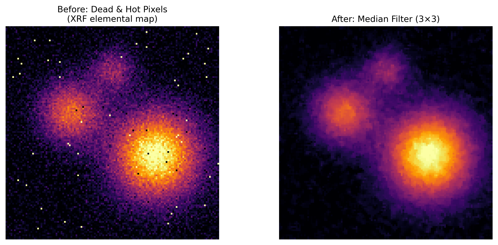

# Dead/Hot Pixel

## Classification

| Attribute | Value |
|-----------|-------|
| **Modality** | XRF Microscopy |
| **Noise Type** | Instrumental |
| **Severity** | Major |
| **Frequency** | Common |
| **Detection Difficulty** | Easy |

## Visual Examples



> **Image source:** Synthetic — simulated XRF elemental map with injected dead (zero) and hot (saturated) pixels, corrected via 3x3 median filter.

```
 Raw elemental map with dead/hot pixels       After median filter correction
 ┌──────────────────────────────┐             ┌──────────────────────────────┐
 │ ▒▒▒▒▒▓▓▓▓▓▓▓▓▒▒▒▒▒░░░░░░░░ │             │ ▒▒▒▒▒▓▓▓▓▓▓▓▓▒▒▒▒▒░░░░░░░░ │
 │ ▒▒▒▒▓▓▓▓█▓▓▓▓▓▒▒▒▒░░░░░░░░ │             │ ▒▒▒▒▓▓▓▓▓▓▓▓▓▓▒▒▒▒░░░░░░░░ │
 │ ▒▒▒▓▓▓▓▓▓▓▓▓▓▓▓▒▒▒░░░░░░░░ │             │ ▒▒▒▓▓▓▓▓▓▓▓▓▓▓▓▒▒▒░░░░░░░░ │
 │ ▒▒▒▓▓▓▓▓▓▓▓▓▓▓▒▒▒▒░░ ░░░░░ │  → fix →   │ ▒▒▒▓▓▓▓▓▓▓▓▓▓▓▒▒▒▒░░░░░░░░ │
 │ ▒▒▒▒▓▓▓▓▓▓▓▓▒▒▒▒▒░░░░░░░░░ │             │ ▒▒▒▒▓▓▓▓▓▓▓▓▒▒▒▒▒░░░░░░░░░ │
 │ ▒▒▒▒▒▒▒▒▒▒▒▒▒▒▒░░░░░░░█░░░ │             │ ▒▒▒▒▒▒▒▒▒▒▒▒▒▒▒░░░░░░░░░░░ │
 └──────────────────────────────┘             └──────────────────────────────┘
           ↑ hot       ↑ dead ↑ hot
```

## Description

Dead and hot pixels are isolated anomalous pixels in XRF elemental maps that show either zero intensity (dead) or extremely high intensity (hot) relative to their immediate neighbors. Dead pixels result from non-responsive detector elements or electronics channels, while hot pixels arise from detector defects that spontaneously generate counts or from single cosmic-ray events captured during the dwell. Unlike photon counting noise, these outliers are spatially uncorrelated and stand out as sharp spikes or voids in an otherwise smooth map.

## Root Cause

Dead pixels originate from permanently damaged or disconnected detector elements in multi-element or pixel-array detectors (e.g., Vortex-ME4, Maia 384-element). Electronics failures such as broken wire bonds or failed preamplifier channels also produce persistently zero readings. Hot pixels arise from detector elements with elevated dark current, single-event upsets from cosmic rays, or digital electronics glitches that inject spurious counts into specific channels. In multi-element detectors, a failed element will cause a systematic pattern of dead/hot pixels that repeats across all scans.

## Quick Diagnosis

```python
import numpy as np

# fe_map: 2D elemental map
z_scores = (fe_map - np.median(fe_map)) / (1.4826 * np.median(np.abs(fe_map - np.median(fe_map))))
n_hot = np.sum(z_scores > 5)
n_dead = np.sum(fe_map == 0)
print(f"Hot pixels (>5 MAD): {n_hot}, Dead pixels (==0): {n_dead}")
print(f"Fraction anomalous: {(n_hot + n_dead) / fe_map.size:.4%}")
```

## Detection Methods

### Visual Indicators

- Bright single-pixel spikes (hot) visible when zooming into the map.
- Dark single-pixel voids (dead) appearing as holes, often at fixed positions across elements.
- Hot/dead pixels do not correlate with sample features — they appear randomly or at fixed detector-channel positions.
- Comparing maps of different elements: dead pixels from a broken detector element appear at the same spatial position in all elemental maps.

### Automated Detection

```python
import numpy as np
from scipy import ndimage


def detect_dead_hot_pixels(element_map, sigma_threshold=5.0):
    """
    Identify dead and hot pixels in an XRF elemental map using
    a local median comparison.

    Parameters
    ----------
    element_map : np.ndarray
        2D array of fluorescence intensity or counts.
    sigma_threshold : float
        Number of MAD deviations from local median to flag a pixel.

    Returns
    -------
    dict with keys:
        'dead_mask' : np.ndarray (bool) — dead pixel locations
        'hot_mask' : np.ndarray (bool) — hot pixel locations
        'combined_mask' : np.ndarray (bool) — all bad pixels
        'n_dead' : int
        'n_hot' : int
    """
    img = element_map.astype(float)

    # Local median in a 5x5 window
    local_median = ndimage.median_filter(img, size=5)

    # Residual from local median
    residual = img - local_median

    # Robust scale estimate (MAD)
    mad = np.median(np.abs(residual))
    mad = mad if mad > 0 else 1.0

    # Dead pixels: zero or near-zero in non-background regions
    background_threshold = np.percentile(img[img > 0], 5) if np.any(img > 0) else 0
    dead_mask = (img == 0) & (local_median > background_threshold)

    # Hot pixels: large positive deviation from local median
    hot_mask = residual > (sigma_threshold * 1.4826 * mad)

    combined_mask = dead_mask | hot_mask

    return {
        'dead_mask': dead_mask,
        'hot_mask': hot_mask,
        'combined_mask': combined_mask,
        'n_dead': int(np.sum(dead_mask)),
        'n_hot': int(np.sum(hot_mask)),
    }
```

## Solutions and Mitigation

### Prevention (Before Data Collection)

- Run detector diagnostics before the experiment to identify and mask known bad channels.
- For multi-element detectors, check each element's count rate with a uniform fluorescence standard.
- Use detector firmware bad-pixel masking if available (e.g., Maia detector built-in pixel rejection).
- Ensure proper detector cooling to minimize thermally generated hot pixels.

### Correction — Traditional Methods

```python
import numpy as np
from scipy import ndimage


def correct_dead_hot_pixels(element_map, bad_pixel_mask=None,
                             sigma_threshold=5.0, method='median'):
    """
    Replace dead/hot pixels with interpolated values from neighbors.

    Parameters
    ----------
    element_map : np.ndarray
        2D array of fluorescence counts.
    bad_pixel_mask : np.ndarray or None
        Boolean mask of known bad pixels. If None, auto-detect.
    sigma_threshold : float
        Threshold for auto-detection (used if bad_pixel_mask is None).
    method : str
        'median' — replace with local median (default)
        'mean'   — replace with local mean of valid neighbors

    Returns
    -------
    np.ndarray — corrected elemental map
    """
    corrected = element_map.astype(float).copy()

    if bad_pixel_mask is None:
        result = detect_dead_hot_pixels(element_map, sigma_threshold)
        bad_pixel_mask = result['combined_mask']

    if method == 'median':
        # Replace bad pixels with local median from 3x3 neighborhood
        local_med = ndimage.median_filter(corrected, size=3)
        corrected[bad_pixel_mask] = local_med[bad_pixel_mask]

    elif method == 'mean':
        # Replace with mean of valid (non-bad) neighbors
        kernel = np.array([[1, 1, 1], [1, 0, 1], [1, 1, 1]], dtype=float)
        valid = (~bad_pixel_mask).astype(float)
        neighbor_sum = ndimage.convolve(corrected * valid, kernel, mode='reflect')
        neighbor_count = ndimage.convolve(valid, kernel, mode='reflect')
        neighbor_count = np.maximum(neighbor_count, 1)  # avoid division by zero
        corrected[bad_pixel_mask] = neighbor_sum[bad_pixel_mask] / neighbor_count[bad_pixel_mask]

    return corrected


def build_persistent_bad_pixel_mask(map_stack):
    """
    Identify persistently bad pixels across multiple elemental maps.
    A pixel that is dead/hot in most elements is likely a detector defect.

    Parameters
    ----------
    map_stack : np.ndarray
        3D array of shape (n_elements, ny, nx).

    Returns
    -------
    np.ndarray (bool) — persistent bad pixel mask
    """
    n_elements = map_stack.shape[0]
    bad_count = np.zeros(map_stack.shape[1:], dtype=int)

    for i in range(n_elements):
        result = detect_dead_hot_pixels(map_stack[i])
        bad_count += result['combined_mask'].astype(int)

    # Pixel is persistently bad if flagged in >50% of elements
    return bad_count > (n_elements / 2)
```

### Correction — AI/ML Methods

Neural network inpainting can restore dead/hot pixels, though for isolated single-pixel defects traditional median replacement is typically sufficient and preferred. ML approaches become more valuable when clusters of adjacent bad pixels need reconstruction, where a trained inpainting network can leverage learned spatial correlations in XRF maps to produce more accurate fill values than simple interpolation.

## Impact If Uncorrected

Dead pixels create artificial voids that can be mistaken for regions of zero concentration, while hot pixels masquerade as tiny high-concentration inclusions. Both corrupt statistical summaries (mean, max, percentiles) and can trigger false positives in automated feature detection or segmentation. In correlation analysis, a single hot pixel shared across elements can create a spurious outlier that dominates a scatter plot. If persistent bad pixels are not masked, they propagate through all downstream analyses including PCA, clustering, and quantification.

## Related Resources

- [XRF EDA notebook](../../06_data_structures/eda/xrf_eda.md) — pixel-level quality checks and outlier screening
- Related artifact: [Photon Counting Noise](photon_counting_noise.md) — statistical noise distinct from single-pixel defects
- Related artifact: [Dead-Time Saturation](dead_time_saturation.md) — can cause apparent hot pixels at high-concentration regions

## Real-World Before/After Examples

The following published sources provide real experimental before/after comparisons:

| Source | Type | Figure | Description | License |
|--------|------|--------|-------------|---------|
| [scikit-image morphological filters](https://scikit-image.org/docs/stable/api/skimage.morphology.html) | Software docs | API examples | Morphological filters (median, opening, closing) for hot pixel removal with examples | BSD-3 |
| [scikit-image inpainting examples](https://scikit-image.org/docs/stable/auto_examples/filters/) | Software docs | Gallery examples | Inpainting and filtering examples including dead/hot pixel correction techniques | BSD-3 |

**Key references with published before/after comparisons:**
- **scikit-image**: Inpainting and morphological filtering gallery examples showing pixel defect correction before/after.

> **Recommended reference**: [scikit-image — inpainting and morphological filtering examples](https://scikit-image.org/docs/stable/auto_examples/filters/)

## Key Takeaway

Dead and hot pixels are easy to detect and easy to fix — always run a bad-pixel screening step before any quantitative analysis. Build a persistent bad-pixel mask from multi-element data to catch detector-level defects that affect all elemental maps consistently.
